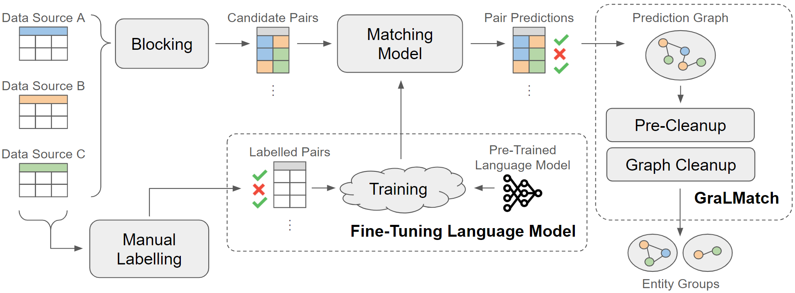
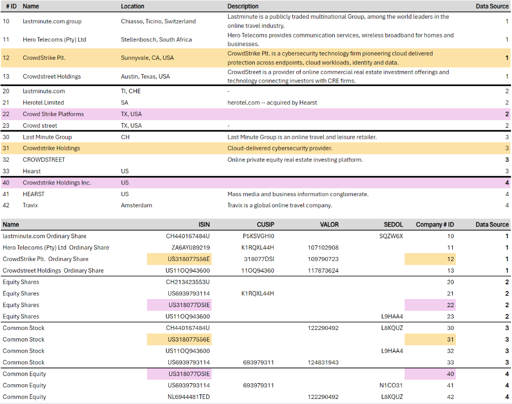
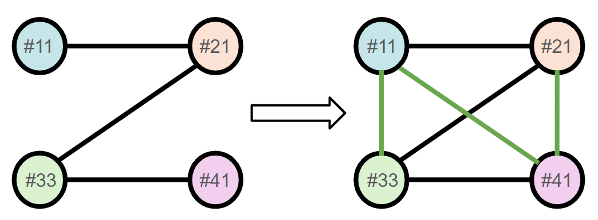
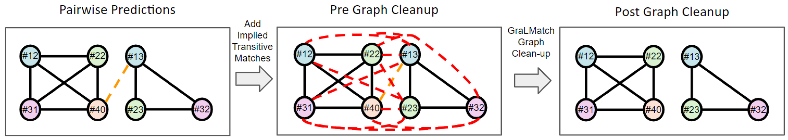

# GraLMatch：图与语言模型结合，精准匹配实体组

发布时间：2024年06月21日

`Agent

这篇论文主要关注的是多源实体匹配问题，即如何将来自不同数据源但对应同一现实实体的记录归为一组。论文中提出了一个新的方法（GraLMatch）来解决这一问题，并利用了图论特性和基于Transformer的模型（DistilBERT）来提高匹配的准确性。这个研究更偏向于开发和应用特定的算法或模型来解决实际问题，而不是深入探讨大型语言模型（LLM）的理论或应用，因此更适合归类为Agent，即开发和应用特定技术或算法来解决问题的研究。` `数据整合`

> GraLMatch: Matching Groups of Entities with Graphs and Language Models

# 摘要

> 本文探讨了多源实体匹配问题，即实体组匹配，旨在将来自不同数据源但对应同一现实实体的记录归为一组。我们特别关注了传递性匹配记录的影响，这些记录在图G=(V,E)中通过路径相连，图中节点和边分别代表记录及其匹配状态。我们以实际案例展示了这一挑战，即如何匹配来自不同数据提供者的公司和金融证券记录。同时，我们推出了两个新的多源基准数据集，它们反映了现实世界中的匹配难题。这些记录的特点是会根据实际事件进行更新，但更新在各数据源中并不一致，这使得某些记录组的匹配必须依赖传递性信息。实验中，我们揭示了考虑传递性匹配记录的复杂性，少量错误的正对匹配预测足以影响大量记录的正确分组。为此，我们开发了GraLMatch方法，利用图论特性来识别并纠正这些错误预测。最后，我们证明了在少量标记样本上微调基于Transformer的模型（DistilBERT）能够实现更优的实体组匹配效果，强调了在处理大量记录时精度的重要性。

> In this paper, we present an end-to-end multi-source Entity Matching problem, which we call entity group matching, where the goal is to assign to the same group, records originating from multiple data sources but representing the same real-world entity. We focus on the effects of transitively matched records, i.e. the records connected by paths in the graph G = (V,E) whose nodes and edges represent the records and whether they are a match or not. We present a real-world instance of this problem, where the challenge is to match records of companies and financial securities originating from different data providers. We also introduce two new multi-source benchmark datasets that present similar matching challenges as real-world records. A distinctive characteristic of these records is that they are regularly updated following real-world events, but updates are not applied uniformly across data sources. This phenomenon makes the matching of certain groups of records only possible through the use of transitive information.
  In our experiments, we illustrate how considering transitively matched records is challenging since a limited amount of false positive pairwise match predictions can throw off the group assignment of large quantities of records. Thus, we propose GraLMatch, a method that can partially detect and remove false positive pairwise predictions through graph-based properties. Finally, we showcase how fine-tuning a Transformer-based model (DistilBERT) on a reduced number of labeled samples yields a better final entity group matching than training on more samples and/or incorporating fine-tuning optimizations, illustrating how precision becomes the deciding factor in the entity group matching of large volumes of records.

[Arxiv](https://arxiv.org/abs/2406.15015)