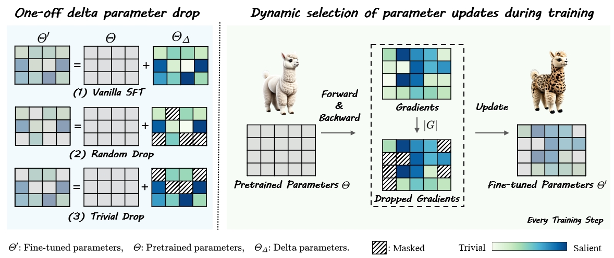
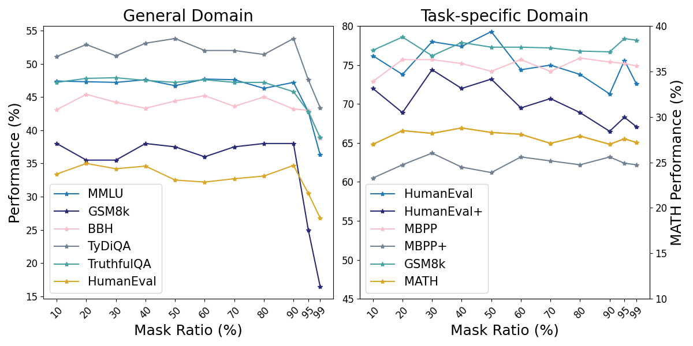
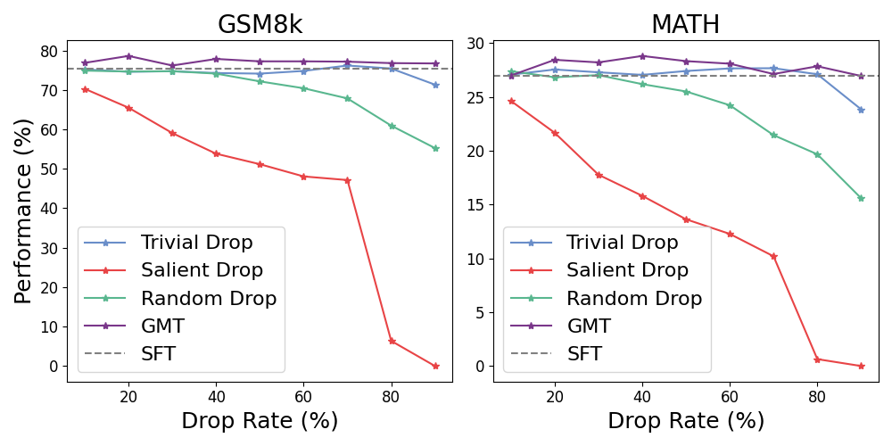

# 梯度掩码调优技术显著提升了大型语言模型的性能潜力

发布时间：2024年06月21日

`LLM理论

这篇论文探讨了大型语言模型（LLMs）的微调过程中的优化方法，提出了梯度掩码调优（GMT）作为一种新的参数更新策略。这种方法通过分析梯度信息来有选择地更新参数，旨在提高模型的性能和效率。由于论文主要关注的是LLMs的理论优化和改进，而不是具体的应用场景或Agent的行为，因此将其归类为LLM理论。` `机器学习`

> Gradient-Mask Tuning Elevates the Upper Limits of LLM Performance

# 摘要

> 大型语言模型（LLMs）的兴起，为众多研究领域带来了革命性的变化。尽管微调被普遍认为是提升这些模型能力的关键，但现有研究指出，微调过程中可能存在冗余，建议仅更新部分参数。然而，这些方法并未充分利用任务特定信息来识别训练中的关键参数。鉴于此，我们提出了梯度掩码调优（GMT），一种依据梯度信息在训练中有选择地更新参数的新方法。我们通过计算梯度的绝对值，并对较小梯度应用掩码。实证研究表明，GMT不仅超越了传统微调方法，还显著提升了LLM性能的极限。此外，GMT对掩码比率不敏感，且在计算效率上与基础SFT相当。

> Large language models (LLMs) have revolutionized lots of fields of research. Although it is well-known that fine-tuning is essential for enhancing the capabilities of LLMs, existing research suggests that there is potential redundancy in the fine-tuning process and therefore proposes to update only a subset of parameters. However, these methods fail to leverage the task-specific information to identify important parameters during training. Based on the insight that gradients inherently contain information on task-specific data, we propose Gradient-Mask Tuning (GMT), a method that selectively updates parameters during training based on their gradient information. Specifically, we compute the absolute values of the gradients and apply masking to those with relatively smaller magnitudes. Our empirical results across various tasks demonstrate that GMT not only outperforms traditional fine-tuning methods but also elevates the upper limits of LLM performance. Further analysis indicates that GMT exhibits insensitivity to mask ratio and possesses computational efficiency comparable to vanilla SFT.

[Arxiv](https://arxiv.org/abs/2406.15330)