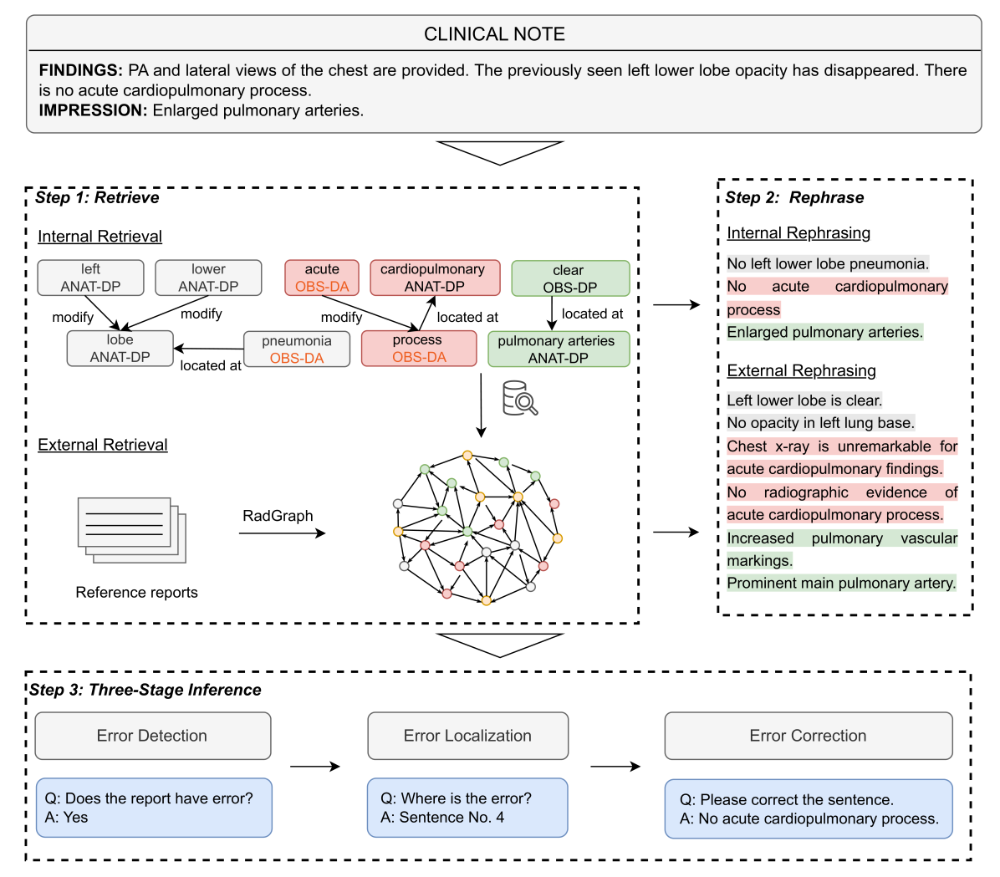
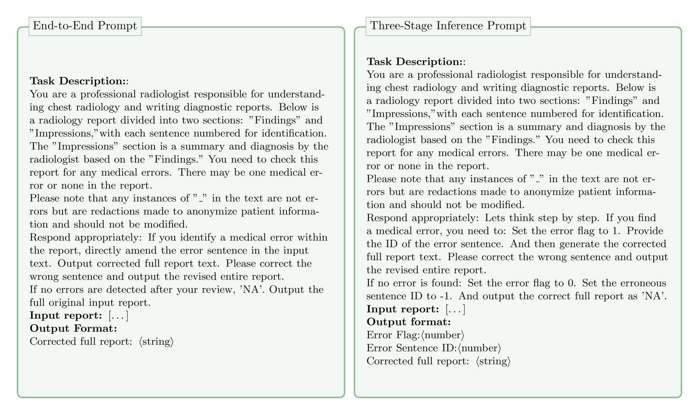
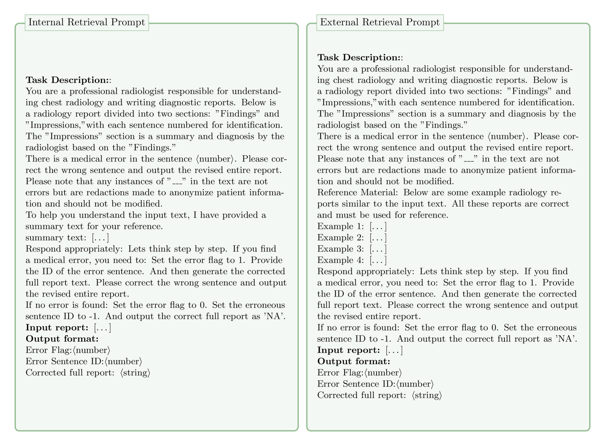

# 借助大型语言模型，精准检索知识以修正临床报告中的错误

发布时间：2024年06月21日

`RAG

理由：这篇论文主要介绍了一种结合大型语言模型（LLM）和检索增强生成（RAG）技术的方法，用于校正临床放射学报告中的错误。这种方法通过检索机制提取医学实体和关系，并使用三阶段推理流程来处理错误。虽然涉及LLM的应用，但核心在于RAG技术的应用和改进，因此更适合归类为RAG。` `放射学`

> Harnessing Knowledge Retrieval with Large Language Models for Clinical Report Error Correction

# 摘要

> 本研究提出了一种新颖的方法，利用大型语言模型和检索增强生成技术，对临床放射学报告中的错误进行校正。该方法通过内部和外部检索机制，精准提取医学实体和关系，并采用三阶段推理流程，将任务细分为错误检测、定位和校正，从而提升系统的透明度和效率。通过由专家指导、模拟真实错误的基准数据集验证，该方法展现出显著优势，特别是在结合内部和外部检索时，大幅提高了错误识别、定位和修正的准确性，适用于多种顶尖的LLMs。这些成果为临床文档错误校正系统的进一步发展奠定了坚实基础。

> This study proposes an approach for error correction in clinical radiology reports, leveraging large language models (LLMs) and retrieval-augmented generation (RAG) techniques. The proposed framework employs internal and external retrieval mechanisms to extract relevant medical entities and relations from the report and external knowledge sources. A three-stage inference process is introduced, decomposing the task into error detection, localization, and correction subtasks, which enhances the explainability and performance of the system. The effectiveness of the approach is evaluated using a benchmark dataset created by corrupting real-world radiology reports with realistic errors, guided by domain experts. Experimental results demonstrate the benefits of the proposed methods, with the combination of internal and external retrieval significantly improving the accuracy of error detection, localization, and correction across various state-of-the-art LLMs. The findings contribute to the development of more robust and reliable error correction systems for clinical documentation.

[Arxiv](https://arxiv.org/abs/2406.15045)