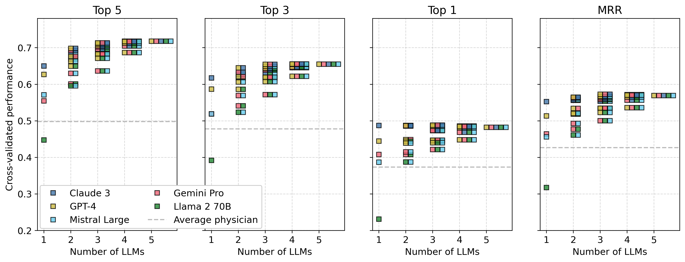
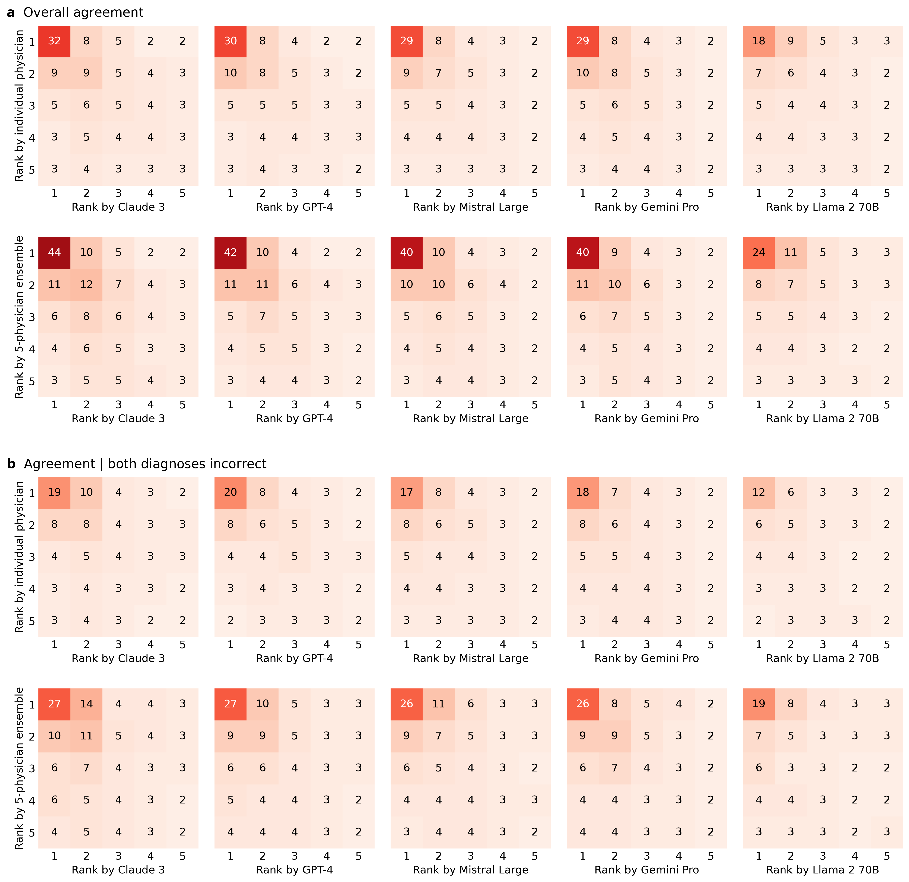

# 人机协作在鉴别诊断上达到了最高准确度

发布时间：2024年06月21日

`Agent

这篇论文介绍了一种混合集体智能系统，该系统结合了人类经验和大型语言模型（LLMs）处理的大量信息，以降低复杂高风险决策中的风险。这种系统可以被视为一种智能代理（Agent），因为它能够整合不同来源的信息（人类和机器），并在此基础上做出决策。在医疗诊断领域的应用进一步强调了这种系统作为智能代理的特性，因为它不仅依赖于LLMs，还结合了人类专家的知识和经验，以提高决策的准确性和可靠性。因此，这篇论文更适合归类于Agent分类。` `人工智能决策支持`

> Human-AI collectives produce the most accurate differential diagnoses

# 摘要

> 人工智能系统，尤其是大型语言模型（LLMs），正越来越多地被用于影响深远的高风险决策，而这些决策往往缺乏确保安全、质量和公平性的充分保障。然而，LLMs存在幻觉、缺乏常识和偏见等问题，这些缺陷可能源于LLMs的固有限制，难以通过更复杂的架构、更多数据或更多人类反馈来解决。因此，仅依赖LLMs进行复杂的高风险决策存在问题。为此，我们提出了一种混合集体智能系统，该系统通过结合人类经验和LLMs处理的大量信息的互补优势，有效降低了风险。我们将此方法应用于开放式医疗诊断，整合了40,762个医生做出的鉴别诊断和五个顶尖LLMs在2,133个医疗案例中的诊断结果。结果显示，医生与LLMs的混合集体在性能上超越了单一医生、医生集体、单一LLMs及LLM集合。这一优势在多种医学专业和不同专业经验水平中均得到体现，归功于人类与LLMs互补的贡献，这些贡献导致了不同类型的错误。我们的方法展示了集体人类与机器智能在提升复杂、开放式领域（如医疗诊断）准确性方面的巨大潜力。

> Artificial intelligence systems, particularly large language models (LLMs), are increasingly being employed in high-stakes decisions that impact both individuals and society at large, often without adequate safeguards to ensure safety, quality, and equity. Yet LLMs hallucinate, lack common sense, and are biased - shortcomings that may reflect LLMs' inherent limitations and thus may not be remedied by more sophisticated architectures, more data, or more human feedback. Relying solely on LLMs for complex, high-stakes decisions is therefore problematic. Here we present a hybrid collective intelligence system that mitigates these risks by leveraging the complementary strengths of human experience and the vast information processed by LLMs. We apply our method to open-ended medical diagnostics, combining 40,762 differential diagnoses made by physicians with the diagnoses of five state-of-the art LLMs across 2,133 medical cases. We show that hybrid collectives of physicians and LLMs outperform both single physicians and physician collectives, as well as single LLMs and LLM ensembles. This result holds across a range of medical specialties and professional experience, and can be attributed to humans' and LLMs' complementary contributions that lead to different kinds of errors. Our approach highlights the potential for collective human and machine intelligence to improve accuracy in complex, open-ended domains like medical diagnostics.

[Arxiv](https://arxiv.org/abs/2406.14981)