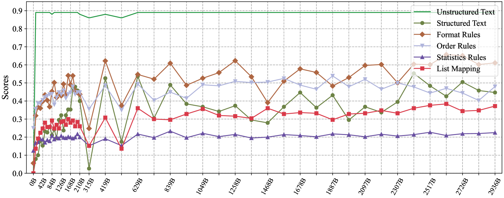

# ICLEval：探究大型语言模型在上下文学习中的表现

发布时间：2024年06月21日

`LLM理论

理由：这篇论文主要关注的是大型语言模型（LLMs）的In-Context Learning（ICL）能力的评估和理解，特别是通过引入ICLEval基准来深入探讨这一能力的发展过程和影响因素。这涉及到对LLMs理论层面的研究，即如何理解和评估模型在训练阶段形成的特定能力，而不是直接的应用或安全性问题。因此，它更符合LLM理论分类。` `人工智能` `语言模型`

> ICLEval: Evaluating In-Context Learning Ability of Large Language Models

# 摘要

> In-Context Learning (ICL) 赋予大型语言模型 (LLMs) 理解和推理跨连接输入的能力，是它们的核心能力之一。通过评估 LLMs 的 ICL 能力，我们不仅能提升其应用效率，还能更深入地理解这种能力在训练阶段的形成过程。然而，当前的评估框架大多侧重于语言和知识能力，对 ICL 能力的评估却鲜有涉及。为此，我们推出了 ICLEval 基准，专门用于评估 LLMs 的 ICL 能力，涵盖了精确复制和规则学习两大关键子能力。通过 ICLEval，我们发现 ICL 能力在不同 LLMs 中普遍存在，且模型大小并非决定 ICL 效能的唯一因素。令人意外的是，我们观察到 ICL 能力，尤其是复制能力，在预训练初期便迅速发展，并随后趋于稳定。我们的源代码和基准已公开在 https://github.com/yiye3/ICLEval。

> In-Context Learning (ICL) is a critical capability of Large Language Models (LLMs) as it empowers them to comprehend and reason across interconnected inputs. Evaluating the ICL ability of LLMs can enhance their utilization and deepen our understanding of how this ability is acquired at the training stage. However, existing evaluation frameworks primarily focus on language abilities and knowledge, often overlooking the assessment of ICL ability. In this work, we introduce the ICLEval benchmark to evaluate the ICL abilities of LLMs, which encompasses two key sub-abilities: exact copying and rule learning. Through the ICLEval benchmark, we demonstrate that ICL ability is universally present in different LLMs, and model size is not the sole determinant of ICL efficacy. Surprisingly, we observe that ICL abilities, particularly copying, develop early in the pretraining process and stabilize afterward. Our source codes and benchmark are released at https://github.com/yiye3/ICLEval.

[Arxiv](https://arxiv.org/abs/2406.14955)