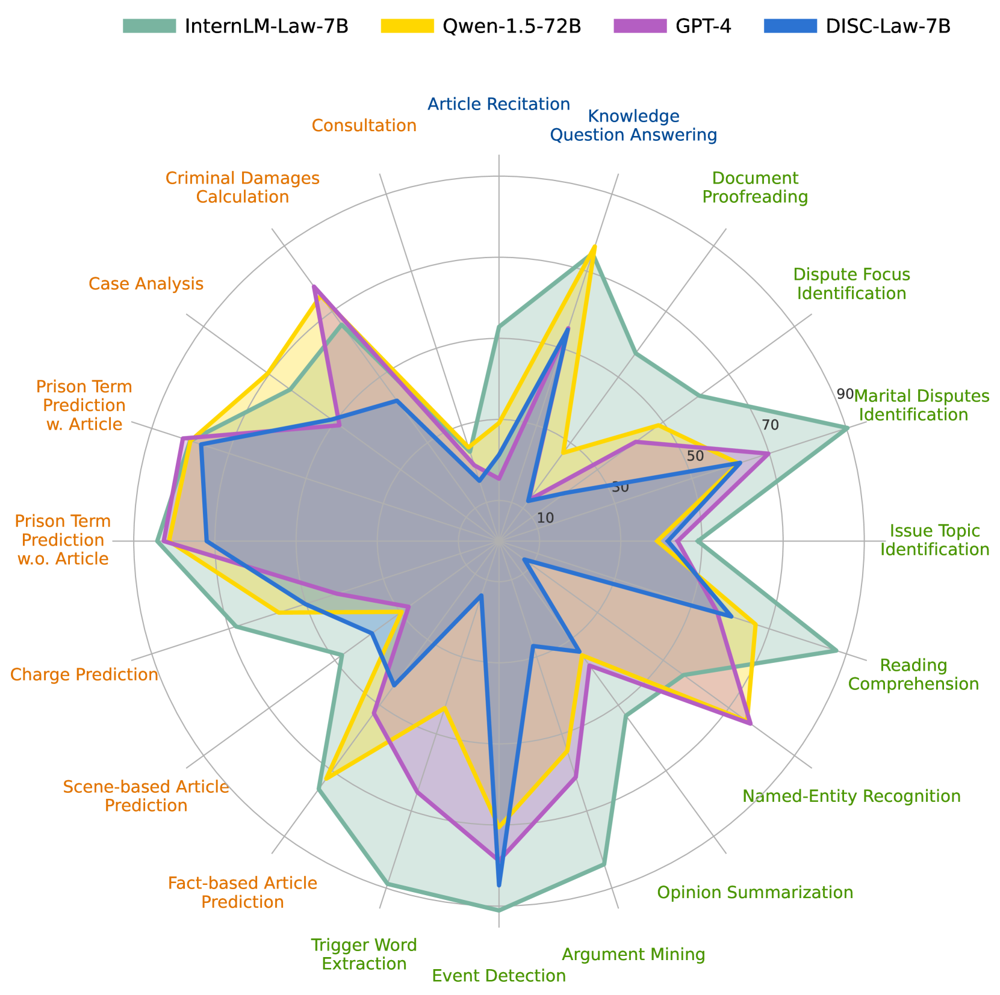
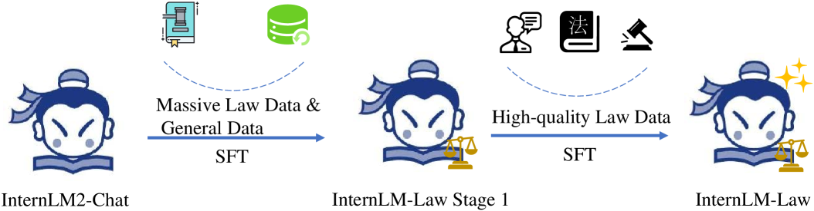
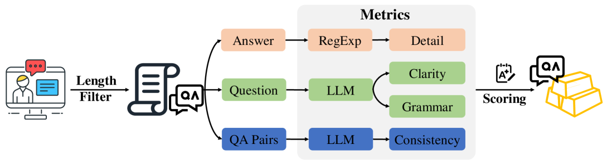

# InternLM-Law：一款开源的中文法律大型语言模型

发布时间：2024年06月21日

`LLM应用

解析：这篇论文介绍了一款专门针对中国法律领域的大型语言模型（LLM）——InternLM-Law，并详细描述了其开发过程、数据集构建以及在特定测试中的表现。论文的核心在于应用LLM技术解决特定领域（法律）的问题，因此属于LLM应用类别。` `人工智能`

> InternLM-Law: An Open Source Chinese Legal Large Language Model

# 摘要

> 大型语言模型（LLMs）虽能力出众，但在应对法律领域的复杂查询时却显得力不从心。为此，我们推出了InternLM-Law，一款专为解答中国法律相关问题而生的LLM，无论是教科书上的法律习题还是现实中的复杂案例，它都能应对自如。我们精心打造了一个包含百万级中文法律查询的数据集，并通过严格的数据处理确保其质量和多样性。训练过程分为两步：先在法律与通用内容上微调LLMs，赋予其广泛知识；再针对优质法律数据进行专属微调，提升结构化输出能力。InternLM-Law在LawBench测试中表现卓越，超越了包括GPT-4在内的顶尖模型，在20个子任务中拿下13个第一。我们已将InternLM-Law及其数据集开放，以期推动法律领域LLMs应用的进一步研究。

> While large language models (LLMs) have showcased impressive capabilities, they struggle with addressing legal queries due to the intricate complexities and specialized expertise required in the legal field. In this paper, we introduce InternLM-Law, a specialized LLM tailored for addressing diverse legal queries related to Chinese laws, spanning from responding to standard legal questions (e.g., legal exercises in textbooks) to analyzing complex real-world legal situations. We meticulously construct a dataset in the Chinese legal domain, encompassing over 1 million queries, and implement a data filtering and processing pipeline to ensure its diversity and quality. Our training approach involves a novel two-stage process: initially fine-tuning LLMs on both legal-specific and general-purpose content to equip the models with broad knowledge, followed by exclusive fine-tuning on high-quality legal data to enhance structured output generation. InternLM-Law achieves the highest average performance on LawBench, outperforming state-of-the-art models, including GPT-4, on 13 out of 20 subtasks. We make InternLM-Law and our dataset publicly available to facilitate future research in applying LLMs within the legal domain.

[Arxiv](https://arxiv.org/abs/2406.14887)