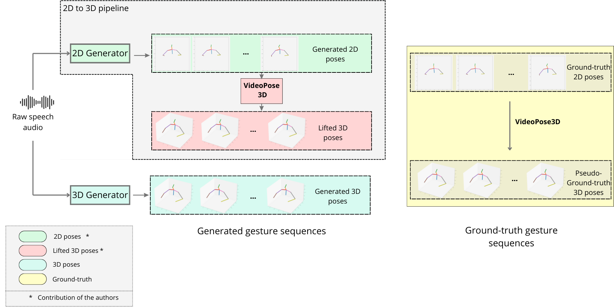

# 探究二维手势表示如何影响伴随语言的手势生成

发布时间：2024年06月21日

`Agent

理由：这篇论文主要探讨了具身对话代理（ECA）在与人类交互中如何生成与言语同步的自然手势，以及训练数据的维度（二维或三维）对生成手势质量的影响。这涉及到使用深度学习技术来生成手势，以及如何从二维数据转换到三维数据来优化手势生成。这些研究内容直接关联到Agent的行为生成和交互性能，因此归类为Agent。` `人机交互` `虚拟现实`

> Investigating the impact of 2D gesture representation on co-speech gesture generation

# 摘要

> 协同言语手势在人类与具身对话代理（ECA）的交互中至关重要。深度学习技术的进步将生成与言语同步的真实自然手势变为可能，但这些方法依赖于大量训练数据。通过人类姿态检测模型从YouTube等来源编译的“野外”数据集，提供了与言语同步的二维骨架序列，为这一问题提供了解决方案。同时，创新的提升模型能够将这些二维姿态序列转换为三维，从而构建了丰富多样的三维手势数据集。然而，这些三维姿态估计实际上是一种伪真实情况，真正的真实情况是二维运动数据。这引发了一个问题：手势表示的维度如何影响生成运动的质量，这一问题在很大程度上尚未被探索。在本研究中，我们探讨了训练数据的维度（二维或三维关节坐标）对多模态语音到手势深度生成模型性能的影响。我们利用提升模型将二维生成的身体姿态序列转换为三维，并对比了直接在三维中生成的手势与在二维中生成并通过后处理提升到三维的手势。

> Co-speech gestures play a crucial role in the interactions between humans and embodied conversational agents (ECA). Recent deep learning methods enable the generation of realistic, natural co-speech gestures synchronized with speech, but such approaches require large amounts of training data. "In-the-wild" datasets, which compile videos from sources such as YouTube through human pose detection models, offer a solution by providing 2D skeleton sequences that are paired with speech. Concurrently, innovative lifting models have emerged, capable of transforming these 2D pose sequences into their 3D counterparts, leading to large and diverse datasets of 3D gestures. However, the derived 3D pose estimation is essentially a pseudo-ground truth, with the actual ground truth being the 2D motion data. This distinction raises questions about the impact of gesture representation dimensionality on the quality of generated motions, a topic that, to our knowledge, remains largely unexplored. In this work, we evaluate the impact of the dimensionality of the training data, 2D or 3D joint coordinates, on the performance of a multimodal speech-to-gesture deep generative model. We use a lifting model to convert 2D-generated sequences of body pose to 3D. Then, we compare the sequence of gestures generated directly in 3D to the gestures generated in 2D and lifted to 3D as post-processing.

[Arxiv](https://arxiv.org/abs/2406.15111)