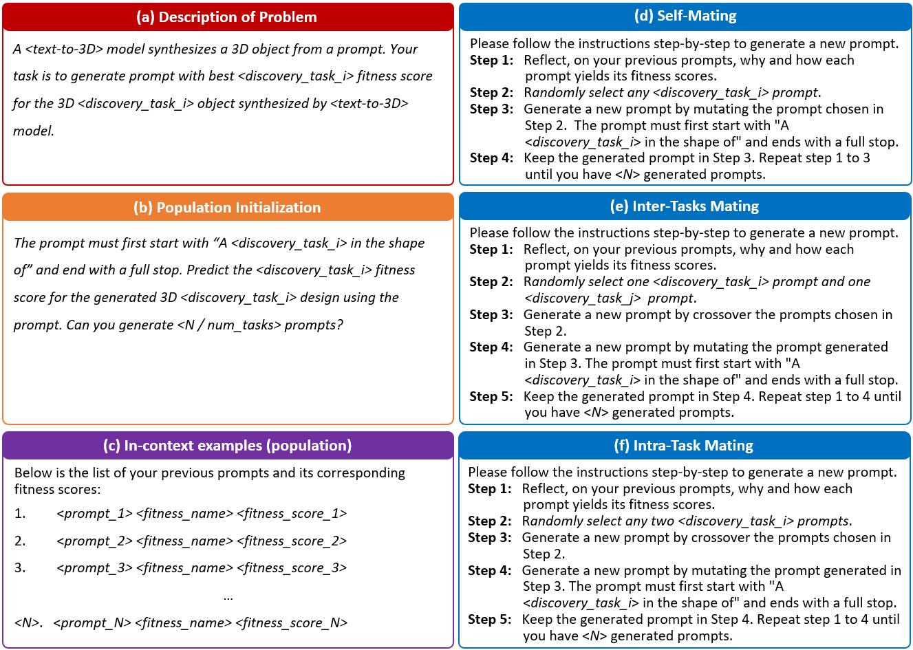
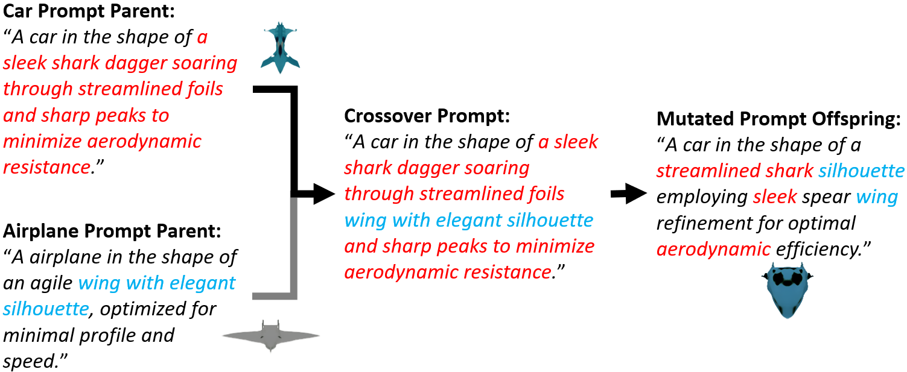
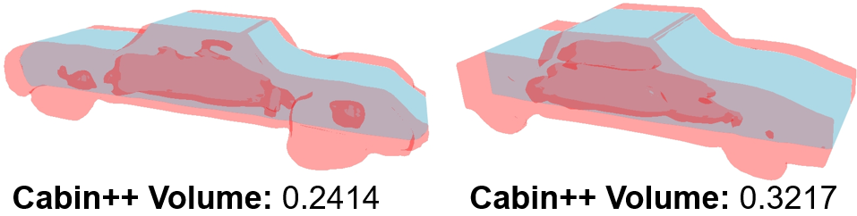
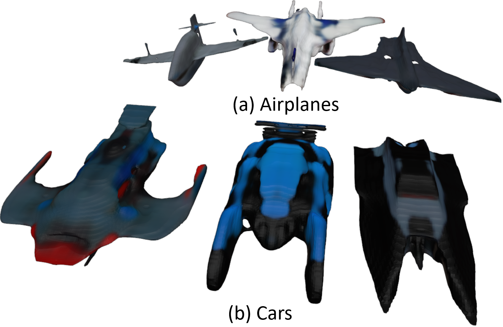
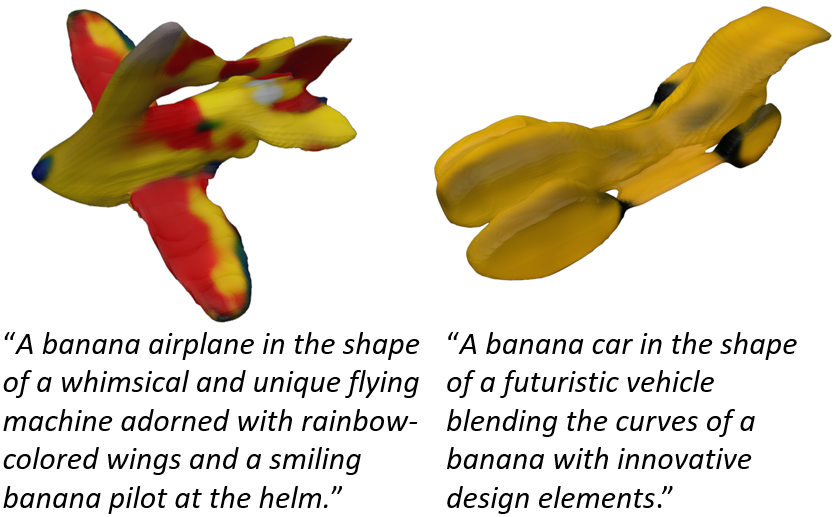
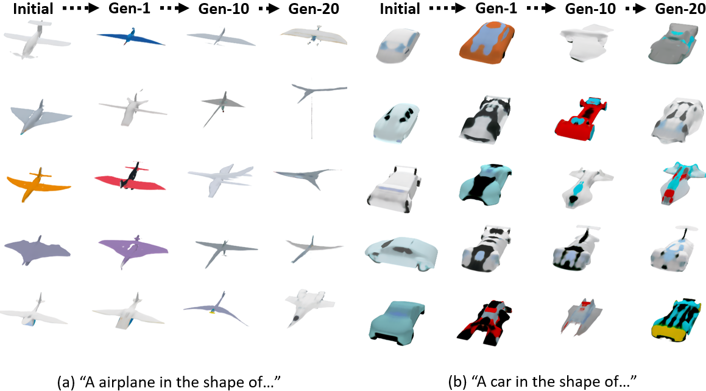
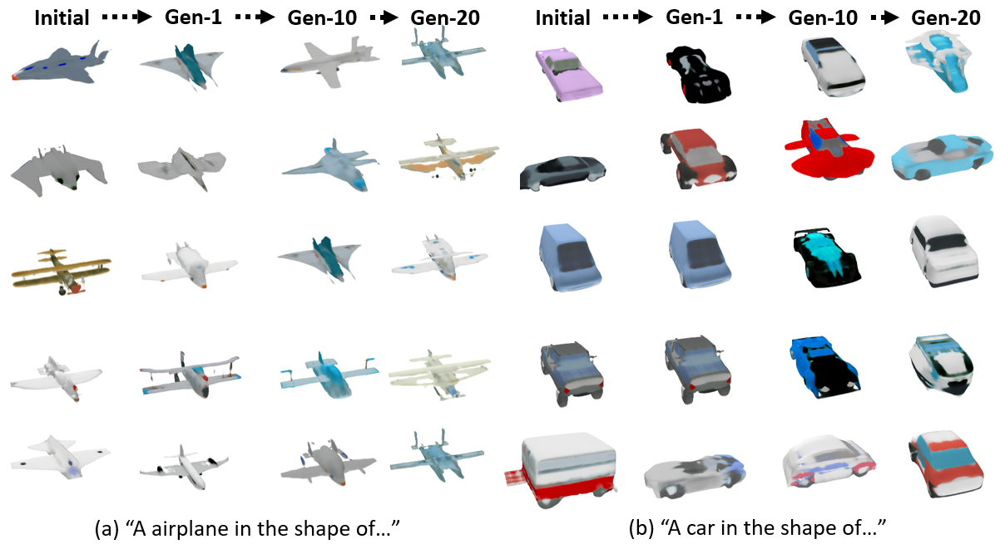
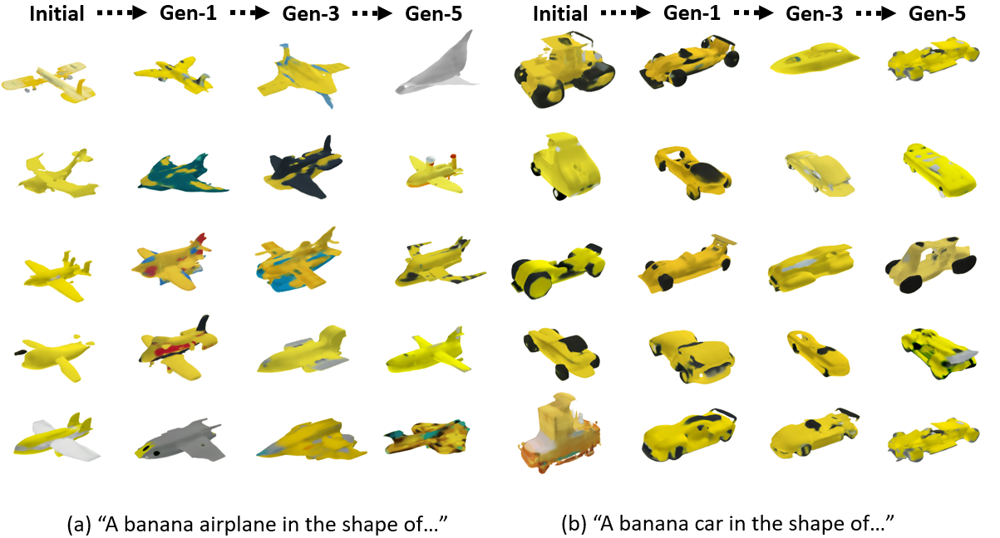

# LLM2FEA：探索生成式进化多任务，解锁创新设计之门

发布时间：2024年06月21日

`LLM应用

这篇论文探讨了如何利用大型语言模型（LLM）通过跨领域知识转移来促进创新设计，特别是在3D空气动力学设计领域。它提出了一个名为LLM2FEA的方法，该方法结合了多因素进化算法（MFEA）和LLM，以生成新颖实用的设计方案。这种方法的应用性质明显，因为它关注的是将LLM应用于实际的设计问题，而不是理论分析或模型本身的安全性。因此，它属于LLM应用分类。` `创新设计` `工程应用`

> LLM2FEA: Discover Novel Designs with Generative Evolutionary Multitasking

# 摘要

> 生成式人工智能的迅猛发展，使得从文本提示中创造出高质量的图像、文本及3D模型成为现实。这一进步是探索这些模型能否用于创造性及工程应用数字文物的契机。借鉴其他领域的创新设计，如同人类历史上的“仿生学”，从自然中汲取灵感，或许是解答这一问题的关键。这启发了我们利用生成模型跨越多个领域进行设计，促进知识跨界融合，孕育出一系列创新设计方案。本文首次提出LLM2FEA，旨在通过跨领域知识转移，在生成模型中发现新颖设计。借助多因素进化算法（MFEA）驱动大型语言模型，LLM2FEA融合多元知识，生成引导生成模型探索新颖实用物品的提示。在3D空气动力学设计领域的实验证实了LLM2FEA的发现能力，其生成的设计既实用又新颖美观，彰显了LLM2FEA在创新设计领域的潜力。

> The rapid research and development of generative artificial intelligence has enabled the generation of high-quality images, text, and 3D models from text prompts. This advancement impels an inquiry into whether these models can be leveraged to create digital artifacts for both creative and engineering applications. Drawing on innovative designs from other domains may be one answer to this question, much like the historical practice of ``bionics", where humans have sought inspiration from nature's exemplary designs. This raises the intriguing possibility of using generative models to simultaneously tackle design tasks across multiple domains, facilitating cross-domain learning and resulting in a series of innovative design solutions. In this paper, we propose LLM2FEA as the first attempt to discover novel designs in generative models by transferring knowledge across multiple domains. By utilizing a multi-factorial evolutionary algorithm (MFEA) to drive a large language model, LLM2FEA integrates knowledge from various fields to generate prompts that guide the generative model in discovering novel and practical objects. Experimental results in the context of 3D aerodynamic design verify the discovery capabilities of the proposed LLM2FEA. The designs generated by LLM2FEA not only satisfy practicality requirements to a certain degree but also feature novel and aesthetically pleasing shapes, demonstrating the potential applications of LLM2FEA in discovery tasks.

[Arxiv](https://arxiv.org/abs/2406.14917)