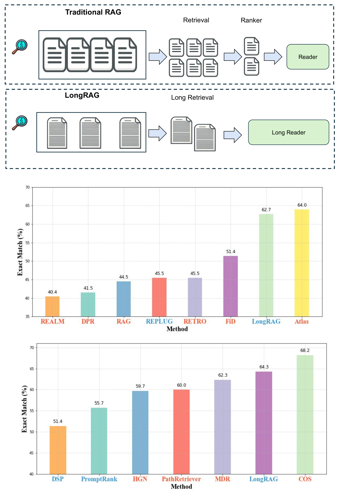
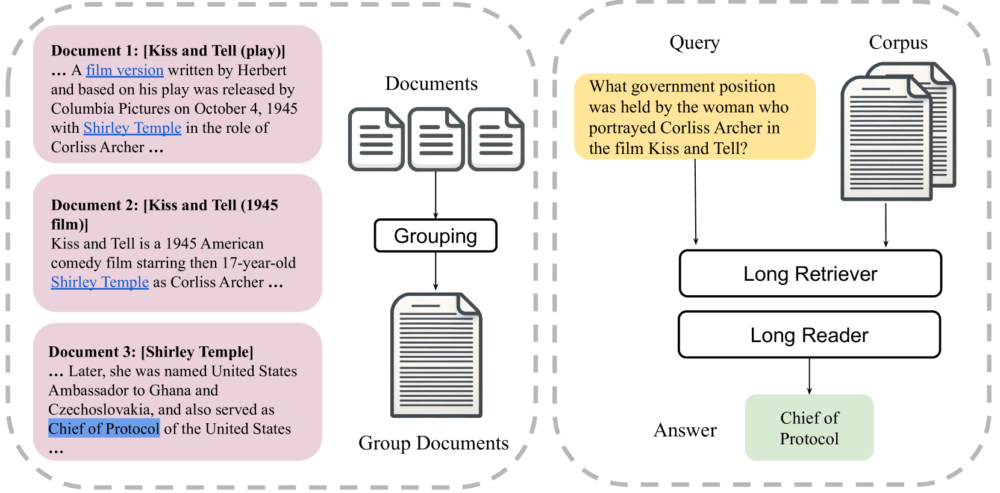
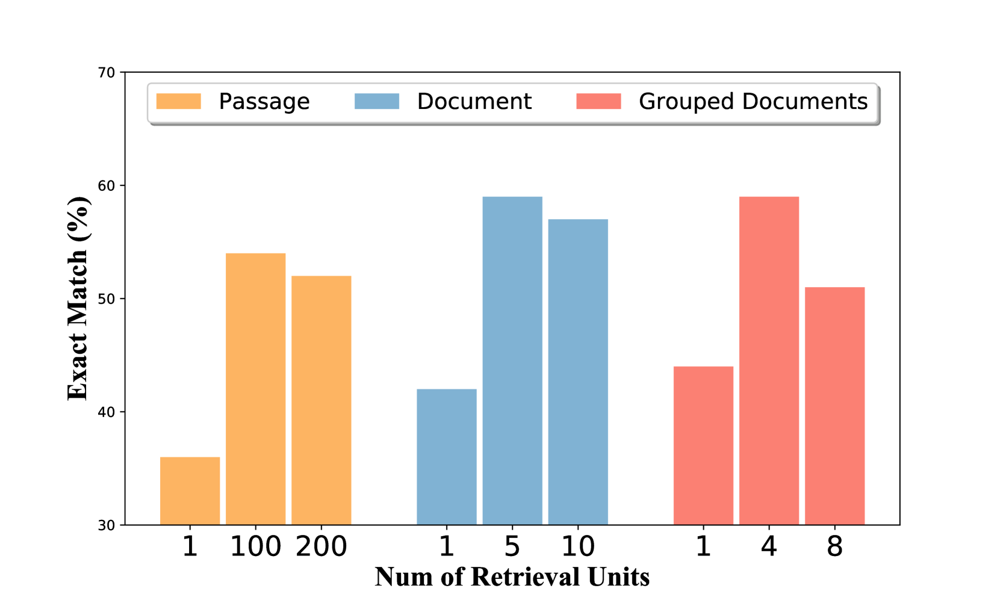
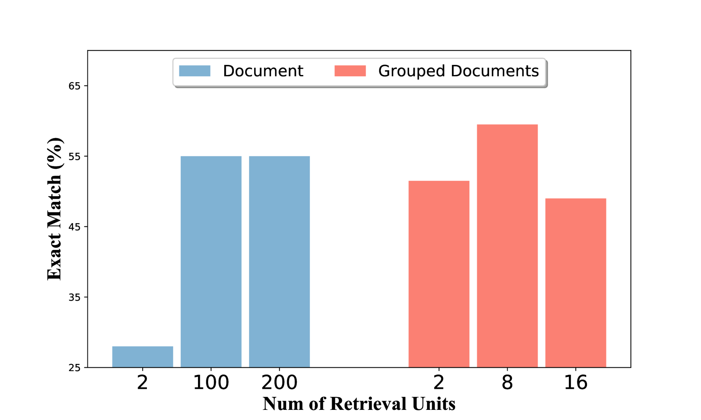
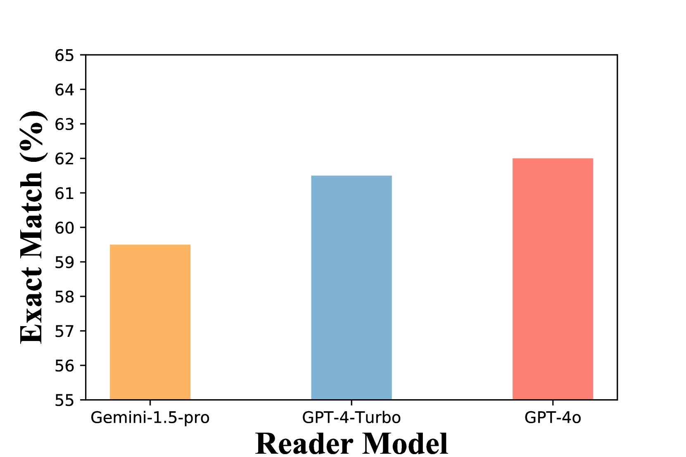

# LongRAG：借助长上下文大型语言模型，提升检索增强生成能力

发布时间：2024年06月21日

`RAG

理由：这篇论文主要介绍了一种改进的RAG（Retrieval-Augmented Generation）框架，即LongRAG，它通过增加检索单元的长度来提高检索效率和答案召回率。论文的核心贡献在于对RAG框架的改进和优化，这与RAG分类直接相关。虽然涉及到了长上下文LLM的应用，但主要焦点是RAG框架的改进，因此更适合归类为RAG。` `问答系统`

> LongRAG: Enhancing Retrieval-Augmented Generation with Long-context LLMs

# 摘要

> 传统的RAG框架中，检索单元通常较短，如DPR处理100字的维基百科段落，迫使检索器在大规模语料库中寻找关键信息，而阅读器则仅需从这些短单元中提取答案。这种检索器“重”与阅读器“轻”的不平衡设计可能导致性能不佳。为此，我们提出了LongRAG框架，它包含一个能够处理4K令牌单元的“长检索器”和一个“长阅读器”，比之前长30倍，大幅减少了总单元数，从而显著提升了检索效率，答案召回率显著提高。我们将这些长单元输入长上下文LLM进行零样本答案提取，无需额外训练，LongRAG在NQ和HotpotQA上均取得了与最先进模型相当的优异成绩。这一研究为RAG与长上下文LLM的未来结合提供了新的视角。

> In traditional RAG framework, the basic retrieval units are normally short. The common retrievers like DPR normally work with 100-word Wikipedia paragraphs. Such a design forces the retriever to search over a large corpus to find the `needle' unit. In contrast, the readers only need to extract answers from the short retrieved units. Such an imbalanced `heavy' retriever and `light' reader design can lead to sub-optimal performance. In order to alleviate the imbalance, we propose a new framework LongRAG, consisting of a `long retriever' and a `long reader'. LongRAG processes the entire Wikipedia into 4K-token units, which is 30x longer than before. By increasing the unit size, we significantly reduce the total units from 22M to 700K. This significantly lowers the burden of retriever, which leads to a remarkable retrieval score: answer recall@1=71% on NQ (previously 52%) and answer recall@2=72% (previously 47%) on HotpotQA (full-wiki). Then we feed the top-k retrieved units ($\approx$ 30K tokens) to an existing long-context LLM to perform zero-shot answer extraction. Without requiring any training, LongRAG achieves an EM of 62.7% on NQ, which is the best known result. LongRAG also achieves 64.3% on HotpotQA (full-wiki), which is on par of the SoTA model. Our study offers insights into the future roadmap for combining RAG with long-context LLMs.

[Arxiv](https://arxiv.org/abs/2406.15319)