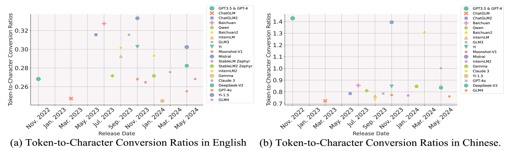
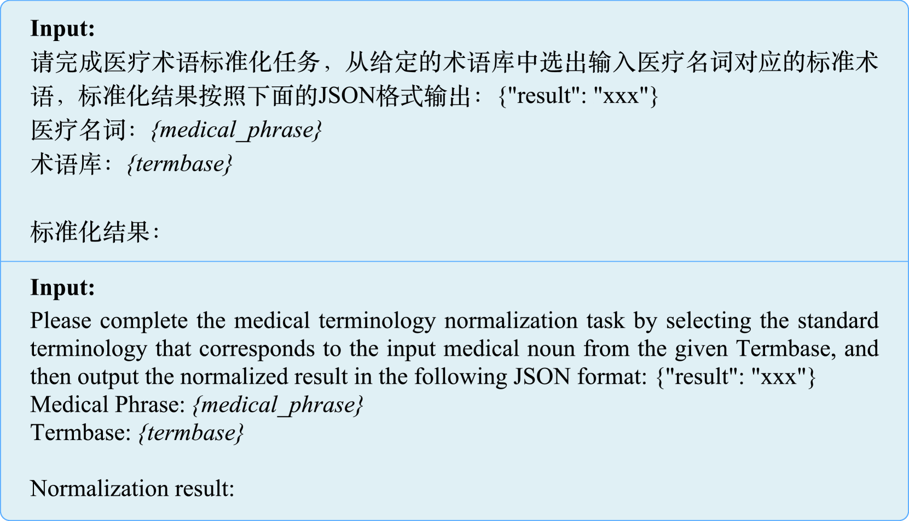

# MedOdyssey：医学领域长上下文评估新基准，支持高达20万令牌的深度分析

发布时间：2024年06月21日

`LLM应用

理由：这篇论文主要介绍了针对医疗领域的大型语言模型（LLMs）的长上下文处理能力的评估基准——MedOdyssey。它专注于医疗领域的特定需求，设计了一系列任务和数据集来评估LLMs在处理长上下文时的表现。这与LLM的应用场景紧密相关，特别是在医疗领域的应用，因此归类为LLM应用。` `基准测试`

> MedOdyssey: A Medical Domain Benchmark for Long Context Evaluation Up to 200K Tokens

# 摘要

> 如今，众多先进的大型语言模型（LLMs）已能支持高达128K的上下文长度，甚至有的扩展至200K。通用领域的基准测试也已开始评估这些模型的长上下文处理能力。然而，在医疗领域，由于其独特的上下文需求和专业知识门槛，相关评估仍显不足。尽管医疗场景中长文本屡见不鲜，但针对医疗领域LLMs的长上下文能力评估基准却寥寥无几。为此，我们推出了MedOdyssey，首个医疗长上下文基准，涵盖从4K到200K令牌的七个长度级别，并包含两大核心部分：医疗上下文“大海捞针”任务及一系列专为医疗应用设计的任务，共计10个数据集。第一部分通过反直觉推理和未知事实注入等挑战，旨在减少LLMs的知识泄露和数据污染风险。第二部分则考验模型的专业医疗知识应用能力。我们特别引入了“最大相同上下文”原则，确保不同LLMs在评估中面对尽可能一致的上下文，以提升评估的公平性。通过实验，我们详细分析了专为长上下文处理优化的高级LLMs的性能，揭示了该领域LLMs仍需克服的挑战和进一步研究的方向。相关代码和数据已公开于GitHub仓库：\url{https://github.com/JOHNNY-fans/MedOdyssey.}

> Numerous advanced Large Language Models (LLMs) now support context lengths up to 128K, and some extend to 200K. Some benchmarks in the generic domain have also followed up on evaluating long-context capabilities. In the medical domain, tasks are distinctive due to the unique contexts and need for domain expertise, necessitating further evaluation. However, despite the frequent presence of long texts in medical scenarios, evaluation benchmarks of long-context capabilities for LLMs in this field are still rare. In this paper, we propose MedOdyssey, the first medical long-context benchmark with seven length levels ranging from 4K to 200K tokens. MedOdyssey consists of two primary components: the medical-context "needles in a haystack" task and a series of tasks specific to medical applications, together comprising 10 datasets. The first component includes challenges such as counter-intuitive reasoning and novel (unknown) facts injection to mitigate knowledge leakage and data contamination of LLMs. The second component confronts the challenge of requiring professional medical expertise. Especially, we design the ``Maximum Identical Context'' principle to improve fairness by guaranteeing that different LLMs observe as many identical contexts as possible. Our experiment evaluates advanced proprietary and open-source LLMs tailored for processing long contexts and presents detailed performance analyses. This highlights that LLMs still face challenges and need for further research in this area. Our code and data are released in the repository: \url{https://github.com/JOHNNY-fans/MedOdyssey.}

[Arxiv](https://arxiv.org/abs/2406.15019)