# MoA：稀疏注意力混合技术在自动压缩大型语言模型中的应用

发布时间：2024年06月21日

`LLM理论

理由：这篇论文主要探讨了大型语言模型（LLM）中的稀疏注意力技术，并提出了混合注意力（MoA）作为一种创新方法来优化这些模型的性能。论文的核心贡献在于理论上的创新，即如何通过定制化的稀疏配置来提高模型的效率和性能，而不是直接应用于特定的应用场景或讨论模型的安全性。因此，这篇论文更符合LLM理论分类，因为它深入探讨了LLM内部机制的改进和优化。` `机器学习`

> MoA: Mixture of Sparse Attention for Automatic Large Language Model Compression

# 摘要

> 稀疏注意力技术有效缓解了大型语言模型在处理长文本时的内存和吞吐量压力。传统方法采用统一的稀疏注意力模式，忽视了不同模型和输入长度下注意力模式的多样性。为此，我们创新性地提出了混合注意力（MoA），它为每个注意力头和层量身定制稀疏配置。MoA通过构建一个包含多样化注意力模式及其缩放规则的搜索空间，智能地分析模型，评估并优化稀疏注意力策略。实验结果显示，MoA在不增加平均注意力跨度的情况下，将上下文长度提升了3.9倍，检索准确性提高了1.5至7.1倍，显著优于传统方法。此外，MoA显著缩小了稀疏模型与密集模型在性能上的差距，将性能下降控制在5%以内。在单个GPU上，MoA为7B和13B模型节省了1.2至1.4倍的GPU内存，并提升了5.5至6.7倍的解码速度，几乎不影响模型性能。

> Sparse attention can effectively mitigate the significant memory and throughput demands of Large Language Models (LLMs) in long contexts. Existing methods typically employ a uniform sparse attention mask, applying the same sparse pattern across different attention heads and input lengths. However, this uniform approach fails to capture the diverse attention patterns inherent in LLMs, ignoring their distinct accuracy-latency trade-offs. To address this challenge, we propose the Mixture of Attention (MoA), which automatically tailors distinct sparse attention configurations to different heads and layers. MoA constructs and navigates a search space of various attention patterns and their scaling rules relative to input sequence lengths. It profiles the model, evaluates potential configurations, and pinpoints the optimal sparse attention compression plan. MoA adapts to varying input sizes, revealing that some attention heads expand their focus to accommodate longer sequences, while other heads consistently concentrate on fixed-length local contexts. Experiments show that MoA increases the effective context length by $3.9\times$ with the same average attention span, boosting retrieval accuracy by $1.5-7.1\times$ over the uniform-attention baseline across Vicuna-7B, Vicuna-13B, and Llama3-8B models. Moreover, MoA narrows the capability gaps between sparse and dense models, reducing the maximum relative performance drop from $9\%-36\%$ to within $5\%$ across two long-context understanding benchmarks. MoA achieves a $1.2-1.4\times$ GPU memory reduction and boosts decode throughput by $5.5-6.7 \times$ for 7B and 13B dense models on a single GPU, with minimal impact on performance.

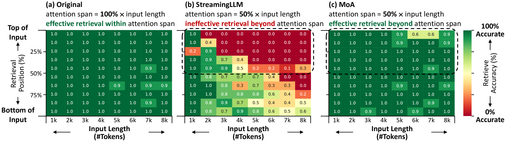

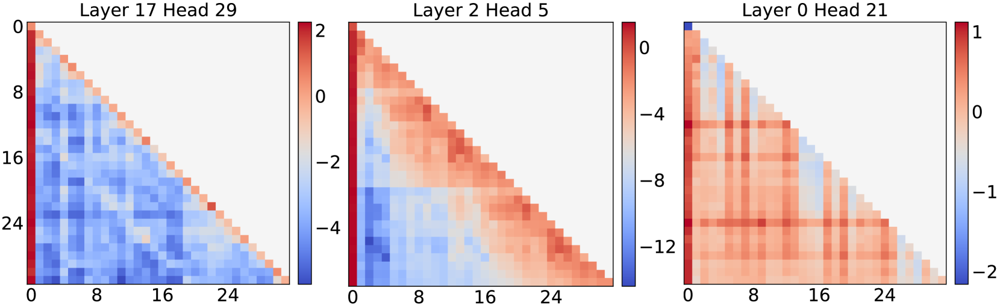

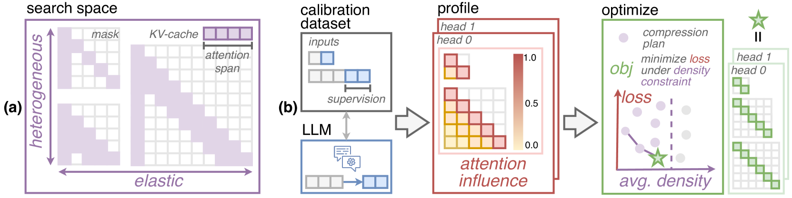

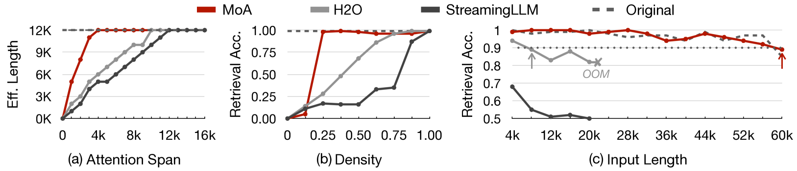

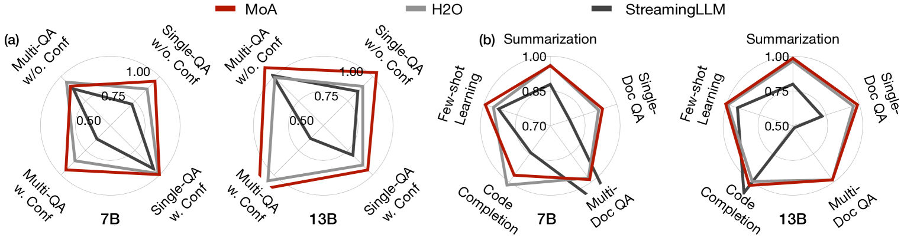

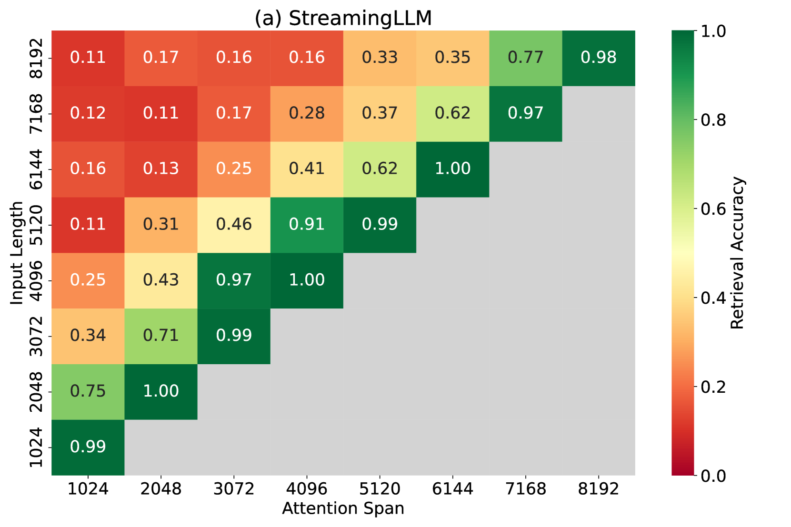

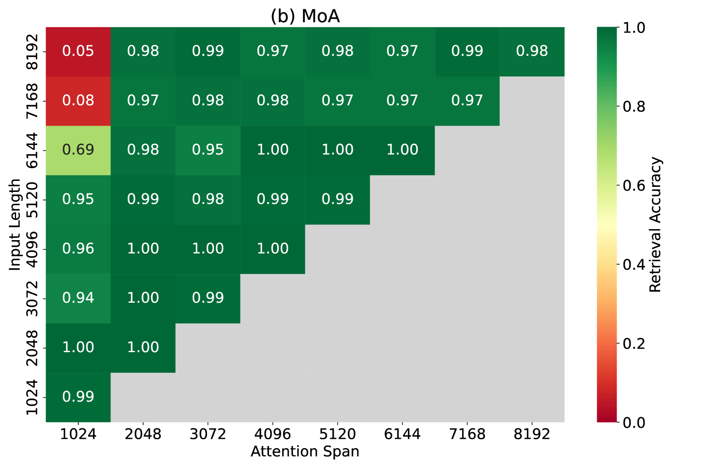

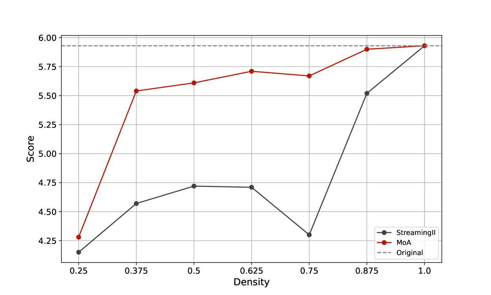

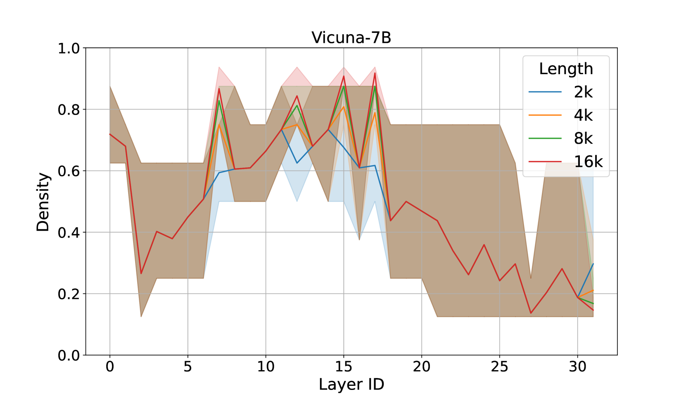

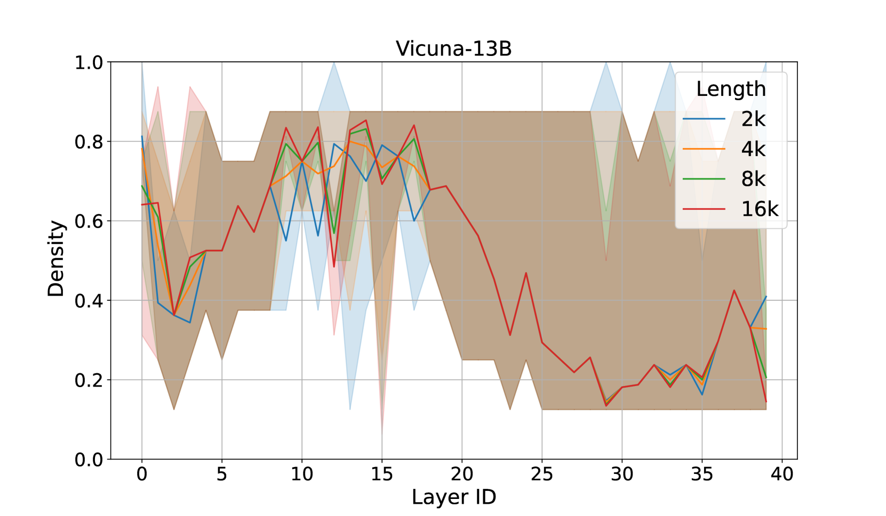

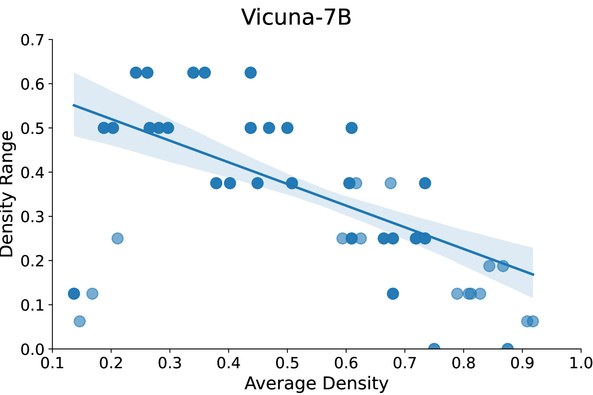

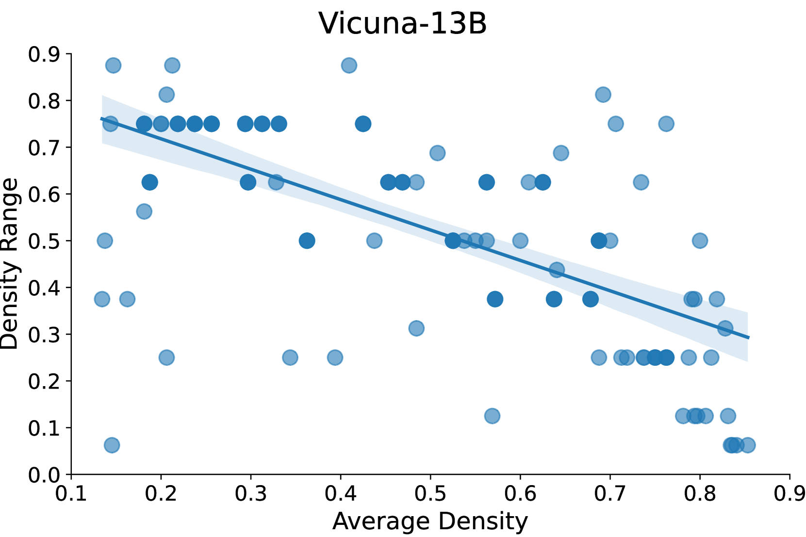

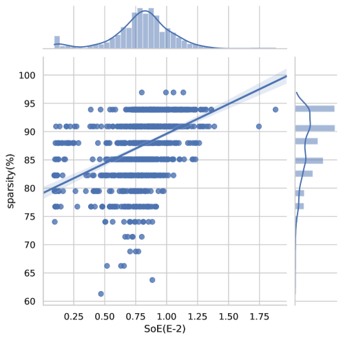

[Arxiv](https://arxiv.org/abs/2406.14909)