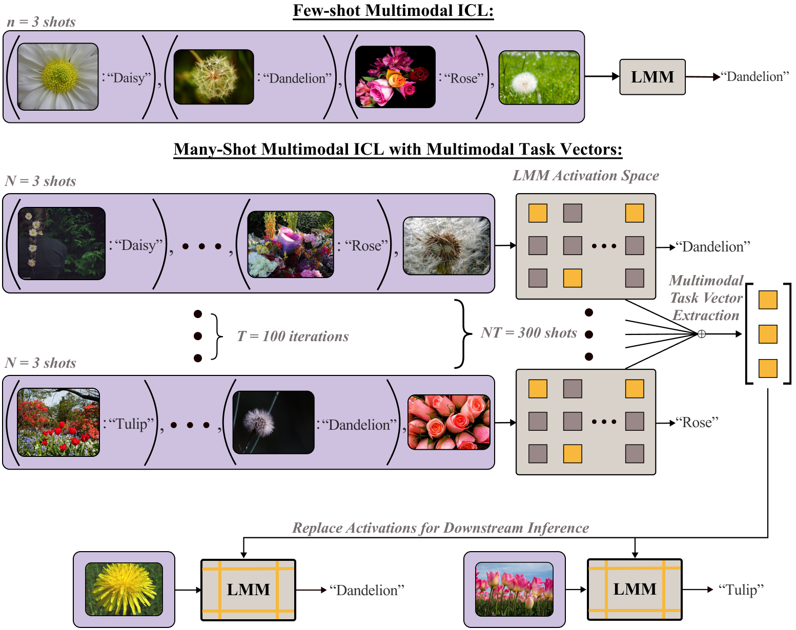
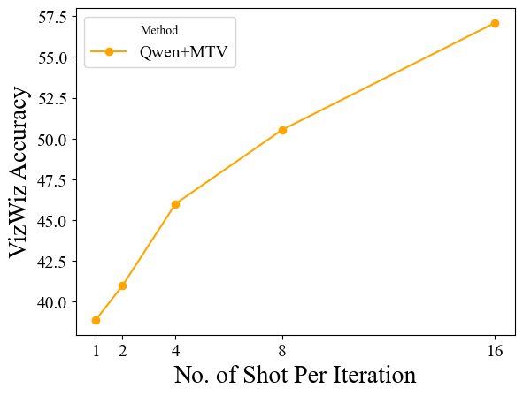
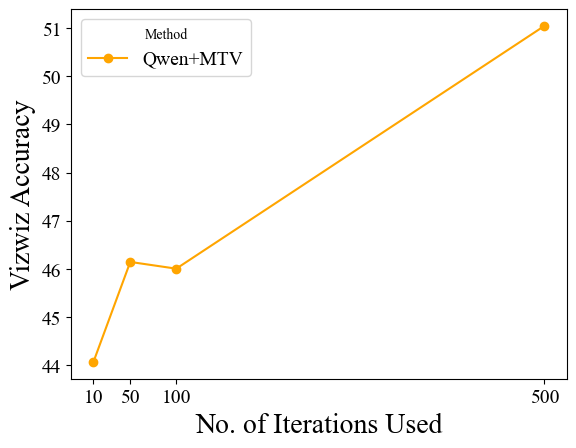
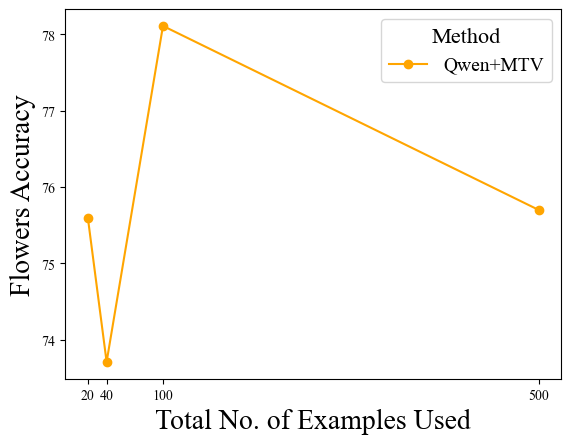

# 多模态任务向量助力实现多-shot情境下的多模态学习

发布时间：2024年06月21日

`RAG

理由：这篇论文主要关注的是多模态模型（LMMs）在少样本学习中的应用，特别是在情境学习（ICL）中如何处理多模态数据（文本与图像）的上下文长度限制问题。论文提出了一种新的方法——多模态任务向量（MTV），这是一种在模型注意力头中压缩的情境示例的紧凑隐式表示，用于提高模型在多模态、多示例情境学习中的效能。这种方法属于模型内部机制的改进，旨在增强模型的信息处理能力，而不涉及代理（Agent）的行为或LLM的理论研究，因此更适合归类为RAG（Retrieval-Augmented Generation），即通过检索增强生成模型的方式来改进模型的性能。` `多模态学习` `情境学习`

> Multimodal Task Vectors Enable Many-Shot Multimodal In-Context Learning

# 摘要

> 近期，交错大型多模态模型（LMMs）在少样本学习领域取得了显著成就，显示出通过大量示例进行情境学习（ICL）对于掌握新任务的潜力。但这一多示例多模态ICL方法面临一个根本性挑战：其效能受限于预训练阶段设定的模型上下文长度。特别是在处理文本与图像的多模态领域，这一限制尤为明显，因为需要更多标记。因此，我们迫切需要一种多模态策略，以在不微调的前提下，将多个示例精简至更少的标记。在本研究中，我们通过引入多模态任务向量（MTV）——一种在模型注意力头中压缩的情境示例的紧凑隐式表示，使LMMs能够进行多模态、多示例的情境学习。我们首先验证了LMMs中MTV的存在，并利用这些提取的MTV，为视觉与语言任务提供了多示例情境学习的能力。实验结果显示，MTV的性能随着压缩示例数量的增加而提升，并能在无需额外上下文长度的情况下，泛化至相似的域外任务。

> The recent success of interleaved Large Multimodal Models (LMMs) in few-shot learning suggests that in-context learning (ICL) with many examples can be promising for learning new tasks. However, this many-shot multimodal ICL setting has one crucial problem: it is fundamentally limited by the model's context length set at pretraining. The problem is especially prominent in the multimodal domain, which processes both text and images, requiring additional tokens. This motivates the need for a multimodal method to compress many shots into fewer tokens without finetuning. In this work, we enable LMMs to perform multimodal, many-shot in-context learning by leveraging Multimodal Task Vectors (MTV)--compact implicit representations of in-context examples compressed in the model's attention heads. Specifically, we first demonstrate the existence of such MTV in LMMs and then leverage these extracted MTV to enable many-shot in-context learning for various vision-and-language tasks. Our experiments suggest that MTV can scale in performance with the number of compressed shots and generalize to similar out-of-domain tasks without additional context length for inference.

[Arxiv](https://arxiv.org/abs/2406.15334)