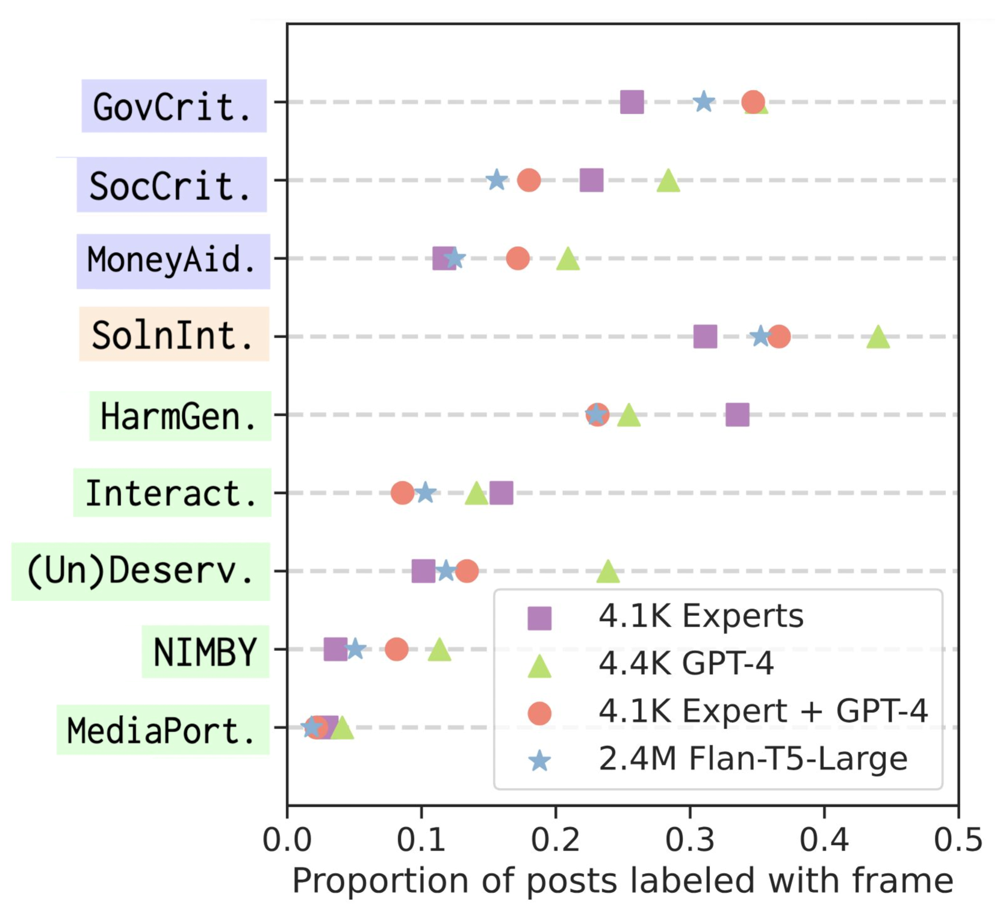

# OATH-Frames：借助LLM助手，揭示网络中对无家可归者的态度特征

发布时间：2024年06月21日

`LLM应用

理由：这篇论文主要描述了如何利用大型语言模型（LLM）来分析公众对特定社会问题的态度，具体案例是美国无家可归问题。通过开发“在线对无家可归态度（OATH）框架”，并结合LLM的能力，研究者能够高效地分析和理解大规模的社交媒体数据，从而揭示社会态度的关键趋势。这种方法展示了LLM在实际应用中的潜力，特别是在社会科学和政策分析领域。因此，这篇论文属于LLM应用类别。` `社会工作` `政策分析`

> OATH-Frames: Characterizing Online Attitudes Towards Homelessness with LLM Assistants

# 摘要

> 警告：本文内容可能引起不适。公众通过在线媒体表达的对关键社会问题的态度，对政策制定和改革至关重要，但大规模理解这些态度颇具挑战。我们以美国无家可归问题为例，利用大型语言模型的强大功能，协助社会工作专家分析了来自Twitter的数百万条帖子。我们提出了“在线对无家可归态度（OATH）框架”，这是一个包含九个层次的框架，用以捕捉批评、回应和感知。通过结合语言模型的辅助，我们发布的注释在扩展性上取得了显著成效：注释速度提升了6.5倍，而F1分数仅比领域专家低3分。实验表明，OATH框架在建模上的价值超越了现有的情感和毒性分类器。我们对240万条关于无家可归的帖子进行的大规模分析，揭示了不同州、时间段和弱势群体中态度的关键趋势，为理解这一问题提供了新的视角。我们的研究为大规模理解复杂公众态度提供了一个通用框架，不仅限于无家可归问题。

> Warning: Contents of this paper may be upsetting.
  Public attitudes towards key societal issues, expressed on online media, are of immense value in policy and reform efforts, yet challenging to understand at scale. We study one such social issue: homelessness in the U.S., by leveraging the remarkable capabilities of large language models to assist social work experts in analyzing millions of posts from Twitter. We introduce a framing typology: Online Attitudes Towards Homelessness (OATH) Frames: nine hierarchical frames capturing critiques, responses and perceptions. We release annotations with varying degrees of assistance from language models, with immense benefits in scaling: 6.5x speedup in annotation time while only incurring a 3 point F1 reduction in performance with respect to the domain experts. Our experiments demonstrate the value of modeling OATH-Frames over existing sentiment and toxicity classifiers. Our large-scale analysis with predicted OATH-Frames on 2.4M posts on homelessness reveal key trends in attitudes across states, time periods and vulnerable populations, enabling new insights on the issue. Our work provides a general framework to understand nuanced public attitudes at scale, on issues beyond homelessness.

[Arxiv](https://arxiv.org/abs/2406.14883)