# 多模态引导下的开放词汇时间动作定位研究

发布时间：2024年06月21日

`Agent

这篇论文介绍了一种名为OVFormer的新型开放词汇框架，用于开放词汇时间动作定位（OVTAL）技术。该框架通过利用大语言模型获取动作类别描述，并通过交叉注意力机制学习类别与视频帧特征的对齐，以及采用两阶段训练策略来适应新类别。这些特性使得OVFormer能够灵活地识别视频中的任何动作类别，包括在推理时出现的新类别。因此，这篇论文更符合Agent分类，因为它描述了一个能够自主执行任务并适应新情况的智能系统。` `视频分析` `动作识别`

> Open-Vocabulary Temporal Action Localization using Multimodal Guidance

# 摘要

> 开放词汇时间动作定位（OVTAL）技术使模型能够灵活识别视频中的任何动作类别，无需预先为所有类别准备训练数据。但这种灵活性也带来了挑战：模型不仅要识别训练中见过的类别，还要识别推理时出现的新类别。与传统的时间动作定位不同，OVTAL需要理解揭示新类别语义的上下文线索。为此，我们推出了OVFormer，一种创新的开放词汇框架，它通过三个关键创新扩展了ActionFormer：首先，利用任务特定提示从大语言模型获取丰富的动作类别描述；其次，通过交叉注意力机制学习类别与视频帧特征的对齐，增强多模态特征引导；最后，采用两阶段训练策略，先在大词汇量数据集上训练，再针对下游数据进行微调，以适应新类别。OVFormer将现有TAL方法扩展至开放词汇环境，并在THUMOS14和ActivityNet-1.3基准测试中展示了其有效性。相关代码和预训练模型将公开发布。

> Open-Vocabulary Temporal Action Localization (OVTAL) enables a model to recognize any desired action category in videos without the need to explicitly curate training data for all categories. However, this flexibility poses significant challenges, as the model must recognize not only the action categories seen during training but also novel categories specified at inference. Unlike standard temporal action localization, where training and test categories are predetermined, OVTAL requires understanding contextual cues that reveal the semantics of novel categories. To address these challenges, we introduce OVFormer, a novel open-vocabulary framework extending ActionFormer with three key contributions. First, we employ task-specific prompts as input to a large language model to obtain rich class-specific descriptions for action categories. Second, we introduce a cross-attention mechanism to learn the alignment between class representations and frame-level video features, facilitating the multimodal guided features. Third, we propose a two-stage training strategy which includes training with a larger vocabulary dataset and finetuning to downstream data to generalize to novel categories. OVFormer extends existing TAL methods to open-vocabulary settings. Comprehensive evaluations on the THUMOS14 and ActivityNet-1.3 benchmarks demonstrate the effectiveness of our method. Code and pretrained models will be publicly released.

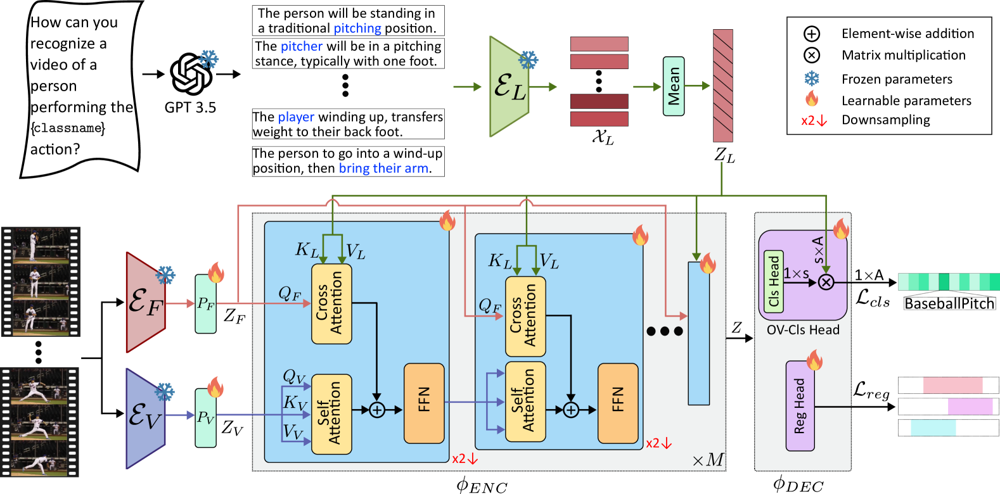

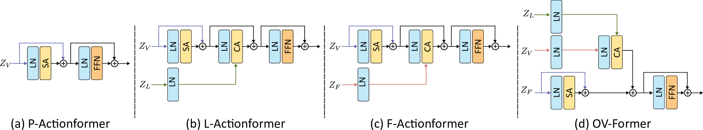

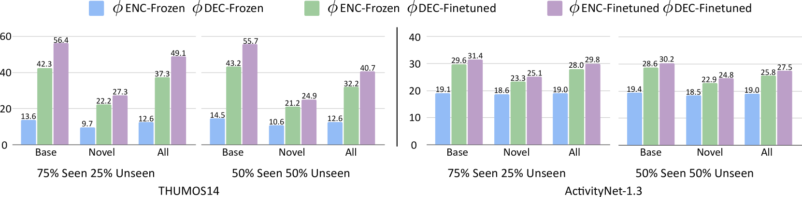

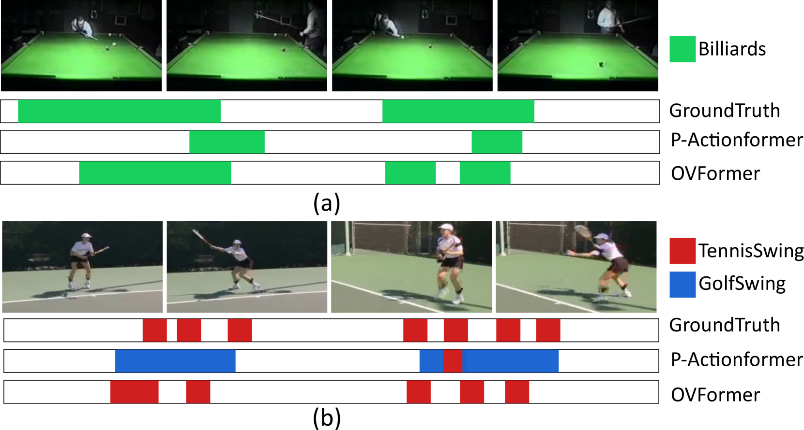

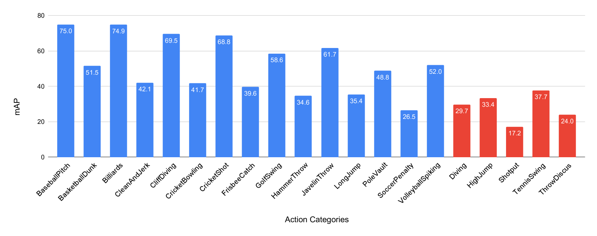

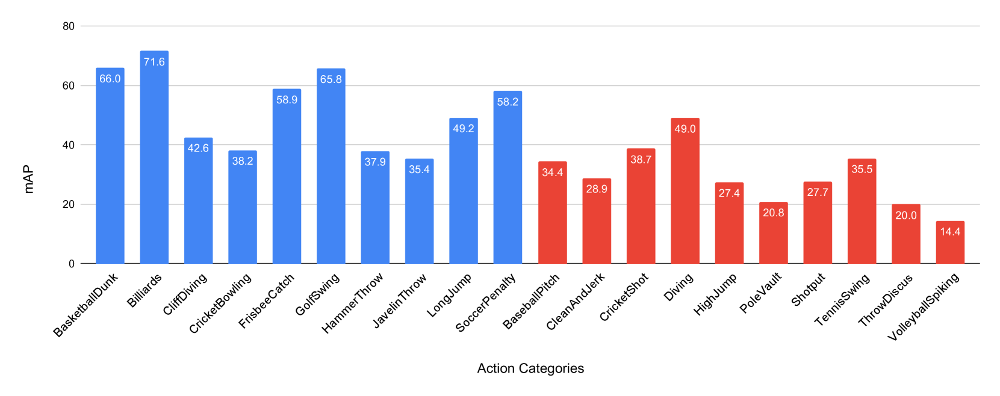

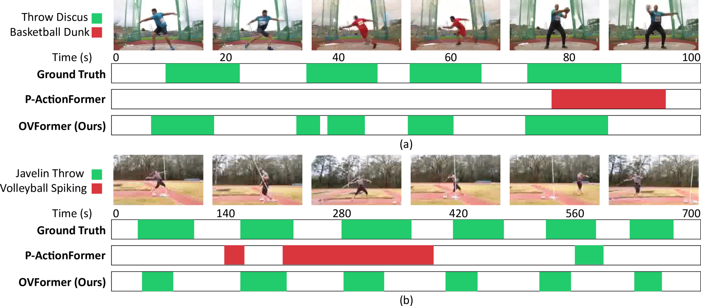

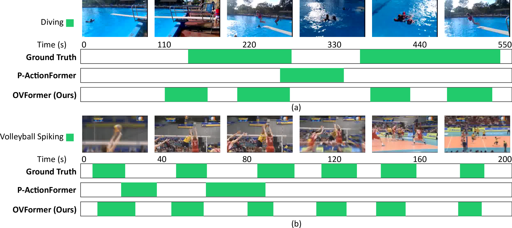

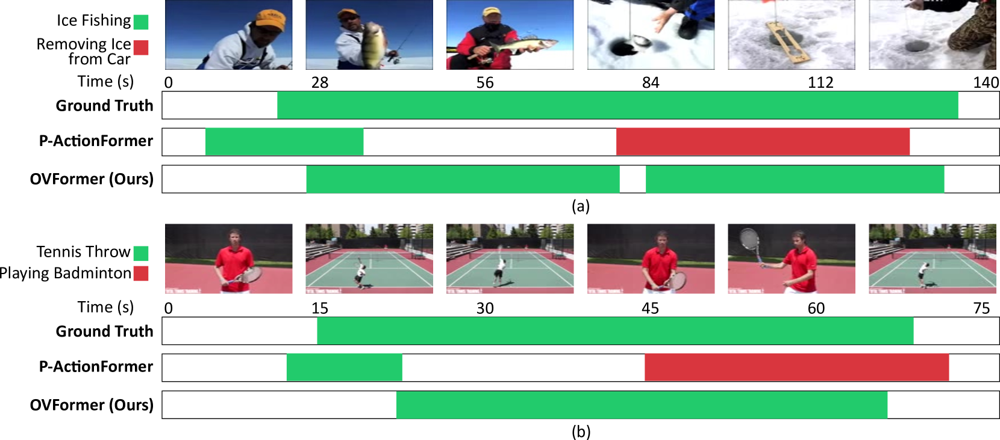

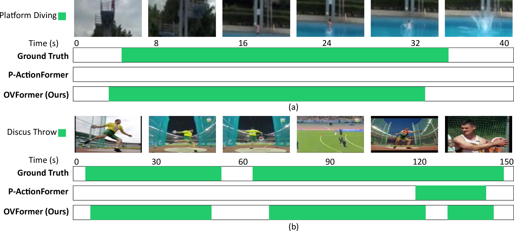

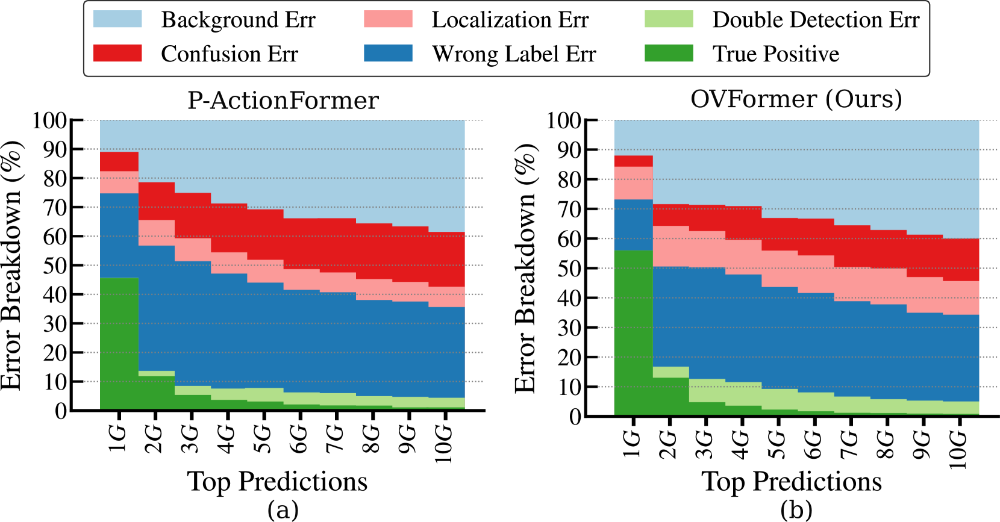

[Arxiv](https://arxiv.org/abs/2406.15556)