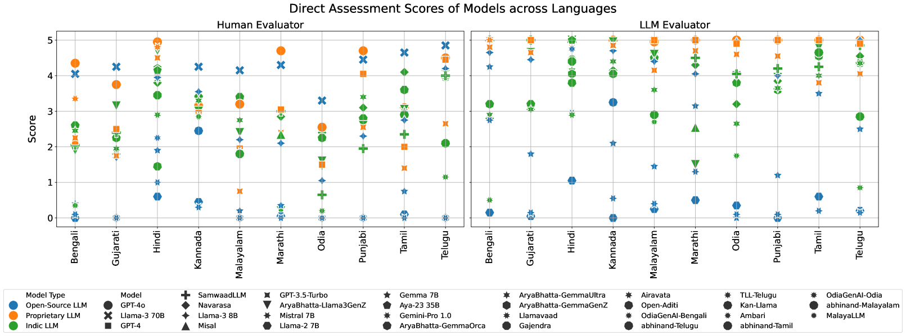

# PARIKSHA：探索多语言与多文化背景下，人类与LLM评估者之间一致性的大规模研究

发布时间：2024年06月21日

`LLM应用

这篇论文主要关注多语言大型语言模型（LLMs）的评估问题，特别是在多语言和多文化背景下的表现。研究通过对比人类评估和LLM评估的结果，探讨了模型在不同语言中的表现，并分析了评估过程中可能存在的偏见。虽然这项工作涉及模型的评估和偏见分析，但其核心在于应用层面的评估和比较，而不是深入探讨LLM的理论基础或Agent的设计与应用，也不是关于RAG（Retrieval-Augmented Generation）的具体研究。因此，将其归类为LLM应用是合适的。` `语言模型评估`

> PARIKSHA : A Large-Scale Investigation of Human-LLM Evaluator Agreement on Multilingual and Multi-Cultural Data

# 摘要

> 评估多语言大型语言模型（LLMs）面临多重挑战，如缺乏语言多样性丰富的基准、基准数据污染至预训练数据，以及翻译基准中文化细节的缺失。本研究在多语言多文化背景下，对比了人类与LLM的评估结果。通过9万次人类评估和3万次LLM评估，我们发现GPT-4o和Llama-3 70B等模型在多数印度语言中表现突出。我们为成对比较和直接评估两种场景设立了排行榜，并探讨了人类与LLM评估的一致性。结果显示，在成对比较中，两者高度一致，但在直接评估，尤其是孟加拉语和奥里亚语中，一致性有所下降。此外，我们还揭示了评估过程中的人类与LLM偏见，特别是GPT评估器中的自我偏见。这项研究标志着向大规模多语言LLMs评估迈出了重要一步。

> Evaluation of multilingual Large Language Models (LLMs) is challenging due to a variety of factors -- the lack of benchmarks with sufficient linguistic diversity, contamination of popular benchmarks into LLM pre-training data and the lack of local, cultural nuances in translated benchmarks. In this work, we study human and LLM-based evaluation in a multilingual, multi-cultural setting. We evaluate 30 models across 10 Indic languages by conducting 90K human evaluations and 30K LLM-based evaluations and find that models such as GPT-4o and Llama-3 70B consistently perform best for most Indic languages. We build leaderboards for two evaluation settings - pairwise comparison and direct assessment and analyse the agreement between humans and LLMs. We find that humans and LLMs agree fairly well in the pairwise setting but the agreement drops for direct assessment evaluation especially for languages such as Bengali and Odia. We also check for various biases in human and LLM-based evaluation and find evidence of self-bias in the GPT-based evaluator. Our work presents a significant step towards scaling up multilingual evaluation of LLMs.

[Arxiv](https://arxiv.org/abs/2406.15053)