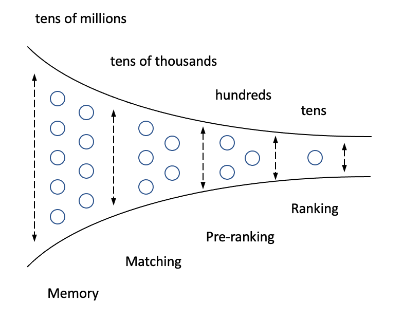
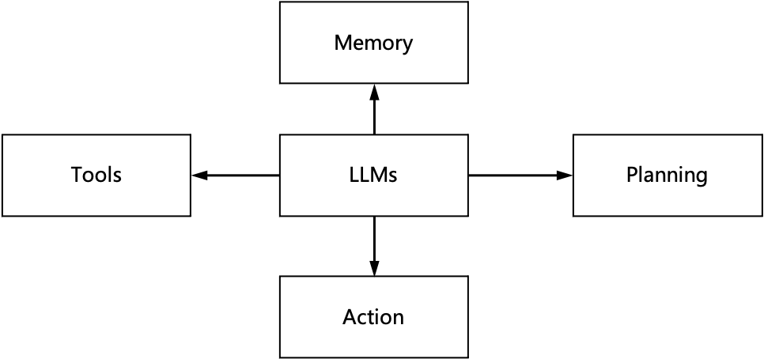
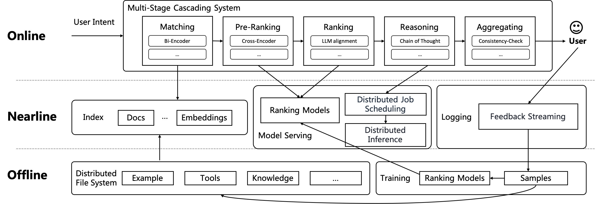

# Pistis-RAG：一款可扩展的级联框架，致力于提升检索增强生成的可信度

发布时间：2024年06月21日

`RAG` `人工智能` `信息检索`

> Pistis-RAG: A Scalable Cascading Framework Towards Trustworthy Retrieval-Augmented Generation

# 摘要

> 在希腊神话中，Pistis 代表诚信与信任，与 LLM 系统中 RAG 的核心理念相契合。Pistis-RAG 框架通过多阶段设计，有效应对大规模 RAG 挑战。各阶段分工明确：匹配精炼搜索范围，预排序聚焦语义相关文档，排序则迎合 LLM 偏好。推理与聚合阶段更支持复杂思维链方法的实施。我们指出，LLM 与外部知识排序间的弱关联，源于 RAG 框架的模型中心倾向。而内容中心策略则强调 LLM 与外部信息的无缝融合，优化任务特定内容转换。我们的排序阶段创新性地认识到，仅凭语义相关性未必能提升生成质量，这一洞察基于少数样本提示顺序的敏感性。为此，我们设计了专为 RAG 系统定制的排序阶段，兼顾信息检索原则与 LLM 偏好及用户反馈。通过整合上下文学习与推理步骤，确保用户反馈的有效融入，实现高效对齐。MMLU 基准测试显示性能提升 9.3%，模型与代码将开源。大规模实际数据实验证实了框架的可扩展性。

> In Greek mythology, Pistis symbolized good faith, trust, and reliability, echoing the core principles of RAG in LLM systems. Pistis-RAG, a scalable multi-stage framework, effectively addresses the challenges of large-scale retrieval-augmented generation (RAG). Each stage plays a distinct role: matching refines the search space, pre-ranking prioritizes semantically relevant documents, and ranking aligns with the large language model's (LLM) preferences. The reasoning and aggregating stage supports the implementation of complex chain-of-thought (CoT) methods within this cascading structure. We argue that the lack of strong alignment between LLMs and the external knowledge ranking methods used in RAG tasks is relevant to the reliance on the model-centric paradigm in RAG frameworks. A content-centric approach would prioritize seamless integration between the LLMs and external information sources, optimizing the content transformation process for each specific task. Critically, our ranking stage deviates from traditional RAG approaches by recognizing that semantic relevance alone may not directly translate to improved generation. This is due to the sensitivity of the few-shot prompt order, as highlighted in prior work \cite{lu2021fantastically}. Current RAG frameworks fail to account for this crucial factor. We introduce a novel ranking stage specifically designed for RAG systems. It adheres to information retrieval principles while considering the unique business scenario captured by LLM preferences and user feedback. Our approach integrates in-context learning (ICL) methods and reasoning steps to incorporate user feedback, ensuring efficient alignment. Experiments on the MMLU benchmark demonstrate a 9.3\% performance improvement. The model and code will be open-sourced on GitHub. Experiments on real-world, large-scale data validate our framework's scalability.

[Arxiv](https://arxiv.org/abs/2407.00072)