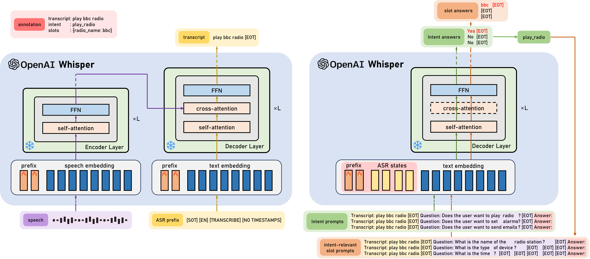
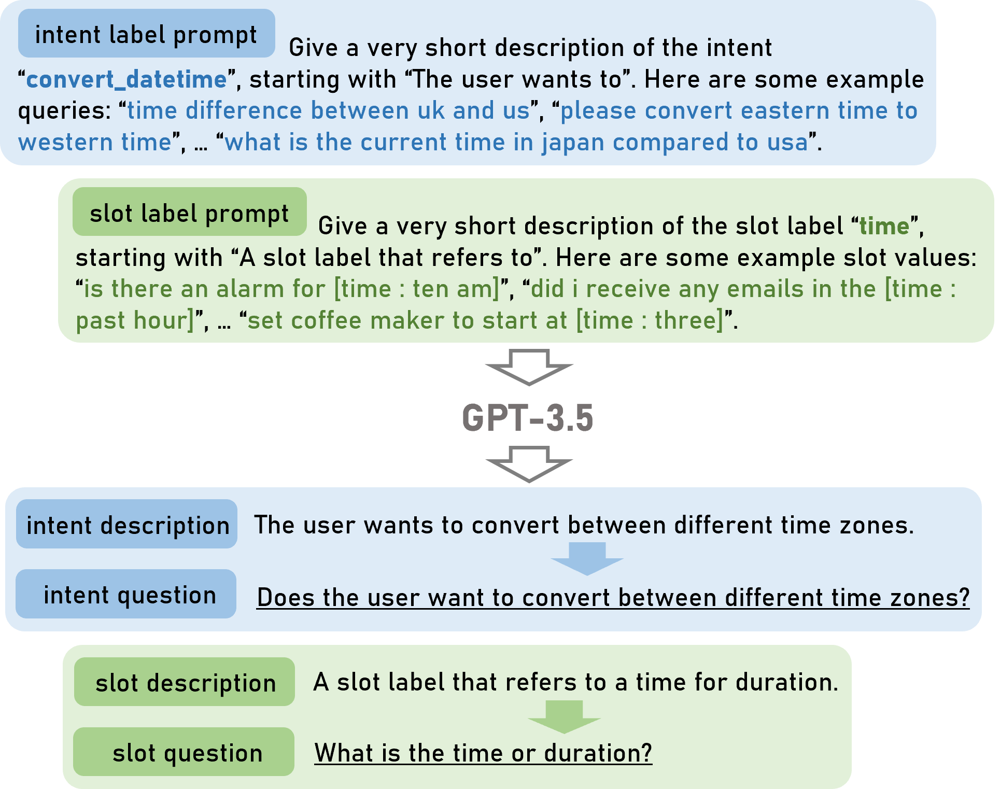

# 借助 Whisper，实现零-shot 问答驱动的端到端口语理解

发布时间：2024年06月21日

`Agent

这篇论文主要介绍了一种零-shot口语理解技术（SLU），通过使用独立的语音处理模型Whisper实现了端到端的SLU，并能够在没有预先训练的情况下理解新领域中的用户话语。该系统通过问答框架处理未知语义标签，引导Whisper解码器进行语义推断，并通过前缀调整优化少量参数，从而在性能和模型参数方面都有所改进。这种技术可以被视为一种智能代理（Agent），因为它能够处理和理解用户的语音输入，并作出相应的响应。因此，这篇论文适合归类在Agent分类中。` `语音识别`

> Prompting Whisper for QA-driven Zero-shot End-to-end Spoken Language Understanding

# 摘要

> 零-shot 口语理解技术 (SLU) 让系统无需预先训练即可理解新领域中的用户话语。本文采用 Whisper 这一独立语音处理模型，实现了零-shot 端到端 SLU，并通过问答框架处理未知语义标签，引导 Whisper 解码器进行语义推断。通过前缀调整优化少量参数，而非整个模型，系统在 SLURP 数据集上的槽填充性能提升了 40.7%，且在语料库内和跨语料库评估中与 Whisper-GPT-2 系统表现相当，同时模型参数减少了 34.8%。

> Zero-shot spoken language understanding (SLU) enables systems to comprehend user utterances in new domains without prior exposure to training data. Recent studies often rely on large language models (LLMs), leading to excessive footprints and complexity. This paper proposes the use of Whisper, a standalone speech processing model, for zero-shot end-to-end (E2E) SLU. To handle unseen semantic labels, SLU tasks are integrated into a question-answering (QA) framework, which prompts the Whisper decoder for semantics deduction. The system is efficiently trained with prefix-tuning, optimising a minimal set of parameters rather than the entire Whisper model. We show that the proposed system achieves a 40.7% absolute gain for slot filling (SLU-F1) on SLURP compared to a recently introduced zero-shot benchmark. Furthermore, it performs comparably to a Whisper-GPT-2 modular system under both in-corpus and cross-corpus evaluation settings, but with a relative 34.8% reduction in model parameters.

[Arxiv](https://arxiv.org/abs/2406.15209)