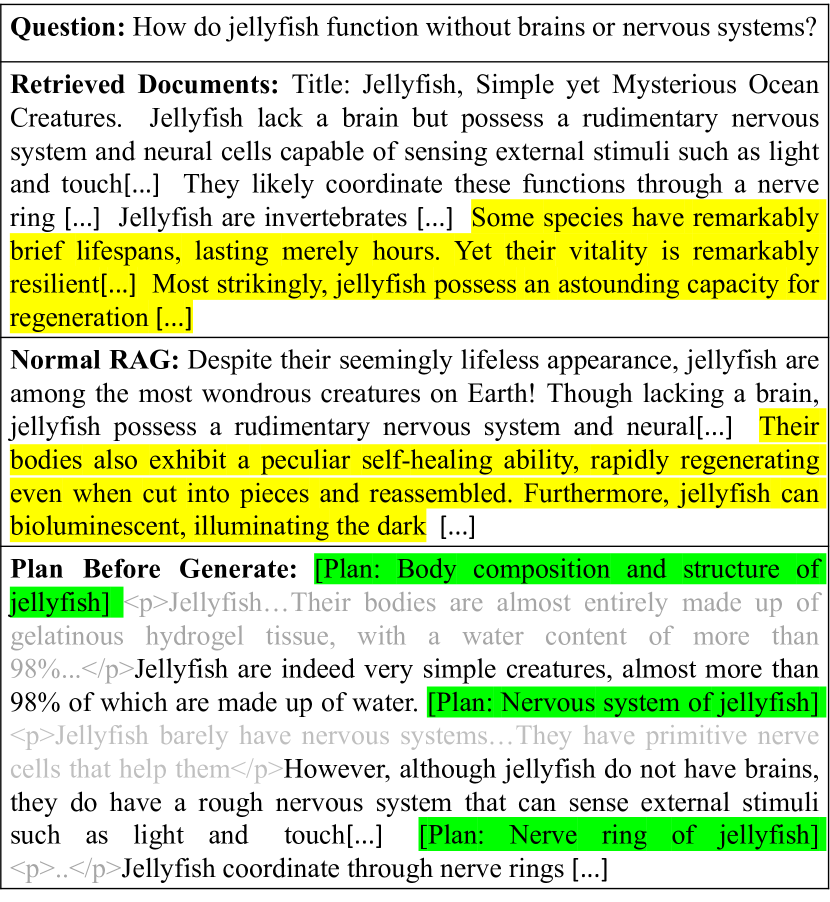
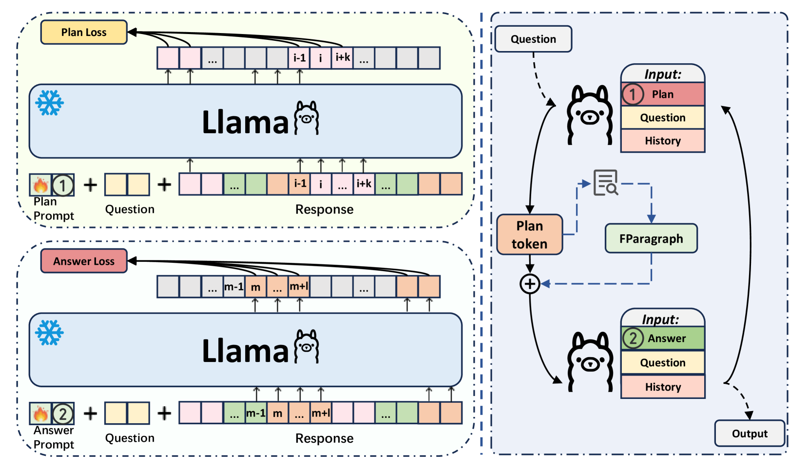
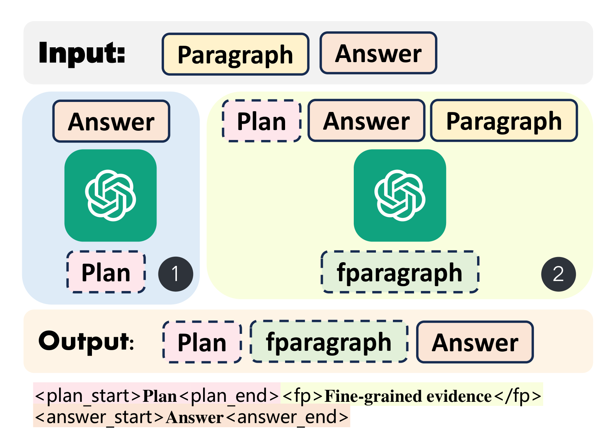
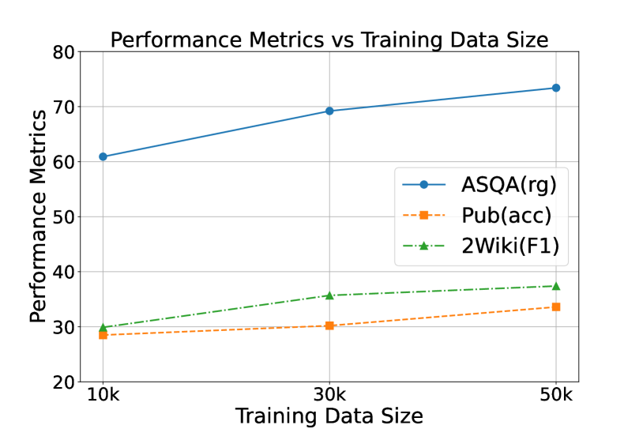

# 知识密集型 LLM 生成的迭代规划与回答框架：Retrieve-Plan-Generation

发布时间：2024年06月21日

`RAG

这篇论文主要讨论了检索增强生成（RAG）方法在大型语言模型（LLMs）中的应用，特别是在处理事实错误和提高生成内容相关性方面的改进。通过引入检索-规划-生成（RPG）框架，论文提出了一种新的方法来优化检索过程，确保生成的内容更加相关和准确。这与RAG的分类相符，因为它专注于通过检索和生成过程的改进来增强LLMs的性能。` `知识密集型任务`

> Retrieve-Plan-Generation: An Iterative Planning and Answering Framework for Knowledge-Intensive LLM Generation

# 摘要

> 大型语言模型（LLMs）虽在多任务中取得显著进步，却常因内部知识局限而产生事实错误。检索增强生成（RAG）通过引入外部知识源，为解决此问题提供了新思路。但这些方法易受检索文档中无关段落的影响。LLM生成的不确定性可能导致输入整个文档时引入离题信息，使模型偏离主题，降低生成内容的相关性。为此，我们提出检索-规划-生成（RPG）框架，通过生成计划令牌在规划阶段指导后续生成，并在回答阶段根据计划精选相关段落，用于进一步回答生成。此过程迭代进行，直至完成，专注于特定主题以提升生成相关性。我们采用了一种高效的多任务提示调优方法，使现有LLMs能同时处理规划与回答，并在五个知识密集型任务上验证了RPG的有效性。

> Despite the significant progress of large language models (LLMs) in various tasks, they often produce factual errors due to their limited internal knowledge. Retrieval-Augmented Generation (RAG), which enhances LLMs with external knowledge sources, offers a promising solution. However, these methods can be misled by irrelevant paragraphs in retrieved documents. Due to the inherent uncertainty in LLM generation, inputting the entire document may introduce off-topic information, causing the model to deviate from the central topic and affecting the relevance of the generated content. To address these issues, we propose the Retrieve-Plan-Generation (RPG) framework. RPG generates plan tokens to guide subsequent generation in the plan stage. In the answer stage, the model selects relevant fine-grained paragraphs based on the plan and uses them for further answer generation. This plan-answer process is repeated iteratively until completion, enhancing generation relevance by focusing on specific topics. To implement this framework efficiently, we utilize a simple but effective multi-task prompt-tuning method, enabling the existing LLMs to handle both planning and answering. We comprehensively compare RPG with baselines across 5 knowledge-intensive generation tasks, demonstrating the effectiveness of our approach.

[Arxiv](https://arxiv.org/abs/2406.14979)