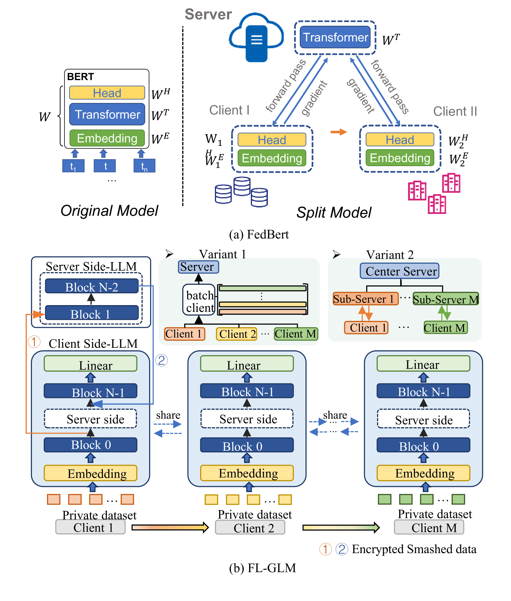
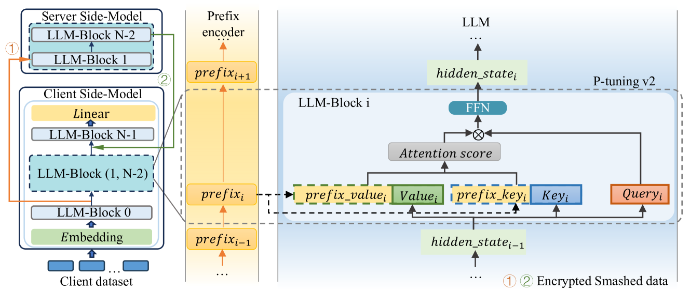
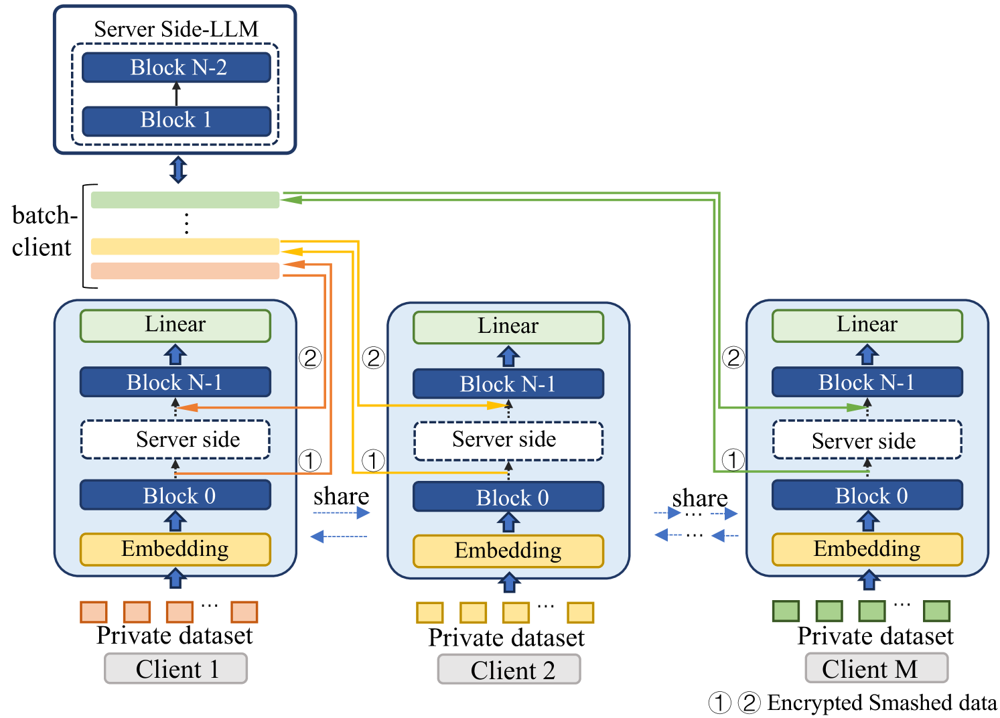
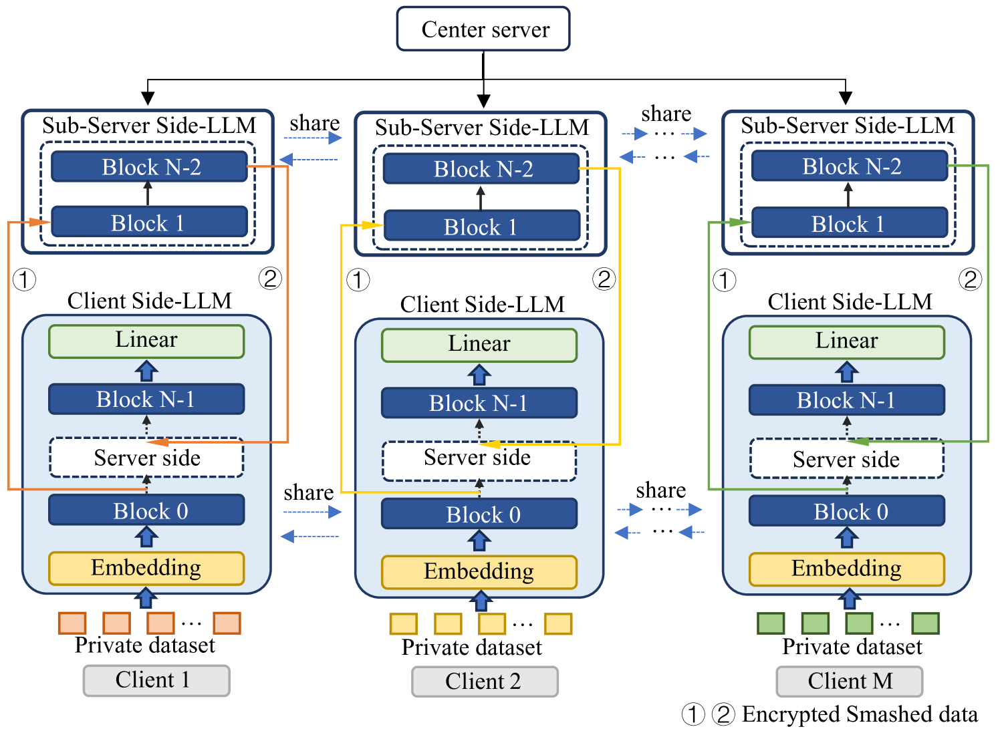
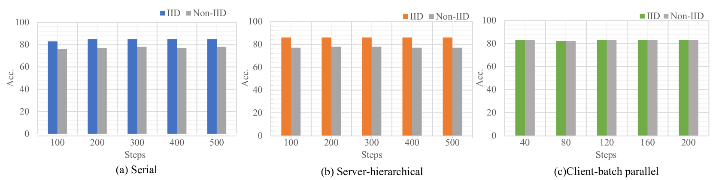
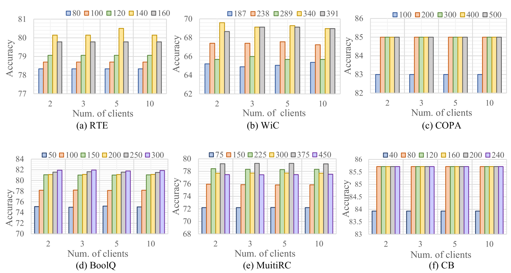
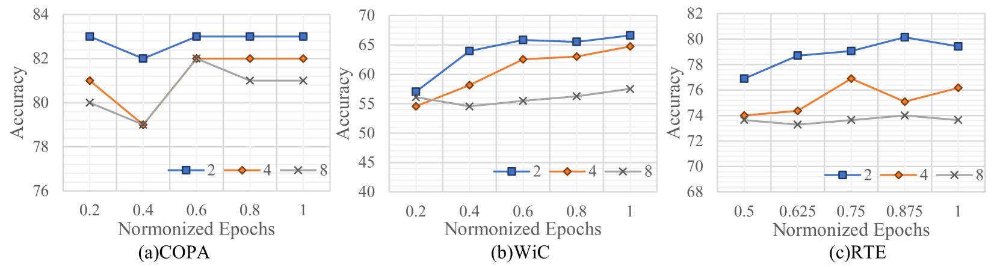
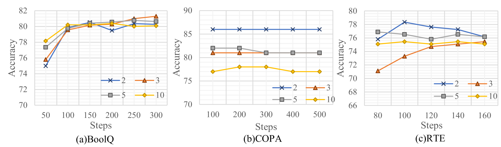

# 保护隐私的数据学习：大型语言模型的联邦学习新框架

发布时间：2024年06月21日

`LLM应用

这篇论文主要探讨了如何通过联邦学习（FL）框架来安全有效地训练大型语言模型（LLM），特别是在处理分散存储的私有数据时。论文提出的FL-GLM框架解决了传统联邦学习方法在处理LLM时的不足，通过优化客户端和服务器之间的交互，提高了训练的安全性和效率。这种方法直接应用于LLM的训练过程中，因此属于LLM应用类别。` `联邦学习`

> Safely Learning with Private Data: A Federated Learning Framework for Large Language Model

# 摘要

> 私有数据因其规模与质量的优势，对大型语言模型（LLM）的提升效果显著。但隐私问题导致这些数据分散存储，安全用于LLM训练成为难题。联邦学习（FL）虽是利用分散私有数据的理想方案，但传统如FedAvg的框架因对客户端计算要求高而不适于LLM。分割学习则将多数训练参数转移至服务器，本地仅处理嵌入与输出层，更匹配LLM需求。然而，它在安全与效率上仍面临挑战：嵌入梯度易受攻击，可能泄露私有数据；服务器一次仅能响应一个客户端请求，限制了并行训练，大幅降低效率。本文提出的FL-GLM框架，通过在客户端部署输入输出块防御服务器攻击，通信加密抵御同行客户端逆向工程，并根据服务器能力优化加速策略，有效提升了LLM的训练安全与效率。实验证明，FL-GLM在NLU与生成任务上与集中式chatGLM表现相当，验证了该联邦学习框架的成效。

> Private data, being larger and quality-higher than public data, can greatly improve large language models (LLM). However, due to privacy concerns, this data is often dispersed in multiple silos, making its secure utilization for LLM training a challenge. Federated learning (FL) is an ideal solution for training models with distributed private data, but traditional frameworks like FedAvg are unsuitable for LLM due to their high computational demands on clients. An alternative, split learning, offloads most training parameters to the server while training embedding and output layers locally, making it more suitable for LLM. Nonetheless, it faces significant challenges in security and efficiency. Firstly, the gradients of embeddings are prone to attacks, leading to potential reverse engineering of private data. Furthermore, the server's limitation of handle only one client's training request at a time hinders parallel training, severely impacting training efficiency. In this paper, we propose a Federated Learning framework for LLM, named FL-GLM, which prevents data leakage caused by both server-side and peer-client attacks while improving training efficiency. Specifically, we first place the input block and output block on local client to prevent embedding gradient attacks from server. Secondly, we employ key-encryption during client-server communication to prevent reverse engineering attacks from peer-clients. Lastly, we employ optimization methods like client-batching or server-hierarchical, adopting different acceleration methods based on the actual computational capabilities of the server. Experimental results on NLU and generation tasks demonstrate that FL-GLM achieves comparable metrics to centralized chatGLM model, validating the effectiveness of our federated learning framework.

[Arxiv](https://arxiv.org/abs/2406.14898)