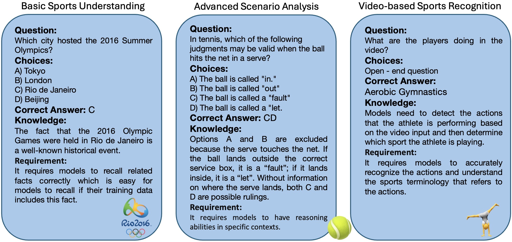
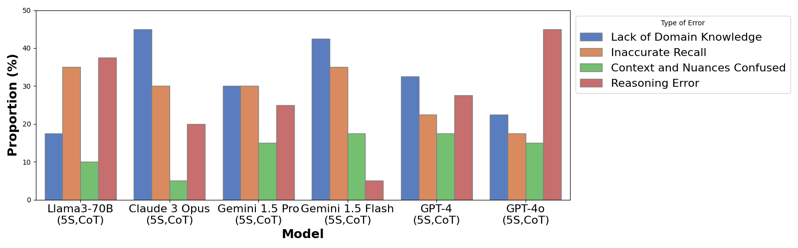
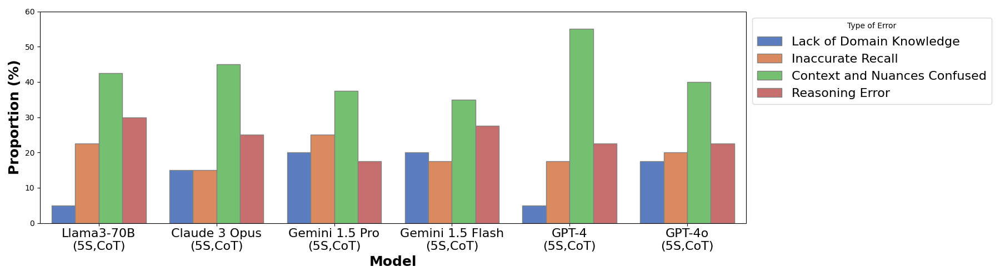
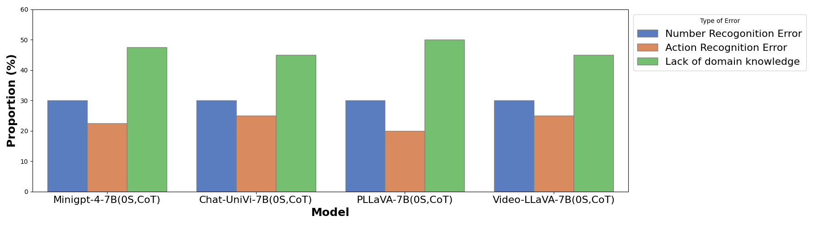

# 体育智能探索：通过问题回答，从文本到视频，全面评估语言模型对体育知识的理解深度。

发布时间：2024年06月21日

`LLM应用

这篇论文主要探讨了大型语言模型（LLM）在体育领域的应用，特别是在处理复杂体育场景时的表现和挑战。论文通过评估LLM在多样的体育任务上的性能，包括基础规则和历史事实的查询以及依赖情境的复杂推理，展示了LLM在体育理解上的应用潜力和存在的问题。此外，论文还涉及了视频语言模型在体育推理上的应用，并提出了新的基准和错误分析，以指导未来的研究方向。因此，这篇论文更符合LLM应用的分类。`

> Sports Intelligence: Assessing the Sports Understanding Capabilities of Language Models through Question Answering from Text to Video

# 摘要

> 体育的复杂动态特性使其成为推动自然语言处理（NLP）进步的不可或缺因素。当前NLP技术在处理复杂体育场景时面临挑战，这需要先进的认知能力。为了克服现有体育理解基准的不足，我们对主流大型语言模型在多样的体育任务上进行了深入评估，从基础规则和历史事实的简单查询到依赖情境的复杂推理，运用了零-shot至少-shot学习及思维链技术。此外，我们还评估了视频语言模型在体育推理上的表现，以填补多模态体育理解基准的空白。我们的研究揭示了NLP在体育理解上的关键挑战，并基于现有体育数据集提出了新基准，进行了详尽的错误分析，旨在为该领域的未来研究指明方向。

> Understanding sports is crucial for the advancement of Natural Language Processing (NLP) due to its intricate and dynamic nature. Reasoning over complex sports scenarios has posed significant challenges to current NLP technologies which require advanced cognitive capabilities. Toward addressing the limitations of existing benchmarks on sports understanding in the NLP field, we extensively evaluated mainstream large language models for various sports tasks. Our evaluation spans from simple queries on basic rules and historical facts to complex, context-specific reasoning, leveraging strategies from zero-shot to few-shot learning, and chain-of-thought techniques. In addition to unimodal analysis, we further assessed the sports reasoning capabilities of mainstream video language models to bridge the gap in multimodal sports understanding benchmarking. Our findings highlighted the critical challenges of sports understanding for NLP. We proposed a new benchmark based on a comprehensive overview of existing sports datasets and provided extensive error analysis which we hope can help identify future research priorities in this field.

[Arxiv](https://arxiv.org/abs/2406.14877)