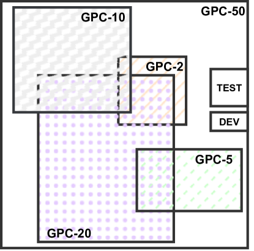
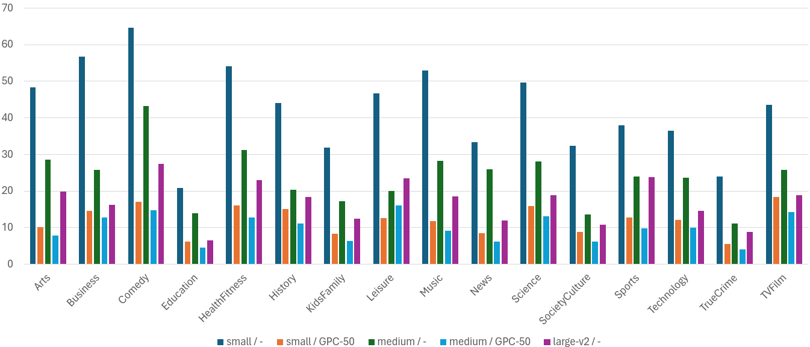
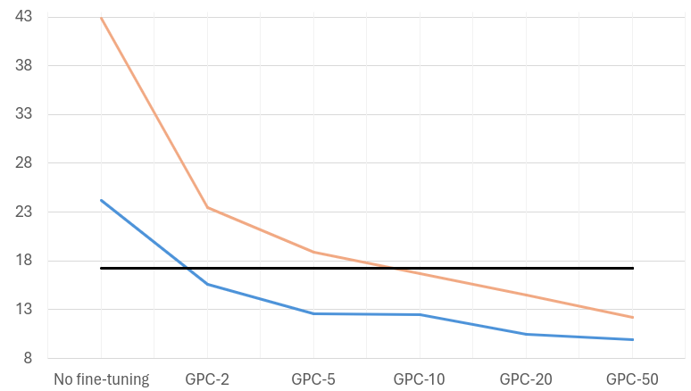

# 希腊播客语料库：借助弱监督数据，为资源有限的语言打造卓越语音模型

发布时间：2024年06月21日

`Agent

理由：这篇论文主要关注的是如何利用弱监督技术从播客中提取数据，以扩充资源有限的语言的语音技术。它描述了一个具体的实验过程，即使用Whisper large-v3模型从800小时的现代希腊语播客中生成转录文本，并微调模型以提升自动语音识别（ASR）性能。这个过程涉及到数据收集、模型训练和性能评估，这些都是Agent（代理）在执行任务时的典型行为。虽然这项工作涉及到了大型模型（LLM）的应用，但其核心在于通过技术手段解决特定问题（资源有限语言的语音技术发展），而不是探讨LLM的理论或应用，因此不属于LLM应用或LLM理论分类。同时，这项工作也不涉及RAG（检索增强生成）的相关技术或应用。` `语音识别` `语言技术`

> The Greek podcast corpus: Competitive speech models for low-resourced languages with weakly supervised data

# 摘要

> 在数字资源有限的语言中，语音技术的进步可能会因数据稀缺而受阻。特别是在大数据模型盛行的今天，这一挑战愈发严峻。近期研究指出，弱监督技术可能是扩充数据资源的有效途径。本研究从播客中整理出800小时的现代希腊语语料，借助Whisper large-v3模型生成初步转录文本。我们利用这些资源微调模型，以验证此方法能否有效提升ASR性能。研究覆盖了16个播客领域，并与现代希腊语的标准数据集进行了对比评估。结果显示，随着数据量和模型规模的增加，误识率稳步下降。这表明，构建大型弱监督语料库是推动资源有限语言语音技术发展的经济高效策略。

> The development of speech technologies for languages with limited digital representation poses significant challenges, primarily due to the scarcity of available data. This issue is exacerbated in the era of large, data-intensive models. Recent research has underscored the potential of leveraging weak supervision to augment the pool of available data. In this study, we compile an 800-hour corpus of Modern Greek from podcasts and employ Whisper large-v3 to generate silver transcriptions. This corpus is utilized to fine-tune our models, aiming to assess the efficacy of this approach in enhancing ASR performance. Our analysis spans 16 distinct podcast domains, alongside evaluations on established datasets for Modern Greek. The findings indicate consistent WER improvements, correlating with increases in both data volume and model size. Our study confirms that assembling large, weakly supervised corpora serves as a cost-effective strategy for advancing speech technologies in under-resourced languages.

[Arxiv](https://arxiv.org/abs/2406.15284)