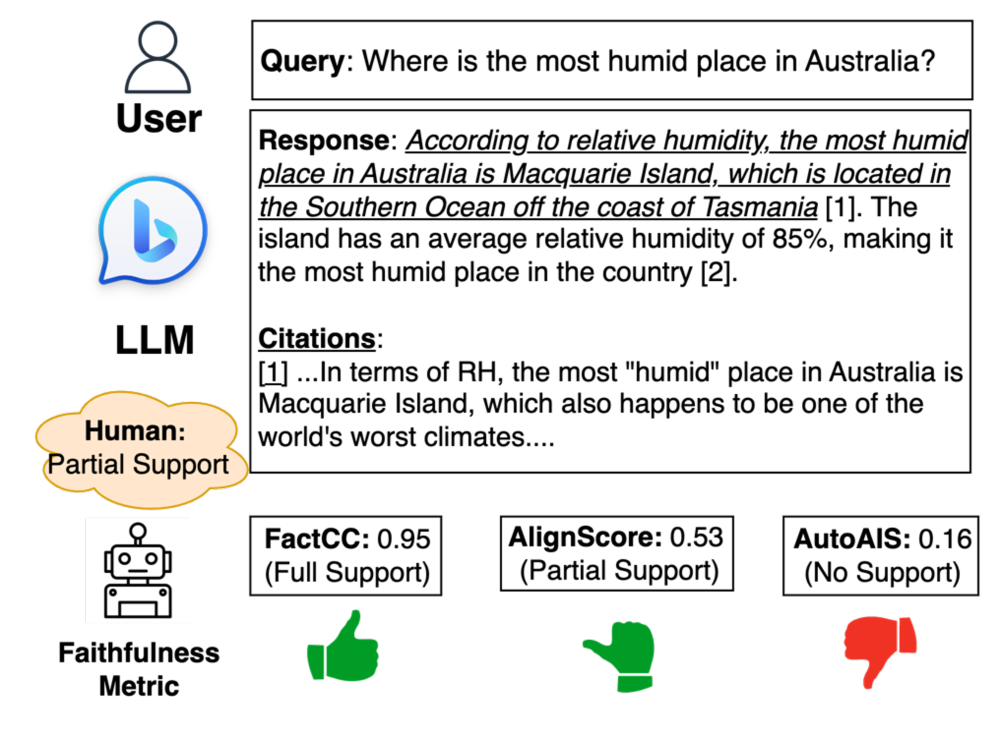
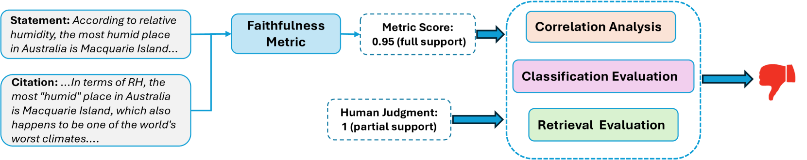
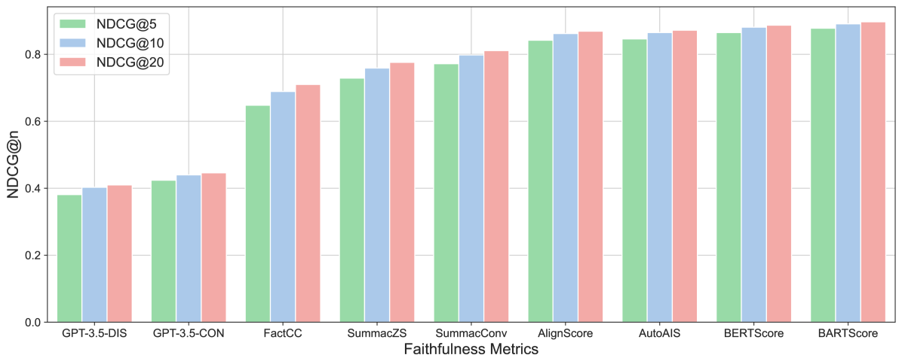

# 探索生成文本中细粒度的引用评估：忠实度度量的比较研究

发布时间：2024年06月21日

`LLM理论

这篇论文主要探讨了大型语言模型（LLMs）在产生“幻觉”问题时的引用支持程度评估，并提出了一种新的评估框架来区分不同级别的支持水平。这涉及到对LLMs理论层面的深入分析和评估方法的改进，因此属于LLM理论分类。` `信息检索`

> Towards Fine-Grained Citation Evaluation in Generated Text: A Comparative Analysis of Faithfulness Metrics

# 摘要

> 大型语言模型（LLMs）常产生“幻觉”，即无法证实或验证的信息。为此，增强检索的LLMs通过引用可验证来源来稳固内容。然而，如何手动评估引用对陈述的支持程度仍是一大挑战。以往研究虽用忠实度指标自动评估，但仅限于二元分类，忽视了实际场景中的细粒度支持。我们提出了一种比较评估框架，旨在评估忠实度指标在区分三种支持水平（完全、部分和无支持）时的有效性，并通过相关性分析、分类评估和检索评估来全面衡量指标与人类判断的一致性。结果表明，没有单一指标在所有评估中始终领先，凸显了评估细粒度支持的复杂性。基于此，我们提供了开发更有效指标的实用建议。

> Large language models (LLMs) often produce unsupported or unverifiable information, known as "hallucinations." To mitigate this, retrieval-augmented LLMs incorporate citations, grounding the content in verifiable sources. Despite such developments, manually assessing how well a citation supports the associated statement remains a major challenge. Previous studies use faithfulness metrics to estimate citation support automatically but are limited to binary classification, overlooking fine-grained citation support in practical scenarios. To investigate the effectiveness of faithfulness metrics in fine-grained scenarios, we propose a comparative evaluation framework that assesses the metric effectiveness in distinguishinging citations between three-category support levels: full, partial, and no support. Our framework employs correlation analysis, classification evaluation, and retrieval evaluation to measure the alignment between metric scores and human judgments comprehensively. Our results show no single metric consistently excels across all evaluations, revealing the complexity of assessing fine-grained support. Based on the findings, we provide practical recommendations for developing more effective metrics.

[Arxiv](https://arxiv.org/abs/2406.15264)