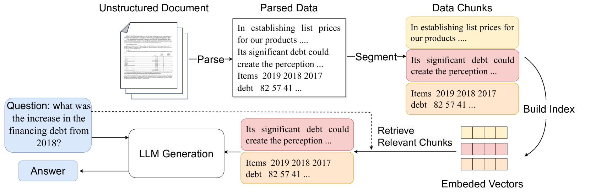
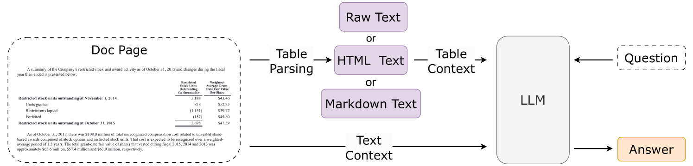
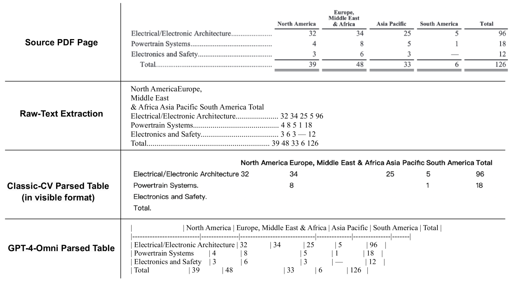
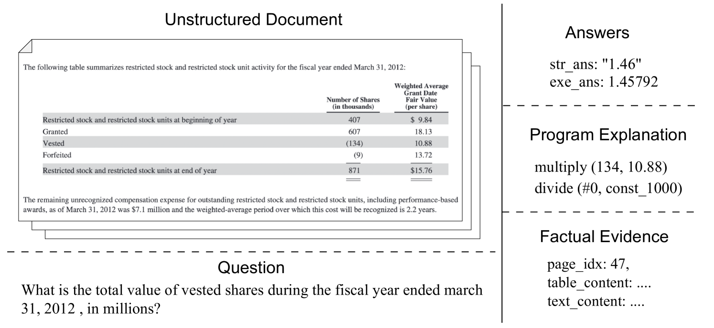

# UDA：现实世界文档分析中检索增强生成能力的基准套件在

发布时间：2024年06月21日

`RAG

理由：这篇论文主要关注的是RAG（Retrieval-Augmented Generation）技术在处理复杂数据格式（如HTML和PDF）中的应用，特别是在学术文献和金融问答领域的应用。论文介绍了Unstructured Document Analysis (UDA) 基准套件，并评估了基于LLM和RAG的文档分析方案。这表明论文的核心内容是关于RAG技术的应用和改进，因此最适合归类为RAG。` `学术文献`

> UDA: A Benchmark Suite for Retrieval Augmented Generation in Real-world Document Analysis

# 摘要

> RAG 技术提升了 LLMs 与外部数据的协作效率，但面对现实世界的复杂场景，挑战依旧显著。特别是在学术文献和金融问答领域，数据常隐藏在 HTML 或 PDF 格式的原始文本和表格中，这些数据既冗长又结构混乱。为此，我们推出了 Unstructured Document Analysis (UDA) 基准套件，包含 2,965 份真实文档和 29,590 对专家标注的问答。我们重新评估了基于 LLM 和 RAG 的文档分析方案，在多个领域和各类查询中检验了设计决策与答案质量。评估结果揭示了数据解析与检索的关键性。我们期待 UDA 基准能为实际文档分析应用提供新的视角和助力。相关资源已发布于 https://github.com/qinchuanhui/UDA-Benchmark。

> The use of Retrieval-Augmented Generation (RAG) has improved Large Language Models (LLMs) in collaborating with external data, yet significant challenges exist in real-world scenarios. In areas such as academic literature and finance question answering, data are often found in raw text and tables in HTML or PDF formats, which can be lengthy and highly unstructured. In this paper, we introduce a benchmark suite, namely Unstructured Document Analysis (UDA), that involves 2,965 real-world documents and 29,590 expert-annotated Q&A pairs. We revisit popular LLM- and RAG-based solutions for document analysis and evaluate the design choices and answer qualities across multiple document domains and diverse query types. Our evaluation yields interesting findings and highlights the importance of data parsing and retrieval. We hope our benchmark can shed light and better serve real-world document analysis applications. The benchmark suite and code can be found at https://github.com/qinchuanhui/UDA-Benchmark.

[Arxiv](https://arxiv.org/abs/2406.15187)