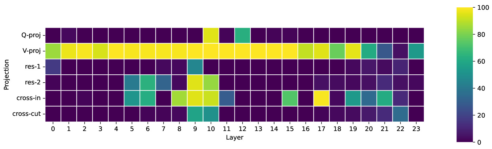

# 揭示低秩适配器间的全球协同潜力

发布时间：2024年06月21日

`LLM理论

理由：这篇论文介绍了HeteroLoRA算法，这是一种针对大型语言模型（LLM）的参数高效微调技术。论文的核心贡献在于提出了一种新的微调方法，该方法通过优化参数分配来提高模型的性能。这属于对LLM进行理论上的改进和优化，因此归类为LLM理论。虽然该技术可能最终应用于实际的LLM模型中，但其主要贡献在于理论和方法的创新，而非直接的应用案例。` `模型微调`

> Unlocking the Global Synergies in Low-Rank Adapters

# 摘要

> LoRA 作为大型语言模型的参数高效微调技术，已广受认可。我们开发的 HeteroLoRA 算法，通过零成本代理，巧妙地在模型中分配有限的 LoRA 参数，显著提升了微调效果。不仅优化了标准 LoRA 模型的参数分配，HeteroLoRA 还在包含 LoRA 模块及快捷连接的复杂搜索空间中展现了其优越性。实验结果显示，在保持参数预算不变的情况下，HeteroLoRA 在 MRPC 数据集上将准确率提升了 1.6%。我们计划在论文被接受后，公开这一算法。

> Low-rank Adaption (LoRA) has been the de-facto parameter-efficient fine-tuning technique for large language models. We present HeteroLoRA, a light-weight search algorithm that leverages zero-cost proxies to allocate the limited LoRA trainable parameters across the model for better fine-tuned performance. In addition to the allocation for the standard LoRA-adapted models, we also demonstrate the efficacy of HeteroLoRA by performing the allocation in a more challenging search space that includes LoRA modules and LoRA-adapted shortcut connections. Experiments show that HeteroLoRA enables improvements in model performance given the same parameter budge. For example, on MRPC, we see an improvement of 1.6% in accuracy with similar training parameter budget. We will open-source our algorithm once the paper is accepted.

[Arxiv](https://arxiv.org/abs/2406.14956)