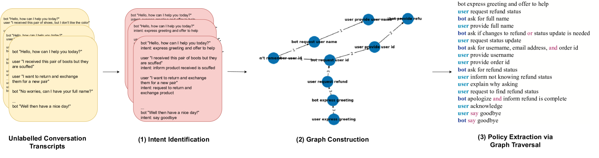
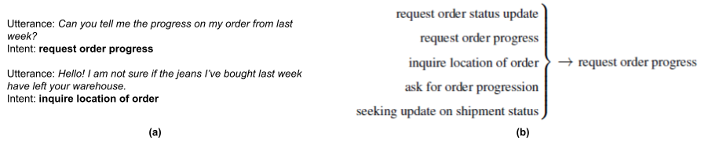
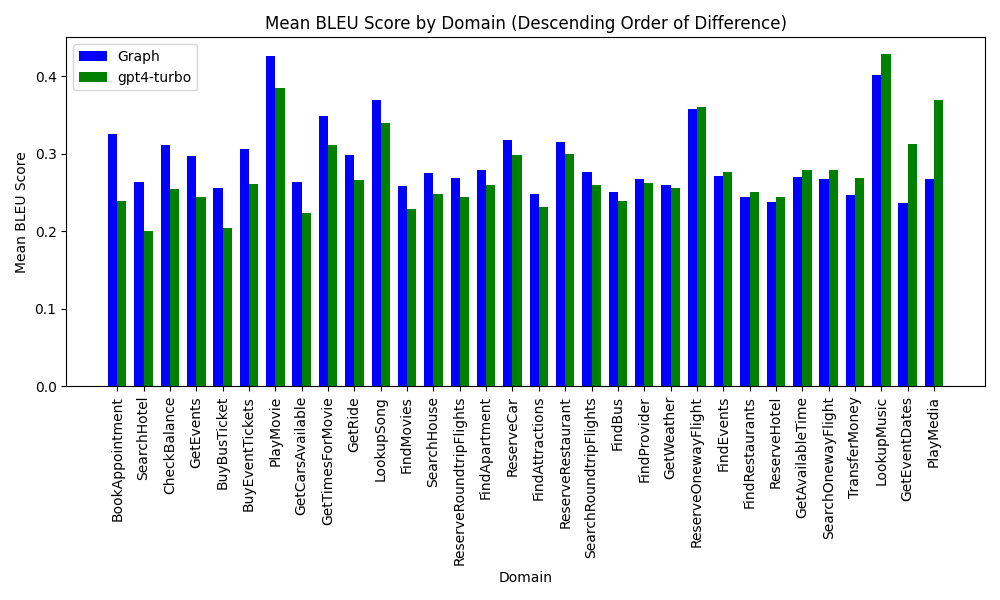
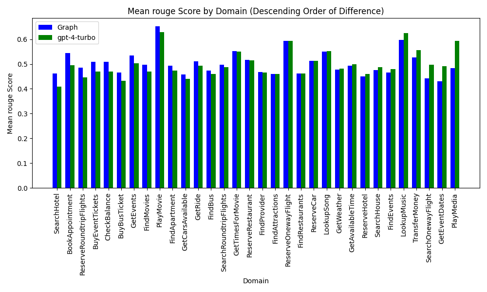
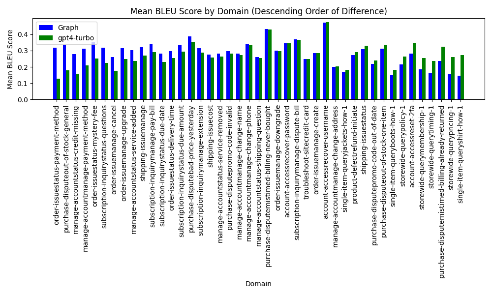
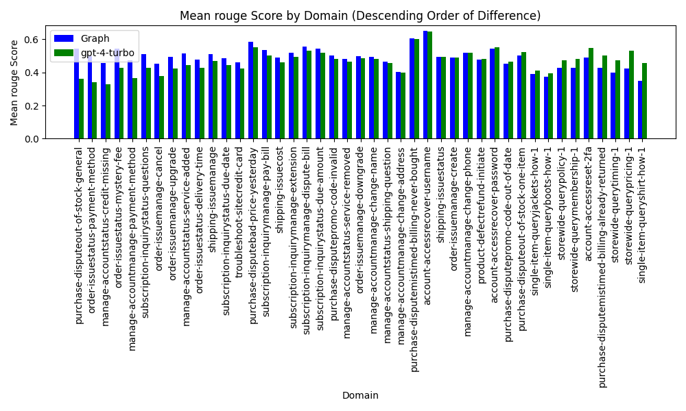
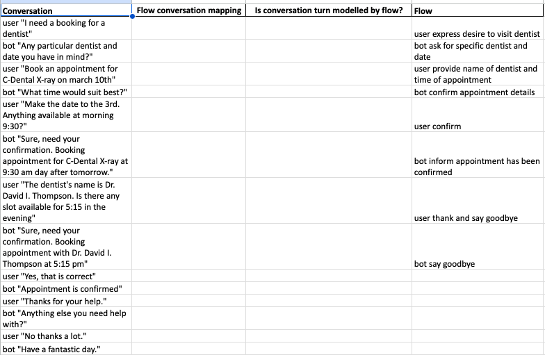

# 对话中的无监督对话策略提取

发布时间：2024年06月21日

`Agent

这篇论文主要探讨了如何利用大型语言模型（LLMs）来提取对话策略，并提出了一种基于图的新方法来生成对话策略。这种方法通过构建对话流程网络和使用图遍历算法来捕捉对话动态，从而为对话设计者提供了一个高效的工具。因此，这篇论文更符合Agent分类，因为它关注的是如何构建和优化对话系统中的智能代理（Agent），以提高对话系统的性能和可控性。` `对话系统` `人工智能`

> Unsupervised Extraction of Dialogue Policies from Conversations

# 摘要

> 对话策略在构建面向任务的对话系统中至关重要，但其开发与维护困难重重，往往需要对话建模专家的深入参与。尽管大量对话数据唾手可得，但从中提炼对话策略的有效方法却寥寥无几。本文首先展示了大型语言模型（LLMs）如何通过将对话转化为统一的中间表示——规范形式，来助力对话策略的提取。接着，我们提出了一种基于图的、可控且可解释的新方法，用于生成对话策略。通过构建对话流程网络并运用图遍历算法，我们能够更精准地捕捉对话动态。这一技术赋予了对话设计者更强的掌控力，为对话策略的开发提供了一个高效的工具。

> Dialogue policies play a crucial role in developing task-oriented dialogue systems, yet their development and maintenance are challenging and typically require substantial effort from experts in dialogue modeling. While in many situations, large amounts of conversational data are available for the task at hand, people lack an effective solution able to extract dialogue policies from this data. In this paper, we address this gap by first illustrating how Large Language Models (LLMs) can be instrumental in extracting dialogue policies from datasets, through the conversion of conversations into a unified intermediate representation consisting of canonical forms. We then propose a novel method for generating dialogue policies utilizing a controllable and interpretable graph-based methodology. By combining canonical forms across conversations into a flow network, we find that running graph traversal algorithms helps in extracting dialogue flows. These flows are a better representation of the underlying interactions than flows extracted by prompting LLMs. Our technique focuses on giving conversation designers greater control, offering a productivity tool to improve the process of developing dialogue policies.

[Arxiv](https://arxiv.org/abs/2406.15214)