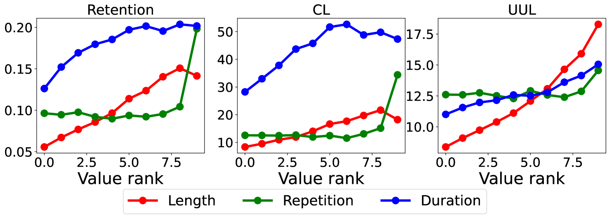
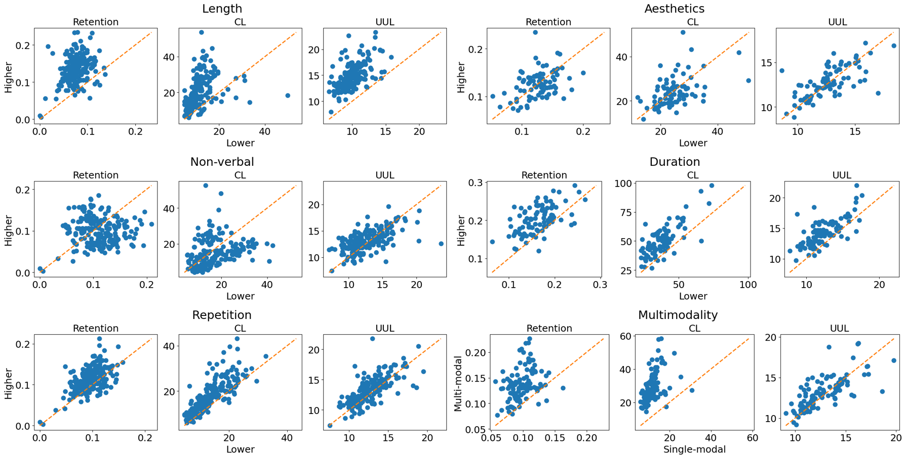

# 探索多模态交互如何提升用户在AI对话中的参与度：一次深入的全面评估

发布时间：2024年06月21日

`LLM应用

这篇论文探讨了大型语言模型（LLMs）在聊天机器人中的应用，特别是在多模态交互（结合图像和音频）如何提升用户参与度方面。研究通过分析真实用户的交互数据，并使用留存率和对话长度等指标，发现多模态交互显著提升了用户参与度。这表明多模态交互不仅优化了认知处理，还促进了更深层次的信息理解。因此，这篇论文属于LLM应用类别，因为它关注的是LLMs在实际应用中的效果和改进，特别是在聊天机器人设计中的多模态交互。` `聊天机器人` `用户体验`

> Unveiling the Impact of Multi-Modal Interactions on User Engagement: A Comprehensive Evaluation in AI-driven Conversations

# 摘要

> 大型语言模型（LLMs）显著提升了用户与聊天机器人的互动质量，使对话更加复杂且连贯。然而，仅依赖文本的交互方式可能未充分挖掘提升用户参与度的潜力。本文深入探讨了结合图像和音频的多模态交互如何影响聊天机器人对话中的用户参与度。通过分析多种聊天机器人与真实用户的交互数据，我们采用留存率和对话长度等指标，发现多模态交互相比纯文本对话显著提升了用户参与度。特别是，引入第三种模态极大地增强了用户参与度，超越了仅使用两种模态的效果。这表明多模态交互不仅优化了认知处理，还促进了更深层次的信息理解。本研究强调了在聊天机器人设计中融入多模态的重要性，为打造更具吸引力和沉浸感的AI通信体验提供了指导，并向AI社区展示了多模态交互在增强用户参与度方面的显著优势。

> Large Language Models (LLMs) have significantly advanced user-bot interactions, enabling more complex and coherent dialogues. However, the prevalent text-only modality might not fully exploit the potential for effective user engagement. This paper explores the impact of multi-modal interactions, which incorporate images and audio alongside text, on user engagement in chatbot conversations. We conduct a comprehensive analysis using a diverse set of chatbots and real-user interaction data, employing metrics such as retention rate and conversation length to evaluate user engagement. Our findings reveal a significant enhancement in user engagement with multi-modal interactions compared to text-only dialogues. Notably, the incorporation of a third modality significantly amplifies engagement beyond the benefits observed with just two modalities. These results suggest that multi-modal interactions optimize cognitive processing and facilitate richer information comprehension. This study underscores the importance of multi-modality in chatbot design, offering valuable insights for creating more engaging and immersive AI communication experiences and informing the broader AI community about the benefits of multi-modal interactions in enhancing user engagement.

[Arxiv](https://arxiv.org/abs/2406.15000)