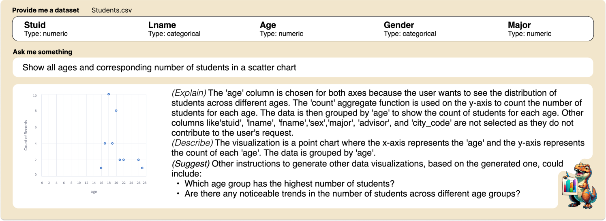

# V-RECS，一款经济实惠的LLM4VIS推荐工具，集解释、标题创作与建议于一体。

发布时间：2024年06月21日

`LLM应用

这篇论文介绍了V-RECS系统，这是一个结合了大型语言模型（LLM）的视觉推荐器，旨在帮助非专业用户通过自然语言指令进行数据可视化和探索。该系统通过微调小型模型和使用思维链（CoT）技术，解决了使用大型LLM时可能遇到的计算、控制和成本问题。此外，论文还提到了使用教师-学生模型（GPT-4作为教师，Llama-2-7B作为学生）来提高小型模型的性能。这些特点表明，该论文主要关注的是LLM在实际应用中的使用，特别是在数据可视化领域的应用，因此应归类为LLM应用。` `数据可视化` `人工智能`

> V-RECS, a Low-Cost LLM4VIS Recommender with Explanations, Captioning and Suggestions

# 摘要

> NL2VIS，即将自然语言转换为可视化的研究领域，正随着大数据时代的到来展现出巨大潜力，它让非专业用户也能轻松探索数据。本文推出的V-RECS系统，是首个结合大型语言模型（LLM）的视觉推荐器，它不仅提供解释、标题，还给出数据探索的建议，极大地便利了非专业用户的数据解读和探索。通过有效微调小型模型，V-RECS解决了使用强大LLM时面临的计算、控制和成本问题。我们采用思维链（CoT）技术，引导LLM逐步推理以生成准确的可视化叙述。面对小型LLM在CoT上的局限，我们设计了一个教师-学生模型，GPT-4作为教师生成指导，微调小型模型Llama-2-7B。实验结果显示，V-RECS在成本大幅降低的同时，性能与GPT-4相当。我们已将V-RECS开放给可视化社区，以助力设计师在可视化创作的全过程中。

> NL2VIS (natural language to visualization) is a promising and recent research area that involves interpreting natural language queries and translating them into visualizations that accurately represent the underlying data. As we navigate the era of big data, NL2VIS holds considerable application potential since it greatly facilitates data exploration by non-expert users. Following the increasingly widespread usage of generative AI in NL2VIS applications, in this paper we present V-RECS, the first LLM-based Visual Recommender augmented with explanations(E), captioning(C), and suggestions(S) for further data exploration. V-RECS' visualization narratives facilitate both response verification and data exploration by non-expert users. Furthermore, our proposed solution mitigates computational, controllability, and cost issues associated with using powerful LLMs by leveraging a methodology to effectively fine-tune small models. To generate insightful visualization narratives, we use Chain-of-Thoughts (CoT), a prompt engineering technique to help LLM identify and generate the logical steps to produce a correct answer. Since CoT is reported to perform poorly with small LLMs, we adopted a strategy in which a large LLM (GPT-4), acting as a Teacher, generates CoT-based instructions to fine-tune a small model, Llama-2-7B, which plays the role of a Student. Extensive experiments-based on a framework for the quantitative evaluation of AI-based visualizations and on manual assessment by a group of participants-show that V-RECS achieves performance scores comparable to GPT-4, at a much lower cost. The efficacy of the V-RECS teacher-student paradigm is also demonstrated by the fact that the un-tuned Llama fails to perform the task in the vast majority of test cases. We release V-RECS for the visualization community to assist visualization designers throughout the entire visualization generation process.

[Arxiv](https://arxiv.org/abs/2406.15259)