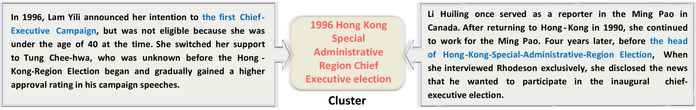
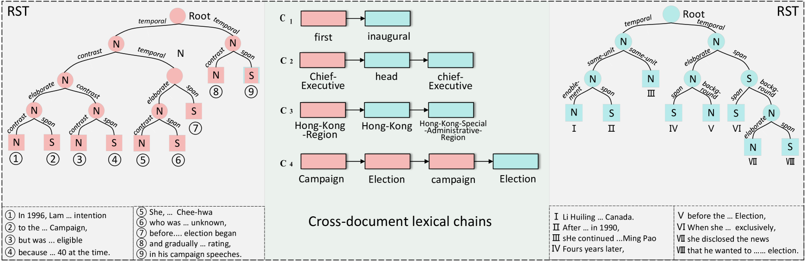
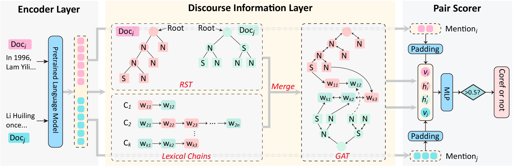
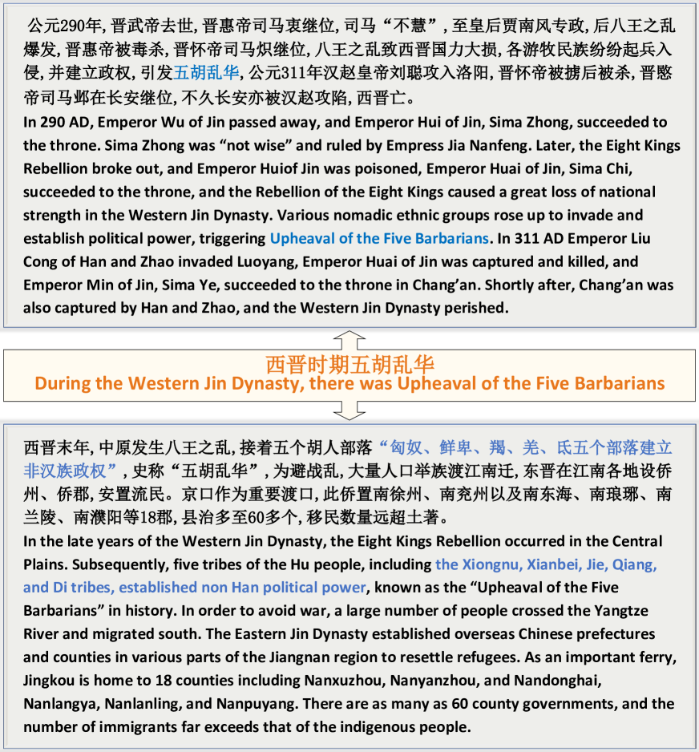

# 借助话语结构与语义信息，提升跨文档事件共指识别的精准度

发布时间：2024年06月22日

`RAG

这篇论文主要关注的是跨文档事件共指问题，并提出了一种新的方法来利用文档级信息，包括构建文档级RST树和跨文档词汇链，以及使用异构图和图注意力网络（GAT）来学习事件表示。这些方法旨在提高模型在处理长距离依赖和复杂事件共指任务时的性能。此外，论文还创建了一个大规模的中文跨文档事件共指数据集，并展示了其模型在英汉数据集上的优越性能。这些内容与RAG（Reasoning and Graph）分类相关，因为它们涉及到了基于图的推理和语义网络的构建，这是RAG领域的一个重要研究方向。` `事件共指`

> Enhancing Cross-Document Event Coreference Resolution by Discourse Structure and Semantic Information

# 摘要

> 现有的跨文档事件共指模型，或直接比较提及相似性，或通过提取事件参数（如位置、时间、代理和患者）来增强提及表示，但都未能充分利用文档级信息，导致难以捕捉长距离依赖，进而在处理依赖此类依赖的事件共指时表现不佳。为此，我们提出构建文档级RST树和跨文档词汇链，以模拟文档的结构与语义信息，进而构建跨文档异构图，并运用GAT学习事件表示。通过一对评分器计算事件对间的相似性，并借助标准聚类算法识别共指事件。此外，鉴于现有数据集仅限于英语，我们创建了一个包含53,066个事件提及和4,476个集群的大规模中文跨文档事件共指数据集。应用我们的模型于英汉数据集后，其性能显著优于所有基线。

> Existing cross-document event coreference resolution models, which either compute mention similarity directly or enhance mention representation by extracting event arguments (such as location, time, agent, and patient), lacking the ability to utilize document-level information. As a result, they struggle to capture long-distance dependencies. This shortcoming leads to their underwhelming performance in determining coreference for the events where their argument information relies on long-distance dependencies. In light of these limitations, we propose the construction of document-level Rhetorical Structure Theory (RST) trees and cross-document Lexical Chains to model the structural and semantic information of documents. Subsequently, cross-document heterogeneous graphs are constructed and GAT is utilized to learn the representations of events. Finally, a pair scorer calculates the similarity between each pair of events and co-referred events can be recognized using standard clustering algorithm. Additionally, as the existing cross-document event coreference datasets are limited to English, we have developed a large-scale Chinese cross-document event coreference dataset to fill this gap, which comprises 53,066 event mentions and 4,476 clusters. After applying our model on the English and Chinese datasets respectively, it outperforms all baselines by large margins.

[Arxiv](https://arxiv.org/abs/2406.15990)