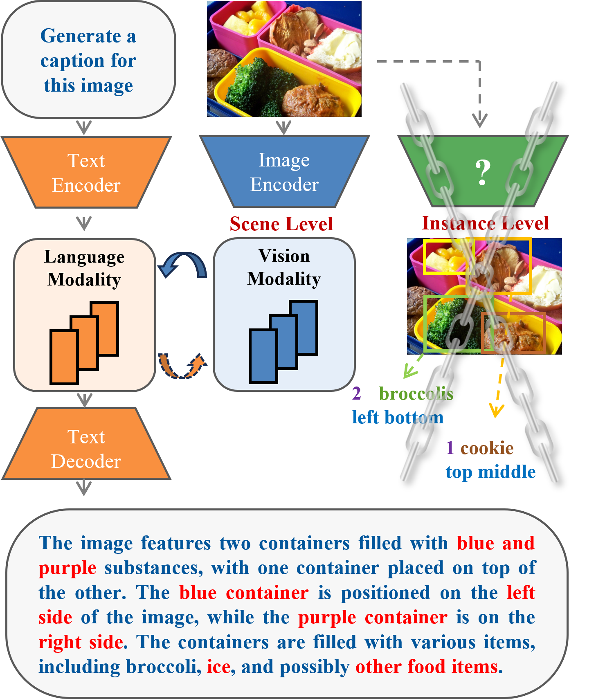
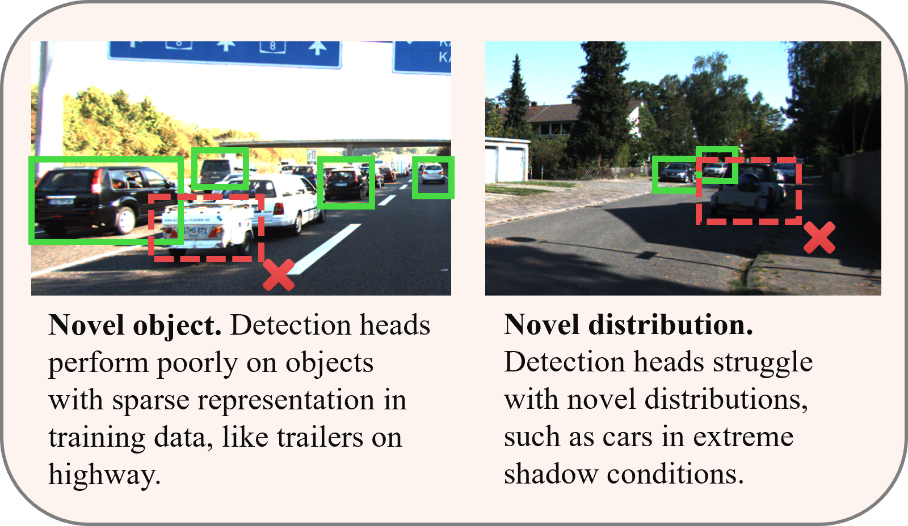
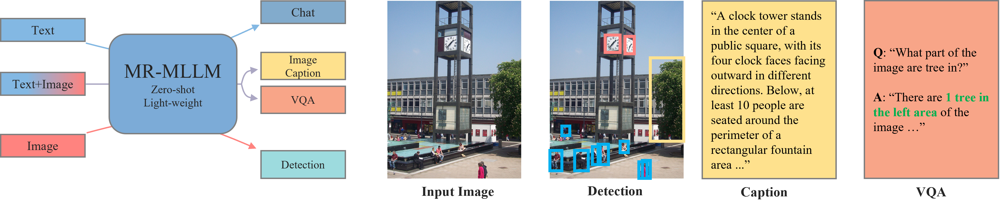
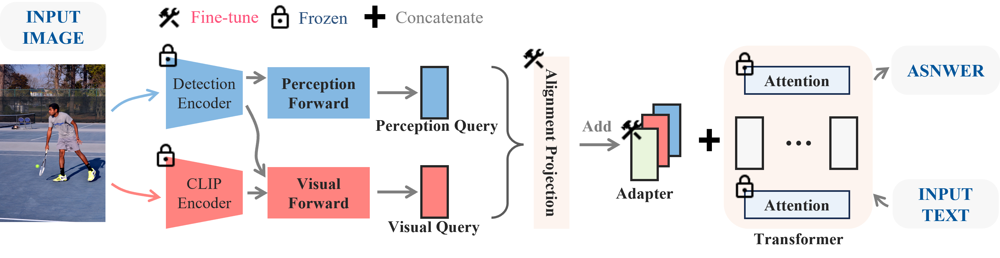
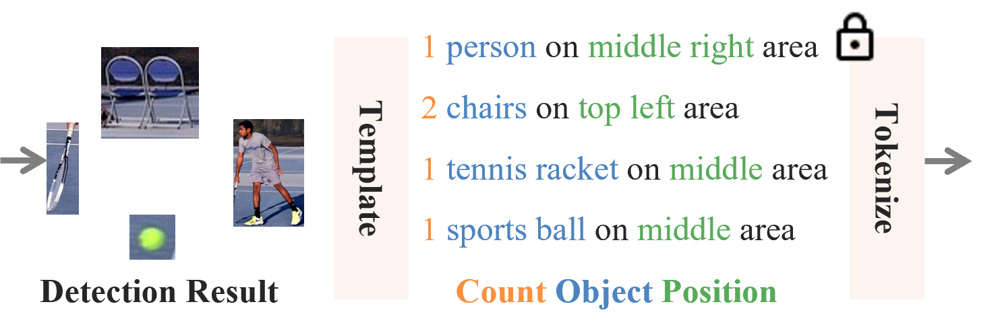
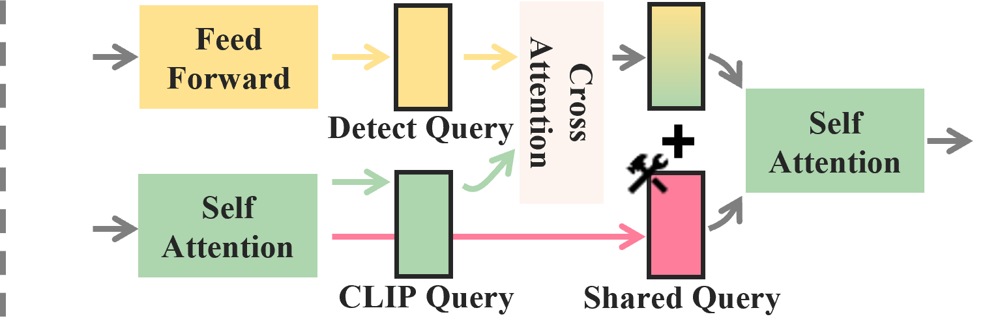
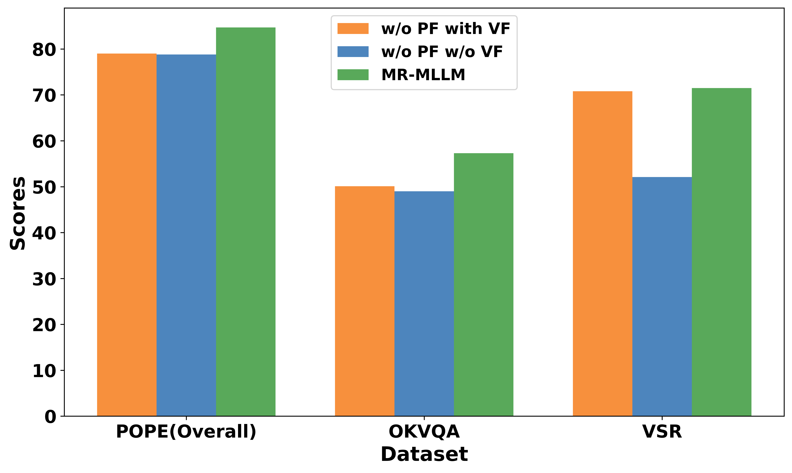
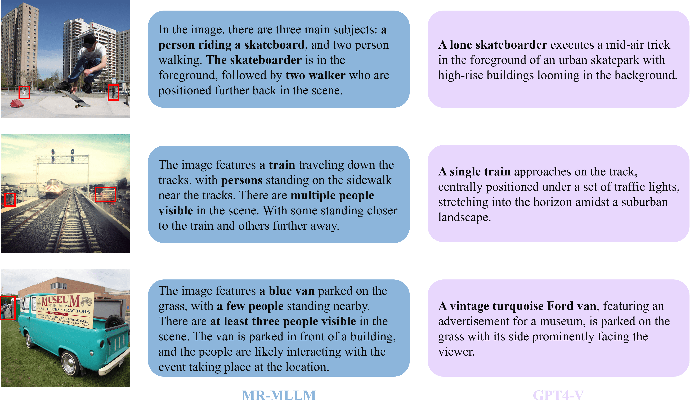
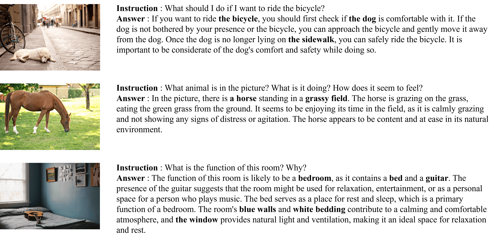

# MR-MLLM：多模态理解与视觉感知的协同增强

发布时间：2024年06月22日

`LLM应用

这篇论文介绍了一种新型的多模态大型语言模型（MR-MLLM），该模型通过创新的框架和技术，旨在提升视觉感知和多模态理解的能力。论文中提到的技术包括共享查询融合机制、感知增强的跨模态整合方法以及感知嵌入提示生成机制，这些都是为了增强模型在处理视觉和语言数据时的性能。这些技术的应用和实验结果表明，MR-MLLM在多模态理解和视觉感知任务中表现出色，特别是在需要精细视觉感知和语言理解的任务中。因此，这篇论文更偏向于LLM的应用层面，即如何通过技术改进和优化现有的多模态大型语言模型，以提高其在特定任务上的表现。` `人工智能` `计算机视觉`

> MR-MLLM: Mutual Reinforcement of Multimodal Comprehension and Vision Perception

# 摘要

> 近年来，多模态大型语言模型（MLLMs）在视觉问答和常识推理等任务中表现出色，同时视觉感知模型在检测和分割等任务中也取得了重大进展。然而，MLLMs在细粒度视觉理解上存在局限，而视觉感知模型则因模型容量有限难以应对开放世界的分布变化。为此，我们提出了互惠增强型多模态大型语言模型（MR-MLLM），这一创新框架旨在协同提升视觉感知与多模态理解。首先，通过共享查询融合机制，我们整合了视觉模型的详细视觉输入与语言模型的语言深度，以协同增强多模态与视觉感知能力。其次，我们引入了感知增强的跨模态整合方法，利用视觉感知输出中的新型模态（如对象检测边界框）捕捉细微视觉元素，从而深化对视觉和文本数据的解读。此外，我们还创新性地提出了感知嵌入提示生成机制，将感知信息融入语言模型的提示中，确保响应在上下文和感知上的一致性，以实现更精准的多模态解释。实验结果显示，MR-MLLM在多模态理解和视觉感知任务中表现卓越，尤其是在需要边缘案例视觉感知和细粒度语言理解的任务中。

> In recent years, multimodal large language models (MLLMs) have shown remarkable capabilities in tasks like visual question answering and common sense reasoning, while visual perception models have made significant strides in perception tasks, such as detection and segmentation. However, MLLMs mainly focus on high-level image-text interpretations and struggle with fine-grained visual understanding, and vision perception models usually suffer from open-world distribution shifts due to their limited model capacity. To overcome these challenges, we propose the Mutually Reinforced Multimodal Large Language Model (MR-MLLM), a novel framework that synergistically enhances visual perception and multimodal comprehension. First, a shared query fusion mechanism is proposed to harmonize detailed visual inputs from vision models with the linguistic depth of language models, enhancing multimodal comprehension and vision perception synergistically. Second, we propose the perception-enhanced cross-modal integration method, incorporating novel modalities from vision perception outputs, like object detection bounding boxes, to capture subtle visual elements, thus enriching the understanding of both visual and textual data. In addition, an innovative perception-embedded prompt generation mechanism is proposed to embed perceptual information into the language model's prompts, aligning the responses contextually and perceptually for a more accurate multimodal interpretation. Extensive experiments demonstrate MR-MLLM's superior performance in various multimodal comprehension and vision perception tasks, particularly those requiring corner case vision perception and fine-grained language comprehension.

[Arxiv](https://arxiv.org/abs/2406.15768)