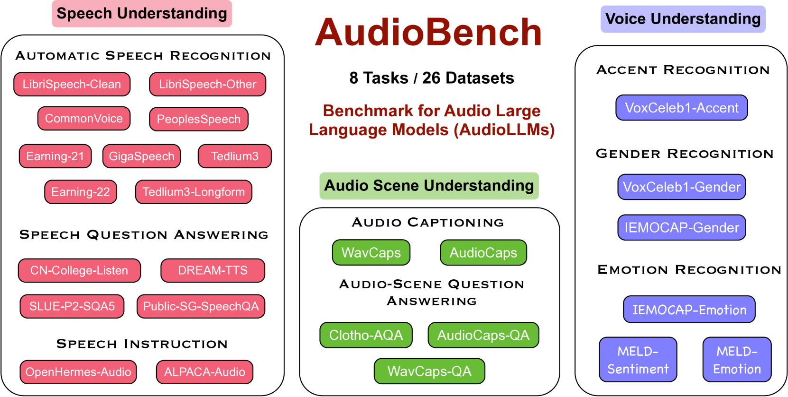
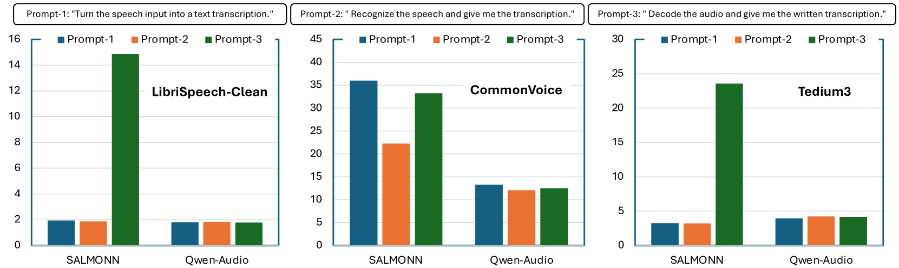
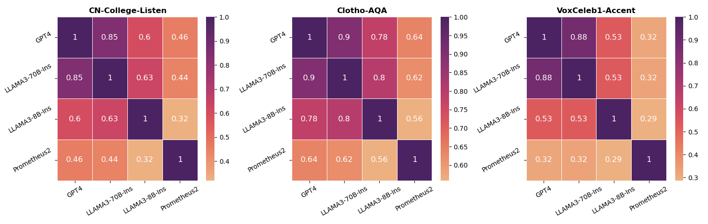
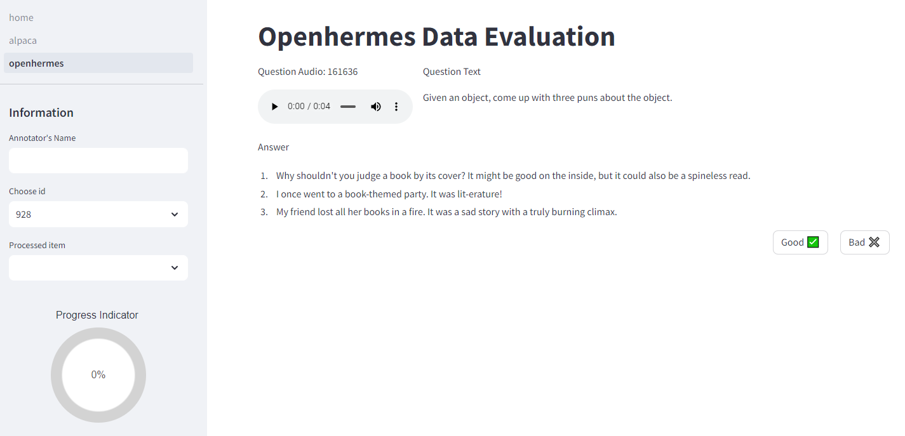
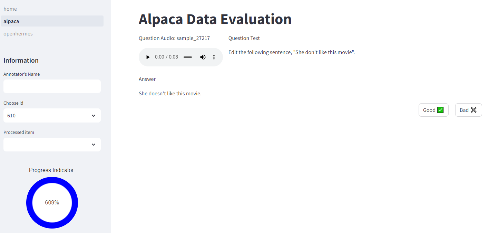
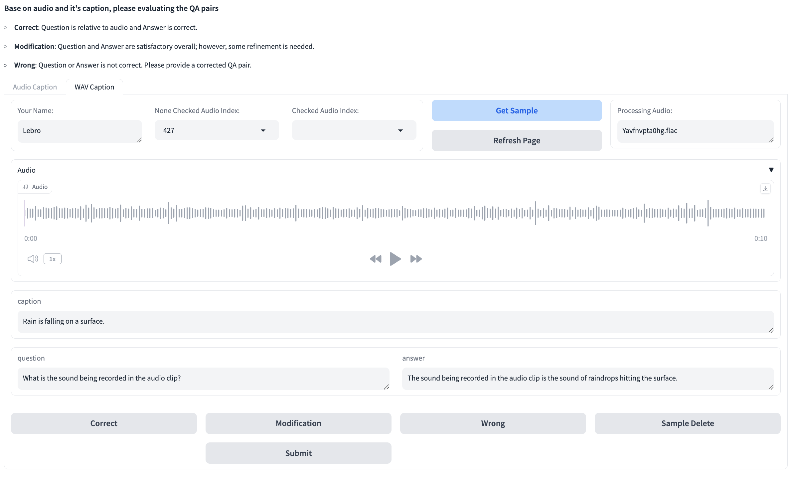

# AudioBench：音频大型语言模型的全能基准

发布时间：2024年06月23日

`LLM应用

理由：这篇论文介绍了 AudioBench，一个专门用于评估音频大型语言模型（AudioLLMs）的基准。它关注的是如何评估和改进大型语言模型在音频处理方面的能力，这属于大型语言模型的应用范畴。虽然它可能间接涉及到一些理论问题，如模型的性能评估和数据集的选择，但其主要焦点是应用层面的评估和改进，因此更适合归类为LLM应用。` `音频处理` `语音识别`

> AudioBench: A Universal Benchmark for Audio Large Language Models

# 摘要

> 我们推出了 AudioBench，这是一个专为评估音频大型语言模型（AudioLLMs）而设计的新基准。它涵盖了 8 项独特任务和 26 个精选或新策划的数据集，专注于语音理解、声音解释和音频场景理解。尽管大型语言模型，包括多模态版本，发展迅速，但全面评估其能力的基准仍有显著不足。AudioBench 通过提供相关数据集和评估指标来弥补这一缺陷。我们的研究表明，四个模型在多个方面进行了评估，但没有一个模型能在所有任务中持续领先。我们展望了 AudioLLMs 的研究前景，并期待我们的开源资源和排行榜能为未来的模型开发提供一个坚实的测试平台。

> We introduce AudioBench, a new benchmark designed to evaluate audio large language models (AudioLLMs). AudioBench encompasses 8 distinct tasks and 26 carefully selected or newly curated datasets, focusing on speech understanding, voice interpretation, and audio scene understanding. Despite the rapid advancement of large language models, including multimodal versions, a significant gap exists in comprehensive benchmarks for thoroughly evaluating their capabilities. AudioBench addresses this gap by providing relevant datasets and evaluation metrics. In our study, we evaluated the capabilities of four models across various aspects and found that no single model excels consistently across all tasks. We outline the research outlook for AudioLLMs and anticipate that our open-source code, data, and leaderboard will offer a robust testbed for future model developments.

[Arxiv](https://arxiv.org/abs/2406.16020)