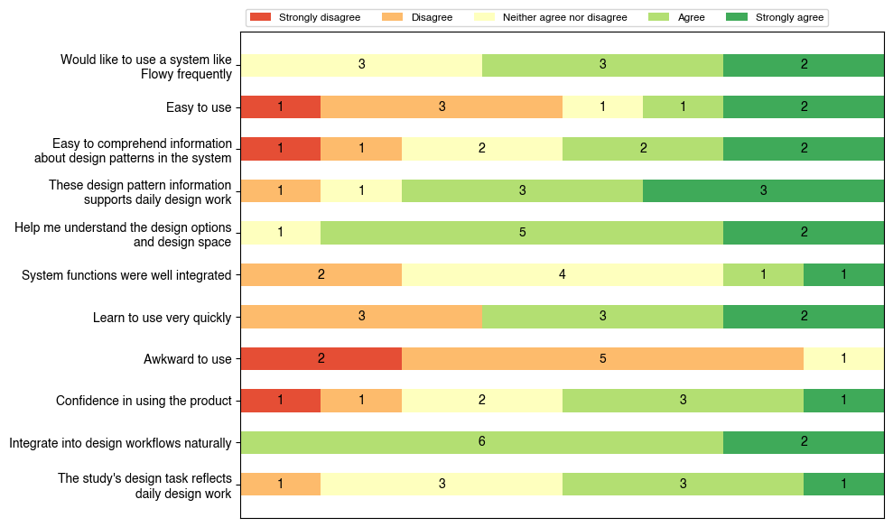

# Flowy：借助 AI 驱动的模式注释，优化多屏幕用户流程中的 UX 设计决策

发布时间：2024年06月23日

`LLM应用

这篇论文介绍了一个名为Flowy的应用，它利用大型多模态AI模型来辅助UX设计师在创意构思阶段更高效地搜集信息，并理解多屏用户流程中的抽象设计模式。Flowy的应用展示了如何将大型语言模型（LLM）和多模态AI技术应用于实际的UX设计任务中，以提高设计效率和质量。因此，这篇论文属于LLM应用分类。` `用户体验设计` `人工智能`

> Flowy: Supporting UX Design Decisions Through AI-Driven Pattern Annotation in Multi-Screen User Flows

# 摘要

> 近期众多AI驱动的UX设计工具侧重于从自然语言生成单一静态UI界面，却忽略了跨屏交互与用户体验这一核心要素。通过与UX专家的深入研究，我们揭示了这些工具在实际UX设计流程支持上的不足。为此，我们推出了Flowy应用，它通过提供具体用户流程案例及精炼的设计模式知识，助力设计师在创意构思阶段更高效地搜集信息。Flowy依托大型多模态AI模型及优质用户流程数据集，协助设计师洞察并理解多屏用户流程中的抽象设计模式。与专业UX设计师的合作研究证实，Flowy能有效支持实际UX任务。Flowy的设计理念，如适度的抽象表示与解决方案空间的智能导航，不仅适用于其他创意领域，更体现了以人为本、智能增强的AI在UX设计中的应用哲学。

> Many recent AI-powered UX design tools focus on generating individual static UI screens from natural language. However, they overlook the crucial aspect of interactions and user experiences across multiple screens. Through formative studies with UX professionals, we identified limitations of these tools in supporting realistic UX design workflows. In response, we designed and developed Flowy, an app that augments designers' information foraging process in ideation by supplementing specific user flow examples with distilled design pattern knowledge. Flowy utilizes large multimodal AI models and a high-quality user flow dataset to help designers identify and understand relevant abstract design patterns in the design space for multi-screen user flows. Our user study with professional UX designers demonstrates how Flowy supports realistic UX tasks. Our design considerations in Flowy, such as representations with appropriate levels of abstraction and assisted navigation through the solution space, are generalizable to other creative tasks and embody a human-centered, intelligence augmentation approach to using AI in UX design.

[Arxiv](https://arxiv.org/abs/2406.16177)