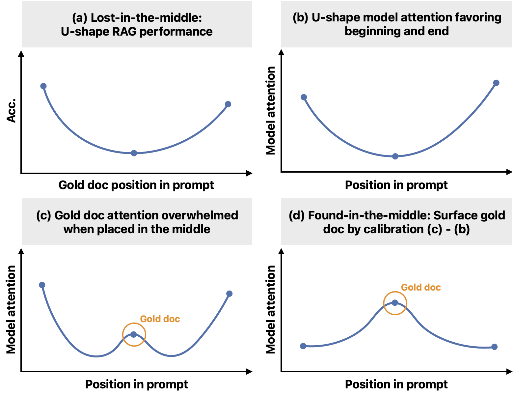
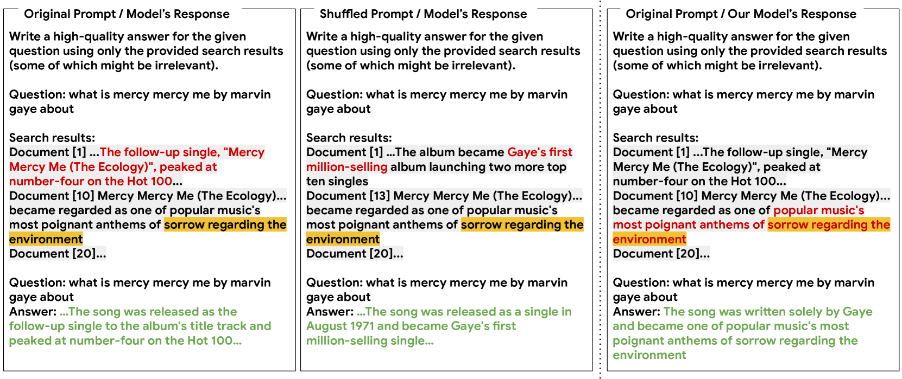
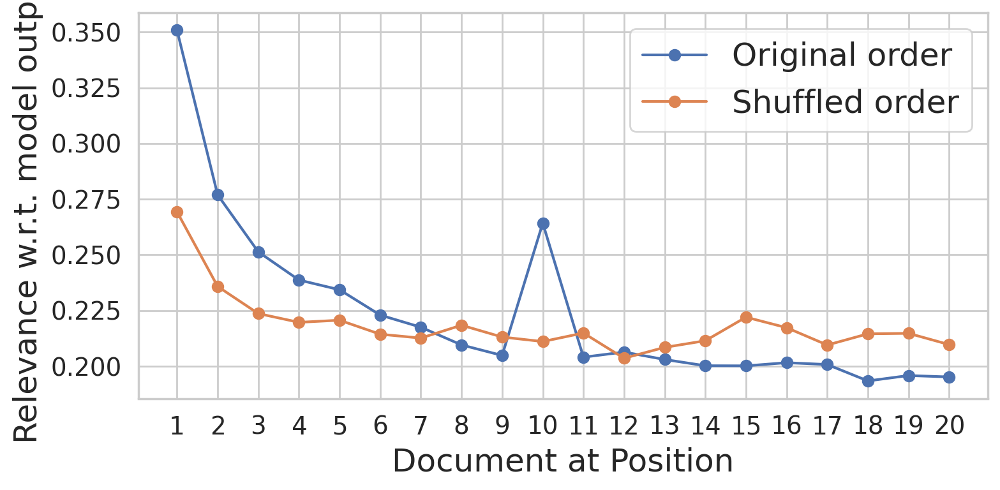
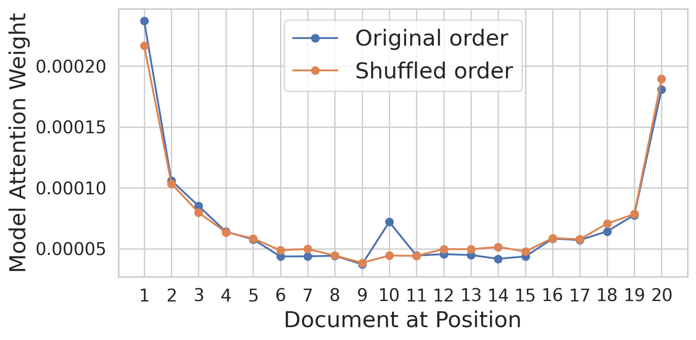
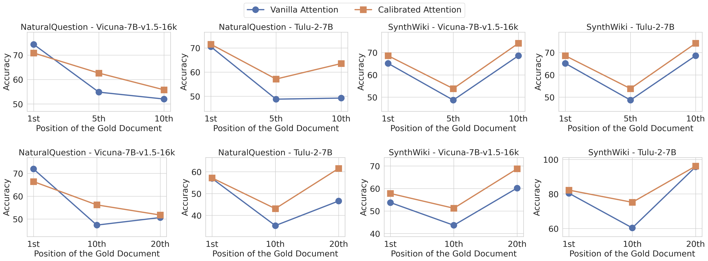
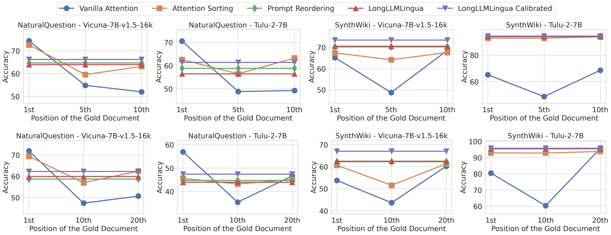

# 居中调整：优化位置注意力偏差，提升长上下文的有效利用

发布时间：2024年06月23日

`RAG

这篇论文主要探讨了大型语言模型（LLMs）在处理长输入时出现的“中间迷失”问题，并提出了一种名为“中间发现”的机制来校正模型固有的U形注意力偏差。该机制使得模型能够根据信息的相关性而非位置来分配注意力，从而在长文本中更精准地定位信息，并显著提升了跨任务的检索增强生成（RAG）性能。因此，这篇论文的内容与RAG（检索增强生成）紧密相关，属于RAG分类。` `机器学习`

> Found in the Middle: Calibrating Positional Attention Bias Improves Long Context Utilization

# 摘要

> 大型语言模型（LLMs）虽经特殊训练以处理长输入，却常在输入中间遗漏关键信息，此即“中间迷失”问题。本研究首先揭示了此问题与LLMs固有的U形注意力偏差有关，即模型更关注输入的始末而非中间部分。为此，我们开发了“中间发现”机制，有效校正了这种偏差，使模型能根据信息的相关性而非位置来分配注意力。实验证明，“中间发现”不仅在长文本中更精准地定位信息，还显著提升了跨任务的检索增强生成（RAG）性能，超越现有技术达15%。这些成果为深入探究LLM的注意力偏差及其影响提供了新视角。

> Large language models (LLMs), even when specifically trained to process long input contexts, struggle to capture relevant information located in the middle of their input. This phenomenon has been known as the lost-in-the-middle problem. In this work, we make three contributions. First, we set out to understand the factors that cause this phenomenon. In doing so, we establish a connection between lost-in-the-middle to LLMs' intrinsic attention bias: LLMs exhibit a U-shaped attention bias where the tokens at the beginning and at the end of its input receive higher attention, regardless of their relevance. Second, we mitigate this positional bias through a calibration mechanism, found-in-the-middle, that allows the model to attend to contexts faithfully according to their relevance, even though when they are in the middle. Third, we show found-in-the-middle not only achieves better performance in locating relevant information within a long context, but also eventually leads to improved retrieval-augmented generation (RAG) performance across various tasks, outperforming existing methods by up to 15 percentage points. These findings open up future directions in understanding LLM attention bias and its potential consequences.

[Arxiv](https://arxiv.org/abs/2406.16008)