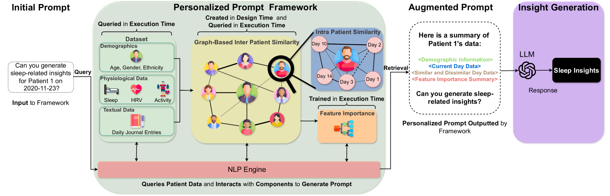

# 图增强LLMs在个性化健康洞察中的应用：以睡眠分析为例

发布时间：2024年06月23日

`RAG

这篇论文主要介绍了一种图增强的LLM框架，该框架通过层次图结构捕捉患者间及患者内部的关系，并利用随机森林模型得出的动态特征重要性得分丰富LLM提示，以提升健康见解的个性化和清晰度。这种方法属于检索增强生成（RAG）的范畴，因为它通过增强LLM的输入提示来改善生成结果的质量和个性化。虽然论文中提到了LLM的应用，但其核心贡献在于改进RAG方法，以更好地处理和解释复杂健康数据，因此更适合归类为RAG。` `医疗保健` `可穿戴设备`

> Graph-Augmented LLMs for Personalized Health Insights: A Case Study in Sleep Analysis

# 摘要

> 健康监测系统通过持续捕捉生理和行为数据，为现代医疗保健带来了革命性的变化，这些数据对于预防和早期干预至关重要。尽管将这些数据与大型语言模型（LLMs）结合显示出在提供交互式健康建议方面的潜力，但传统的如检索增强生成（RAG）和微调方法往往未能充分利用可穿戴设备提供的复杂、多维且时间相关的数据，导致提供的健康见解有限且不够个性化。为此，本文提出了一种图增强的LLM框架，旨在显著提升健康见解的个性化和清晰度。该框架通过层次图结构捕捉患者间及患者内部的关系，并利用随机森林模型得出的动态特征重要性得分丰富LLM提示。通过一项涉及20名大学生在COVID-19封锁期间的睡眠分析案例研究，验证了该方法的有效性，并展示了我们的模型高效生成行动性和个性化健康见解的潜力。我们还利用另一个LLM评估见解的相关性、全面性、行动性和个性化，以满足处理和有效解释复杂健康数据的模型的关键需求。研究结果显示，通过我们的框架增强提示在所有评估标准上均取得了显著改进，能够为特定患者提供更为精心和周到的回应。

> Health monitoring systems have revolutionized modern healthcare by enabling the continuous capture of physiological and behavioral data, essential for preventive measures and early health intervention. While integrating this data with Large Language Models (LLMs) has shown promise in delivering interactive health advice, traditional methods like Retrieval-Augmented Generation (RAG) and fine-tuning often fail to fully utilize the complex, multi-dimensional, and temporally relevant data from wearable devices. These conventional approaches typically provide limited actionable and personalized health insights due to their inadequate capacity to dynamically integrate and interpret diverse health data streams. In response, this paper introduces a graph-augmented LLM framework designed to significantly enhance the personalization and clarity of health insights. Utilizing a hierarchical graph structure, the framework captures inter and intra-patient relationships, enriching LLM prompts with dynamic feature importance scores derived from a Random Forest Model. The effectiveness of this approach is demonstrated through a sleep analysis case study involving 20 college students during the COVID-19 lockdown, highlighting the potential of our model to generate actionable and personalized health insights efficiently. We leverage another LLM to evaluate the insights for relevance, comprehensiveness, actionability, and personalization, addressing the critical need for models that process and interpret complex health data effectively. Our findings show that augmenting prompts with our framework yields significant improvements in all 4 criteria. Through our framework, we can elicit well-crafted, more thoughtful responses tailored to a specific patient.

[Arxiv](https://arxiv.org/abs/2406.16252)