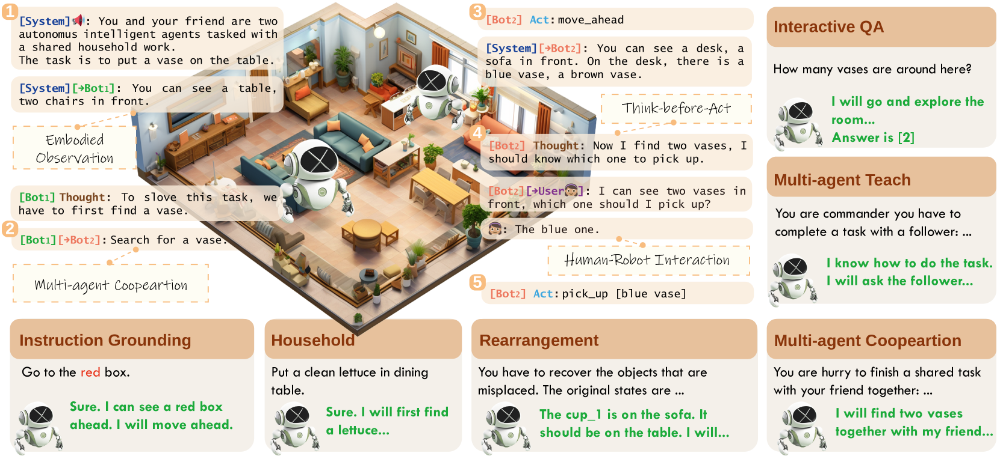
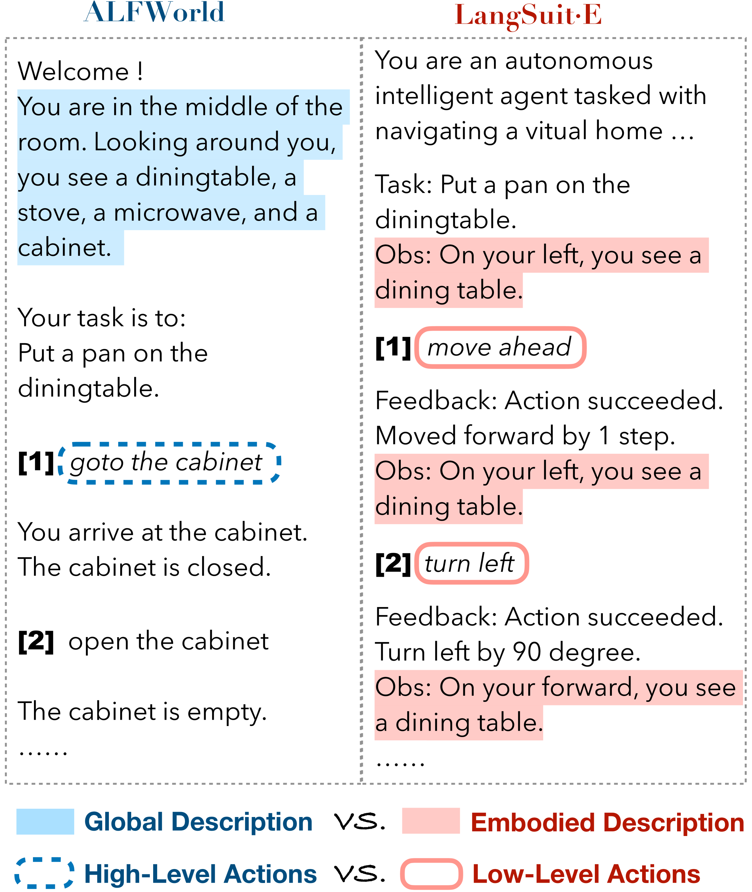
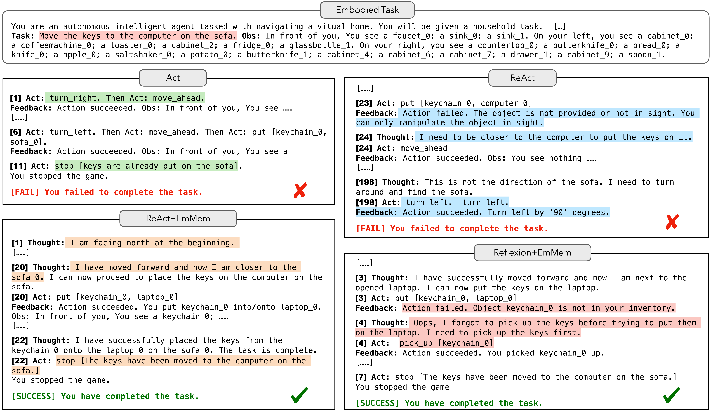
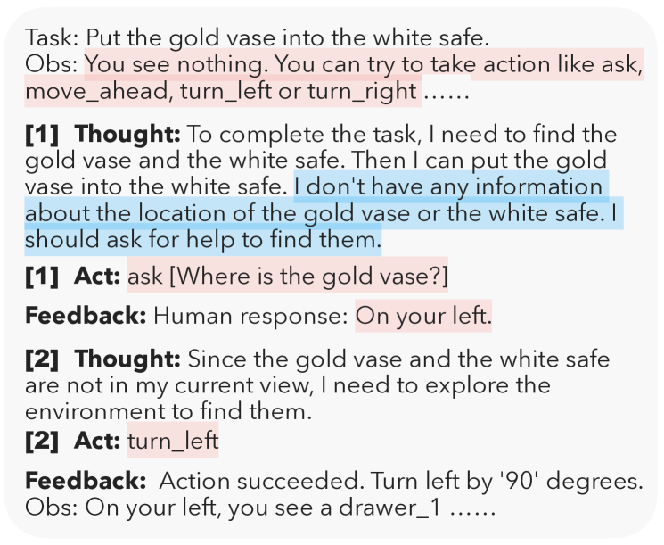

# LangSuitE：驾驭大型语言模型，在具身体文本环境中实现精准规划、灵活控制与高效互动

发布时间：2024年06月23日

`Agent

这篇论文主要介绍了LangSuitE，一个专注于文本实体世界中实体任务的测试平台，并探讨了大型语言模型（LLMs）在动态交互环境中作为自主代理的表现。论文中提到的EmMem思维链模式和实体规划的挑战与洞见，都是围绕如何利用LLMs构建有效的自主代理展开的。因此，这篇论文更符合Agent分类，因为它关注的是如何将LLMs应用于构建自主代理，而不是LLMs的理论研究或应用。` `自主代理` `实体任务`

> LangSuitE: Planning, Controlling and Interacting with Large Language Models in Embodied Text Environments

# 摘要

> 大型语言模型（LLMs）在构建依赖语言描述的自主代理方面取得了显著进展，但其在动态交互环境中作为少量样本或零样本实体代理的表现仍是一个谜。为此，我们推出了LangSuitE，一个无需模拟的多功能测试平台，专注于文本实体世界中的六大实体任务。相较于以往的LLM测试平台，LangSuitE不仅适应性强，无需依赖多种模拟引擎，还能评估代理通过实体观察内化世界知识的能力，并支持灵活调整通信与行动策略。针对实体挑战，我们创新性地提出了EmMem思维链模式，该模式能基于历史信息总结实体状态。通过全面的基准测试，我们揭示了实体规划的挑战与洞见，LangSuitE的推出标志着在语言模型背景下构建实体通用者的重要进展。

> Recent advances in Large Language Models (LLMs) have shown inspiring achievements in constructing autonomous agents that rely on language descriptions as inputs. However, it remains unclear how well LLMs can function as few-shot or zero-shot embodied agents in dynamic interactive environments. To address this gap, we introduce LangSuitE, a versatile and simulation-free testbed featuring 6 representative embodied tasks in textual embodied worlds. Compared with previous LLM-based testbeds, LangSuitE (i) offers adaptability to diverse environments without multiple simulation engines, (ii) evaluates agents' capacity to develop ``internalized world knowledge'' with embodied observations, and (iii) allows easy customization of communication and action strategies. To address the embodiment challenge, we devise a novel chain-of-thought (CoT) schema, EmMem, which summarizes embodied states w.r.t. history information. Comprehensive benchmark results illustrate challenges and insights of embodied planning. LangSuitE represents a significant step toward building embodied generalists in the context of language models.

[Arxiv](https://arxiv.org/abs/2406.16294)