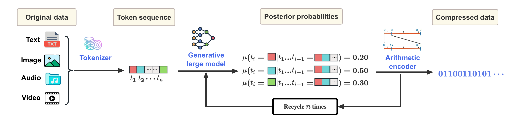

# 理解，实为一种压缩。

发布时间：2024年06月23日

`LLM理论` `信息技术` `数据压缩`

> Understanding is Compression

# 摘要

> 我们曾证明，在合理假设下，理解和学习本质上都是数据压缩。理论上，对数据理解的提升应能促进压缩效率。传统压缩技术多依赖于数据频率等可计算特性。而大型语言模型则模拟了难以计算的Solomonoff分布，为我们的理论提供了新视角。基于此，我们推出了LMCompress，它利用大型模型深入理解数据，实现了无损压缩比的显著提升。相较于其他无损压缩技术，LMCompress在图像、音频、视频及文本压缩上均有突破，例如将JPEG-XL、FLAC、H264的压缩比翻倍，bz2的文本压缩比更是提升至三到四倍。大型模型对数据的理解越深刻，LMCompress的压缩效果就越出色。

> We have previously shown all understanding or learning are compression, under reasonable assumptions. In principle, better understanding of data should improve data compression. Traditional compression methodologies focus on encoding frequencies or some other computable properties of data. Large language models approximate the uncomputable Solomonoff distribution, opening up a whole new avenue to justify our theory.
  Under the new uncomputable paradigm, we present LMCompress based on the understanding of data using large models. LMCompress has significantly better lossless compression ratios than all other lossless data compression methods, doubling the compression ratios of JPEG-XL for images, FLAC for audios and H264 for videos, and tripling or quadrupling the compression ratio of bz2 for texts. The better a large model understands the data, the better LMCompress compresses.

[Arxiv](https://arxiv.org/abs/2407.07723)