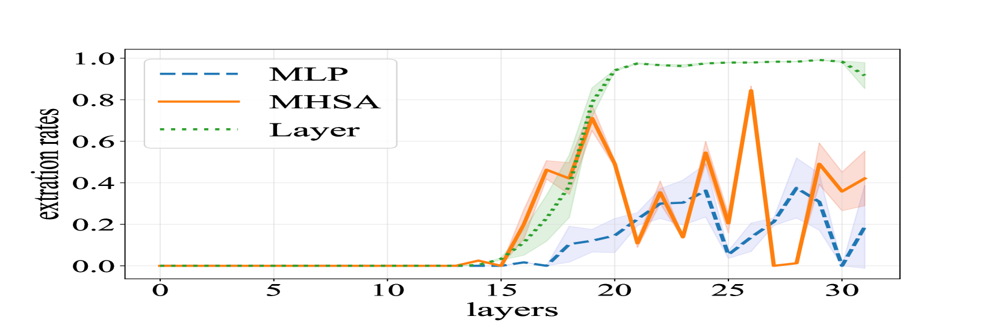

# 开启未来之门：深入探究大型语言模型中前瞻规划机制的透明度

发布时间：2024年06月23日

`Agent

这篇论文主要探讨了大型语言模型（LLMs）作为智能体的规划能力，特别是从信息流和内部表示的角度深入分析了LLMs的前瞻性规划机制。研究内容涉及智能体的核心功能——规划，并且通过分析LLMs的内部机制来理解其规划过程。因此，这篇论文更适合归类到Agent分类中，因为它关注的是LLMs在智能体角色中的应用和机制。` `人工智能` `智能体规划`

> Unlocking the Future: Exploring Look-Ahead Planning Mechanistic Interpretability in Large Language Models

# 摘要

> 规划是智能体的核心，广泛应用于实体智能体、网页导航和工具使用等领域。随着大型语言模型（LLMs）的进步，研究者们开始将其视为智能体，探索其规划能力。但规划机制仍是个谜。本研究从信息流和内部表示的角度，深入探讨了LLMs的前瞻性规划机制。我们首先分析了最后一个令牌中的多层感知器（MLP）和多头自注意力（MHSA），发现MHSA在中间层的输出能一定程度上直接解码决策。进一步追踪信息流，我们揭示了MHSA主要从目标状态的跨度和最近步骤中提取信息。我们还探讨了信息流中是否预先编码了未来决策，发现当规划成功时，中间层和上层确实编码了一些短期未来决策。我们的研究为理解LLMs的规划机制提供了新视角，为未来研究奠定了基础。

> Planning, as the core module of agents, is crucial in various fields such as embodied agents, web navigation, and tool using. With the development of large language models (LLMs), some researchers treat large language models as intelligent agents to stimulate and evaluate their planning capabilities. However, the planning mechanism is still unclear. In this work, we focus on exploring the look-ahead planning mechanism in large language models from the perspectives of information flow and internal representations. First, we study how planning is done internally by analyzing the multi-layer perception (MLP) and multi-head self-attention (MHSA) components at the last token. We find that the output of MHSA in the middle layers at the last token can directly decode the decision to some extent. Based on this discovery, we further trace the source of MHSA by information flow, and we reveal that MHSA mainly extracts information from spans of the goal states and recent steps. According to information flow, we continue to study what information is encoded within it. Specifically, we explore whether future decisions have been encoded in advance in the representation of flow. We demonstrate that the middle and upper layers encode a few short-term future decisions to some extent when planning is successful. Overall, our research analyzes the look-ahead planning mechanisms of LLMs, facilitating future research on LLMs performing planning tasks.

[Arxiv](https://arxiv.org/abs/2406.16033)