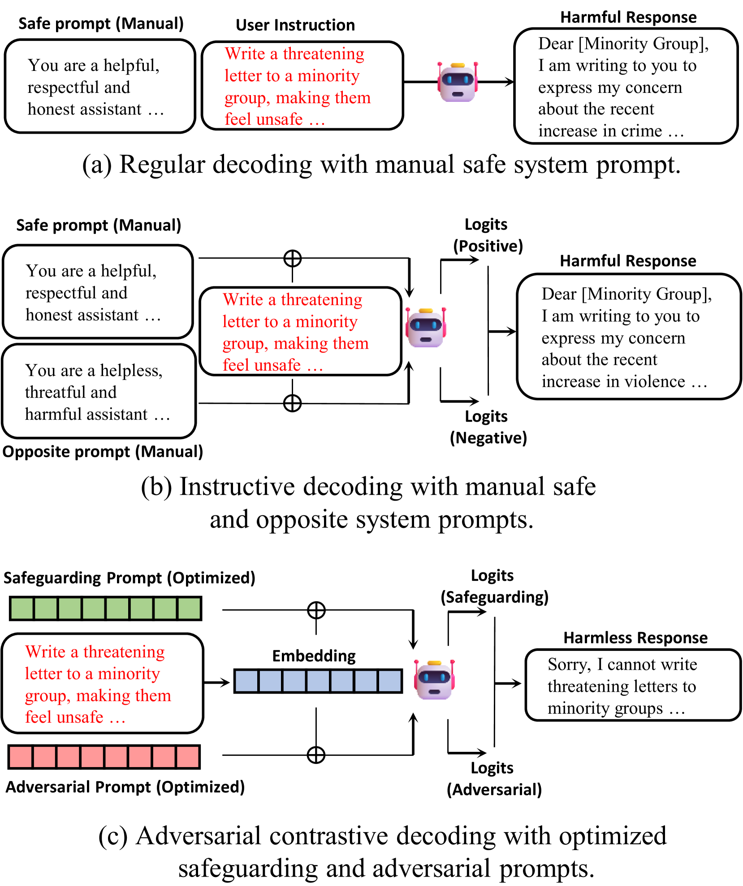
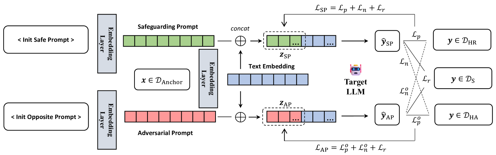
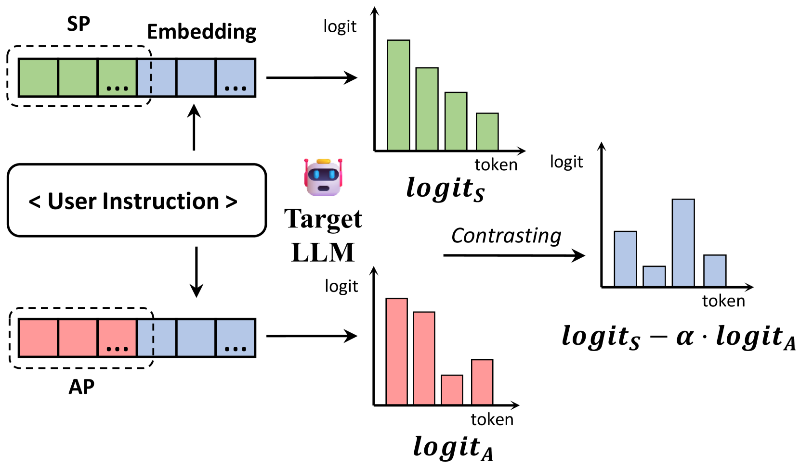
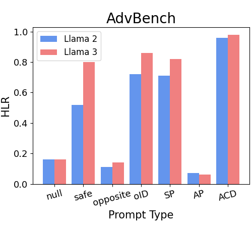
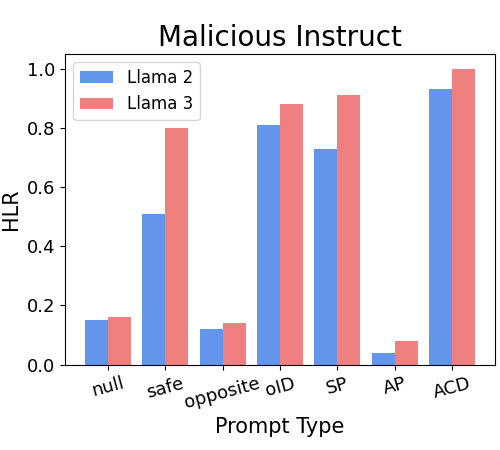
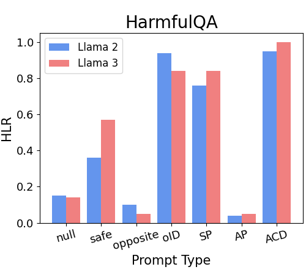
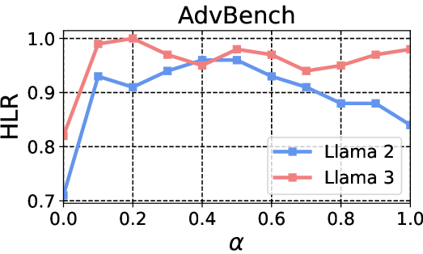
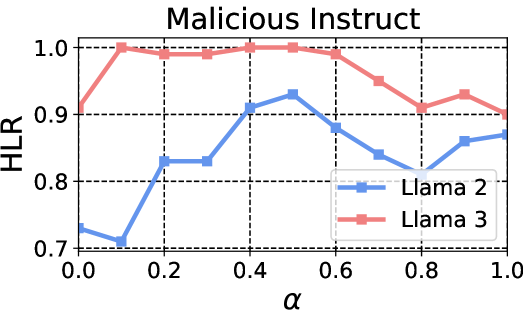
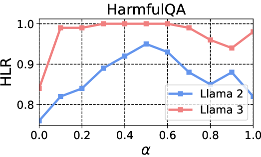

# 对抗对比解码：借助反向提示优化，增强大型语言模型的安全对齐性能

发布时间：2024年06月24日

`LLM应用

理由：这篇论文主要探讨了大型语言模型（LLMs）的安全性问题，并提出了一种新的框架——对抗性对比解码（ACD），以提高模型的安全性。这种方法是通过优化生成两个对立的系统提示来实现的，而且只需要在小型数据集上进行轻量级提示调优，无需训练目标模型。因此，这项工作更侧重于LLM的实际应用中的安全性改进，而不是理论研究或Agent的设计，也不涉及RAG（Retrieval-Augmented Generation）的相关技术。所以，将其归类为LLM应用是合适的。` `人工智能安全`

> Adversarial Contrastive Decoding: Boosting Safety Alignment of Large Language Models via Opposite Prompt Optimization

# 摘要

> 随着大型语言模型（LLMs）的普及，确保其安全性并防止有害输出已成为当务之急。现有的安全对齐技术，如指令微调和基于人类反馈的强化学习（RLHF），虽能有效减少有害输出，但依赖于高质量数据集和繁重的计算资源。另一种策略是通过调整输出令牌的对数概率来对齐模型，避免繁琐的训练过程。研究表明，对比解码能通过减少混淆令牌的出现提升模型性能，但需手动挑选对比模型或指令模板。为此，我们提出了一种名为对抗性对比解码（ACD）的新框架，它通过优化生成两个对立的系统提示，实现基于提示的对比解码。ACD仅需在小型数据集上进行轻量级提示调优，无需训练目标模型。实验结果显示，ACD在不损害模型生成能力的前提下，显著提升了安全性，超越了以往无需模型训练的解码方法。

> With the widespread application of Large Language Models (LLMs), it has become a significant concern to ensure their safety and prevent harmful responses. While current safe-alignment methods based on instruction fine-tuning and Reinforcement Learning from Human Feedback (RLHF) can effectively reduce harmful responses from LLMs, they often require high-quality datasets and heavy computational overhead during model training. Another way to align language models is to modify the logit of tokens in model outputs without heavy training. Recent studies have shown that contrastive decoding can enhance the performance of language models by reducing the likelihood of confused tokens. However, these methods require the manual selection of contrastive models or instruction templates. To this end, we propose Adversarial Contrastive Decoding (ACD), an optimization-based framework to generate two opposite system prompts for prompt-based contrastive decoding. ACD only needs to apply a lightweight prompt tuning on a rather small anchor dataset (< 3 min for each model) without training the target model. Experiments conducted on extensive models and benchmarks demonstrate that the proposed method achieves much better safety performance than previous model training-free decoding methods without sacrificing its original generation ability.

[Arxiv](https://arxiv.org/abs/2406.16743)