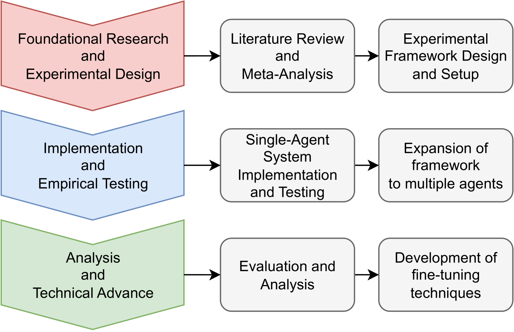

# 基于代理的自动软件优化

发布时间：2024年06月24日

`Agent

这篇论文摘要主要描述了利用大型语言模型（LLMs）赋能的代理进行软件维护的研究提案。这些代理具有迭代学习能力，能够适应并解决代码生成中的问题，特别是“最后一英里问题”。此外，论文还提到了通过代理间的协作框架来相互学习和纠错，以及通过系统内的迭代反馈来优化代理背后的LLMs。这些内容主要集中在使用LLMs作为工具来增强软件维护的效率和可靠性，因此属于Agent分类。` `软件开发` `自动化软件改进`

> Agent-Driven Automatic Software Improvement

# 摘要

> 软件维护成本高达开发总成本的一半，提升代码质量和可靠性刻不容缓。为此，本博士研究提案提出，利用大型语言模型（LLMs）赋能的代理进行软件维护，以期探索新解。这些代理具备迭代学习能力，能不断适应并克服代码生成中的常见难题，尤其是“最后一英里问题”，即功能性和上下文相关代码生成末端的错误。此外，本项目还计划通过代理间的协作框架，相互纠错学习，突破现有LLMs在源代码处理上的局限。我们将借助系统内的迭代反馈，进一步优化代理背后的LLMs，使其更贴合自动化软件改进的需求。我们的终极目标是通过开发新型工具和框架，大幅提升软件开发的效率与可靠性，推动自动软件改进领域迈向新高度。

> With software maintenance accounting for 50% of the cost of developing software, enhancing code quality and reliability has become more critical than ever. In response to this challenge, this doctoral research proposal aims to explore innovative solutions by focusing on the deployment of agents powered by Large Language Models (LLMs) to perform software maintenance tasks. The iterative nature of agents, which allows for continuous learning and adaptation, can help surpass common challenges in code generation. One distinct challenge is the last-mile problems, errors at the final stage of producing functionally and contextually relevant code. Furthermore, this project aims to surpass the inherent limitations of current LLMs in source code through a collaborative framework where agents can correct and learn from each other's errors. We aim to use the iterative feedback in these systems to further fine-tune the LLMs underlying the agents, becoming better aligned to the task of automated software improvement. Our main goal is to achieve a leap forward in the field of automatic software improvement by developing new tools and frameworks that can enhance the efficiency and reliability of software development.

[Arxiv](https://arxiv.org/abs/2406.16739)