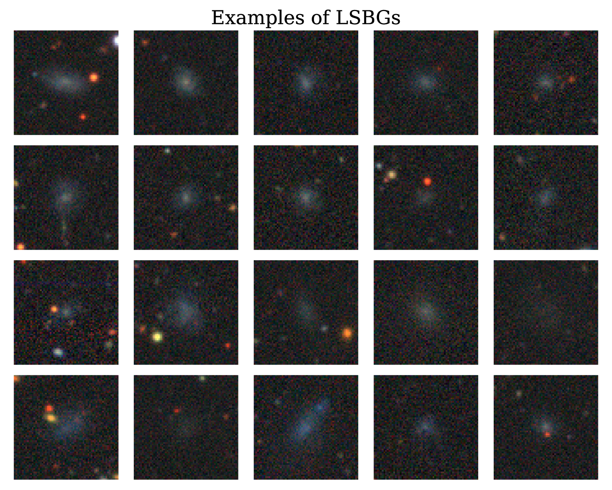
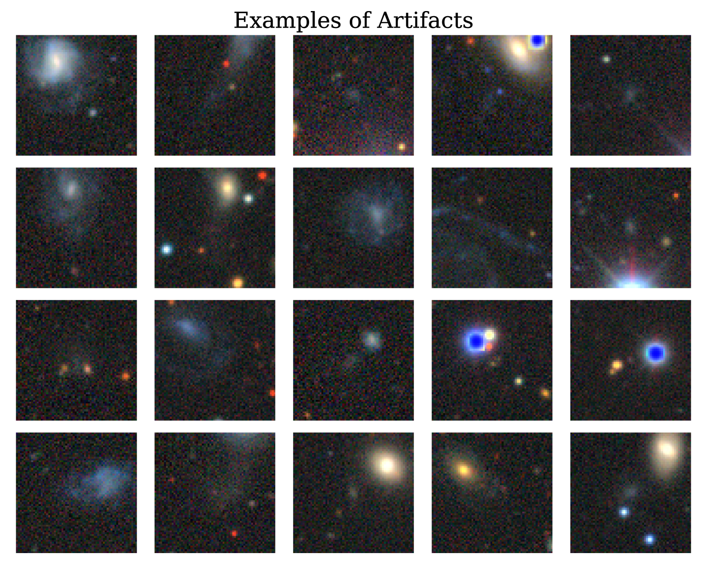

# 一眼定乾坤：大型多模态模型在天文图像零-shot分类中的应用

发布时间：2024年06月24日

`LLM应用

这篇论文摘要讨论了视觉-语言多模态模型（VLMs）在天文学中的应用，特别是在零-shot分类任务中的表现。这些模型，如GPT-4o和LLaVA-NeXT，展示了在星系分类等任务中的高准确率，无需额外的训练或微调。这种应用展示了大型语言模型（LLM）在特定领域（如天文学）的实际应用价值，因此将其归类为LLM应用。` `天文学`

> At First Sight: Zero-Shot Classification of Astronomical Images with Large Multimodal Models

# 摘要

> 视觉-语言多模态模型（VLMs）为天文学带来了零-shot分类的新机遇，即通过自然语言提示实现分类，无需任何训练。我们探索了GPT-4o和LLaVA-NeXT两种模型，它们在低表面亮度星系和伪影的分类，以及星系形态分类上展现了出色的零-shot能力，准确率通常超过80%，且无需额外训练或微调。我们指出了这些模型，尤其是开源的LLaVA-NeXT，仍需改进之处。我们的研究成果旨在鼓励天文学界将VLMs视为研究和教学的有力工具，并期待未来定制或微调的模型能带来更佳表现。

> Vision-Language multimodal Models (VLMs) offer the possibility for zero-shot classification in astronomy: i.e. classification via natural language prompts, with no training. We investigate two models, GPT-4o and LLaVA-NeXT, for zero-shot classification of low-surface brightness galaxies and artifacts, as well as morphological classification of galaxies. We show that with natural language prompts these models achieved significant accuracy (above 80 percent typically) without additional training/fine tuning. We discuss areas that require improvement, especially for LLaVA-NeXT, which is an open source model. Our findings aim to motivate the astronomical community to consider VLMs as a powerful tool for both research and pedagogy, with the prospect that future custom-built or fine-tuned models could perform better.

[Arxiv](https://arxiv.org/abs/2406.17057)