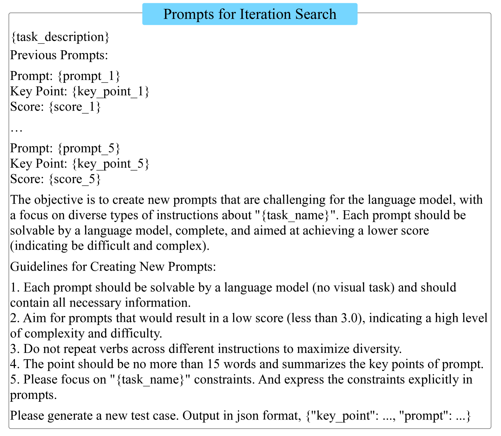

# AutoDetect：构建大型语言模型弱点自动化检测的统一框架

发布时间：2024年06月24日

`Agent

这篇论文介绍了一个名为AutoDetect的框架，该框架利用三个由LLM驱动的智能体（考官、提问者和评估者）来自动检测大型语言模型（LLMs）在多任务中的弱点。这种方法通过智能体之间的协同工作，实现了对模型弱点的全面深入识别，并有效地指导了模型的优化。因此，这篇论文的内容与“Agent”分类最为相关，因为它涉及到了使用智能体来执行特定的任务和功能。` `人工智能` `教育评估`

> AutoDetect: Towards a Unified Framework for Automated Weakness Detection in Large Language Models

# 摘要

> 尽管大型语言模型（LLMs）日益强大，但仍存在微妙的弱点，如在指令遵循或编码任务中的错误。这些意外错误在实际应用中可能带来严重后果，因此系统地探究LLMs的局限性至关重要。传统的基准测试方法难以精准定位模型缺陷，而手动检查则成本高昂且不可扩展。为此，我们提出了一个名为AutoDetect的统一框架，旨在自动检测LLMs在多任务中的弱点。该框架借鉴教育评估的理念，集成了三个由LLM驱动的智能体：考官、提问者和评估者，通过它们的协同工作，实现对模型弱点的全面深入识别。AutoDetect在揭示模型缺陷方面成效显著，识别成功率在ChatGPT和Claude等主流模型中超过30%。更重要的是，这些识别出的弱点能有效指导模型优化，其效果远超无针对性的数据增强方法，如Self-Instruct。我们的方法已显著提升了包括Llama系列和Mistral-7b在内的流行LLMs的性能，在多个基准测试中提升了超过10%。相关代码和数据已公开发布于https://github.com/thu-coai/AutoDetect。

> Although Large Language Models (LLMs) are becoming increasingly powerful, they still exhibit significant but subtle weaknesses, such as mistakes in instruction-following or coding tasks. As these unexpected errors could lead to severe consequences in practical deployments, it is crucial to investigate the limitations within LLMs systematically. Traditional benchmarking approaches cannot thoroughly pinpoint specific model deficiencies, while manual inspections are costly and not scalable. In this paper, we introduce a unified framework, AutoDetect, to automatically expose weaknesses in LLMs across various tasks. Inspired by the educational assessment process that measures students' learning outcomes, AutoDetect consists of three LLM-powered agents: Examiner, Questioner, and Assessor. The collaboration among these three agents is designed to realize comprehensive and in-depth weakness identification. Our framework demonstrates significant success in uncovering flaws, with an identification success rate exceeding 30% in prominent models such as ChatGPT and Claude. More importantly, these identified weaknesses can guide specific model improvements, proving more effective than untargeted data augmentation methods like Self-Instruct. Our approach has led to substantial enhancements in popular LLMs, including the Llama series and Mistral-7b, boosting their performance by over 10% across several benchmarks. Code and data are publicly available at https://github.com/thu-coai/AutoDetect.

[Arxiv](https://arxiv.org/abs/2406.16714)