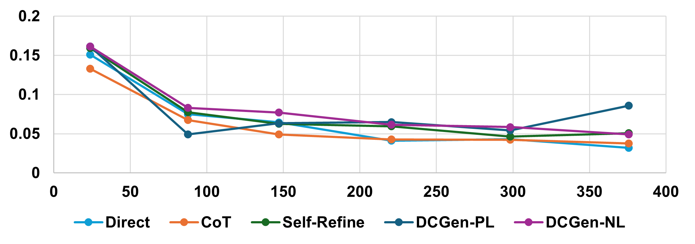

# 基于分治策略的截图自动生成UI代码方法

发布时间：2024年06月24日

`LLM应用

这篇论文主要探讨了如何利用多模态大型语言模型（MLLMs）来改进UI代码的生成过程，特别是通过一种名为DCGen的新方法，该方法采用分而治之的策略，将网页设计图细分为小片段，并为每个片段生成描述，最终整合成完整的UI代码。这种方法在视觉相似性上比其他方法有显著提升。因此，这篇论文属于LLM应用类别，因为它展示了如何应用大型语言模型来解决实际问题，即网站UI代码的自动化生成。` `网页设计` `UI开发`

> Automatically Generating UI Code from Screenshot: A Divide-and-Conquer-Based Approach

# 摘要

> 在数字化时代，网站的重要性不言而喻，全球活跃网站超过11亿，每天新增约252,000个。将网站设计图转换为实用的UI代码，虽耗时却至关重要。传统的手动转换方法对非专业人士来说挑战重重。为此，我们研究了GPT-4o，并发现了UI代码生成中的三大问题：元素遗漏、变形和错位。我们发现，聚焦于小视觉片段能帮助多模态大型语言模型（MLLMs）减少这些错误。本文介绍了DCGen，一种基于分而治之的策略，能自动将网页设计转化为UI代码。DCGen首先将截图细分为小片段，为每个片段生成描述，再整合成完整的UI代码。通过大量测试，我们发现DCGen在视觉相似性上比其他方法提升了14%。DCGen是首个基于分段感知的提示方法，能直接从截图生成UI代码。

> Websites are critical in today's digital world, with over 1.11 billion currently active and approximately 252,000 new sites launched daily. Converting website layout design into functional UI code is a time-consuming yet indispensable step of website development. Manual methods of converting visual designs into functional code present significant challenges, especially for non-experts. To explore automatic design-to-code solutions, we first conduct a motivating study on GPT-4o and identify three types of issues in generating UI code: element omission, element distortion, and element misarrangement. We further reveal that a focus on smaller visual segments can help multimodal large language models (MLLMs) mitigate these failures in the generation process. In this paper, we propose DCGen, a divide-and-conquer-based approach to automate the translation of webpage design to UI code. DCGen starts by dividing screenshots into manageable segments, generating descriptions for each segment, and then reassembling them into complete UI code for the entire screenshot. We conduct extensive testing with a dataset comprised of real-world websites and various MLLMs and demonstrate that DCGen achieves up to a 14% improvement in visual similarity over competing methods. To the best of our knowledge, DCGen is the first segment-aware prompt-based approach for generating UI code directly from screenshots.

[Arxiv](https://arxiv.org/abs/2406.16386)