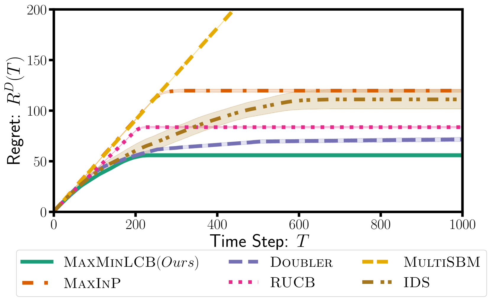
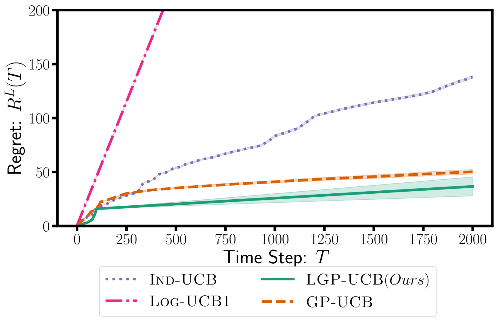
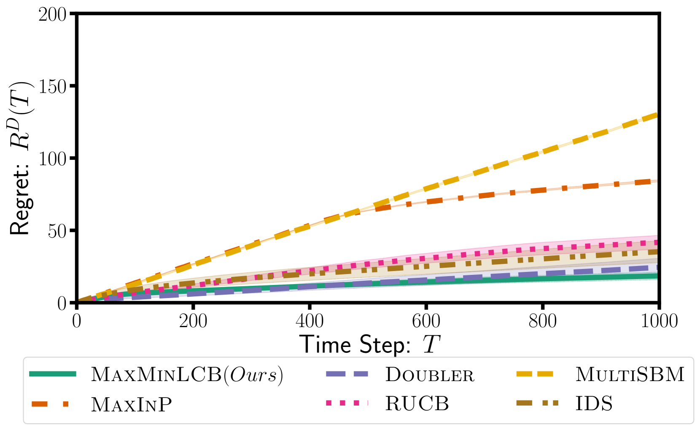

# 偏好反馈下的强盗策略：Stackelberg博弈的视角解析

发布时间：2024年06月24日

`Agent

理由：这篇论文主要探讨了偏好反馈的Bandit模型，并提出了一种新的算法MAXMINLCB，用于在无限域和非线性奖励的情况下优化未知目标函数。这种模型能够整合人类反馈到在线推理和优化过程中，适用于微调大型语言模型。由于该论文关注的是一个能够根据反馈进行学习和优化的模型，它更符合Agent的分类，即一个能够自主行动和决策的实体。虽然它涉及到大型语言模型的应用，但其核心在于模型的自主学习和优化过程，而不是大型语言模型本身的理论或应用。` `机器学习` `在线优化`

> Bandits with Preference Feedback: A Stackelberg Game Perspective

# 摘要

> 偏好反馈的Bandit模型是一种强大的工具，用于在仅允许成对比较而非直接值查询的情况下优化未知目标函数。这种模型能够整合人类反馈到在线推理和优化过程中，已被应用于微调大型语言模型的系统。尽管在简化的线性目标函数或有限小域设置中，这一问题得到了较好理解，但这些设置在实际应用中受到限制。我们进一步探讨了无限域和非线性（核化）奖励的情况。在此情况下，选择一对动作极具挑战，需要在成对内部及算法迭代过程中平衡探索与利用。我们提出的MAXMINLCB算法，将这种平衡视为零和Stackelberg游戏，并选择既能提供信息又能带来有利奖励的动作对。MAXMINLCB不仅持续超越现有算法，还提供了任何时候都有效的最优后悔率保证，这得益于我们为核化逻辑估计器设计的新颖基于偏好的置信序列。

> Bandits with preference feedback present a powerful tool for optimizing unknown target functions when only pairwise comparisons are allowed instead of direct value queries. This model allows for incorporating human feedback into online inference and optimization and has been employed in systems for fine-tuning large language models. The problem is well understood in simplified settings with linear target functions or over finite small domains that limit practical interest. Taking the next step, we consider infinite domains and nonlinear (kernelized) rewards. In this setting, selecting a pair of actions is quite challenging and requires balancing exploration and exploitation at two levels: within the pair, and along the iterations of the algorithm. We propose MAXMINLCB, which emulates this trade-off as a zero-sum Stackelberg game, and chooses action pairs that are informative and yield favorable rewards. MAXMINLCB consistently outperforms existing algorithms and satisfies an anytime-valid rate-optimal regret guarantee. This is due to our novel preference-based confidence sequences for kernelized logistic estimators.

[Arxiv](https://arxiv.org/abs/2406.16745)