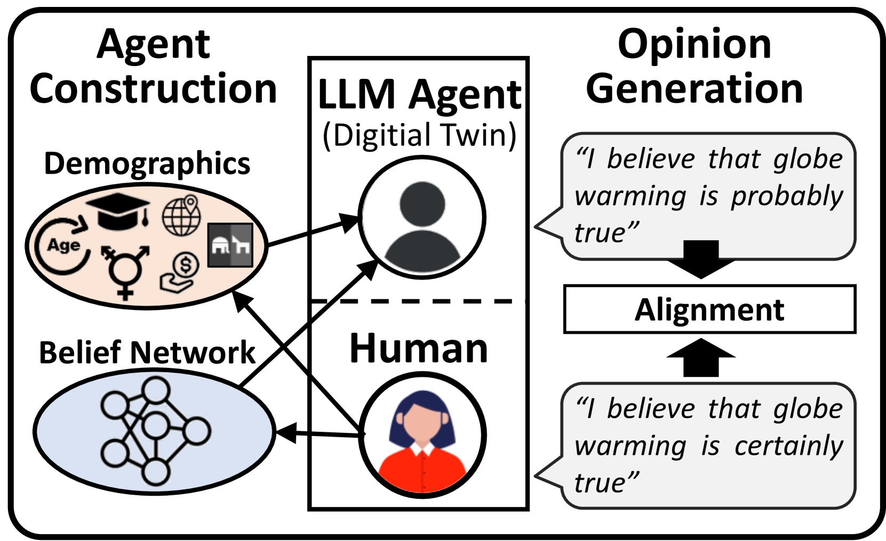
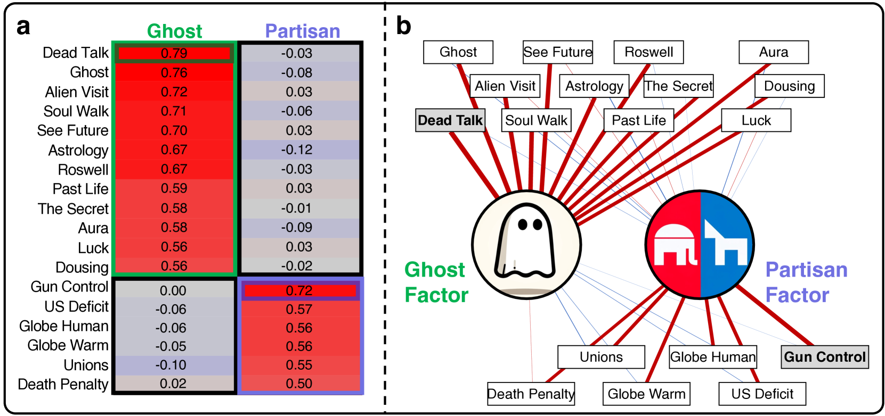
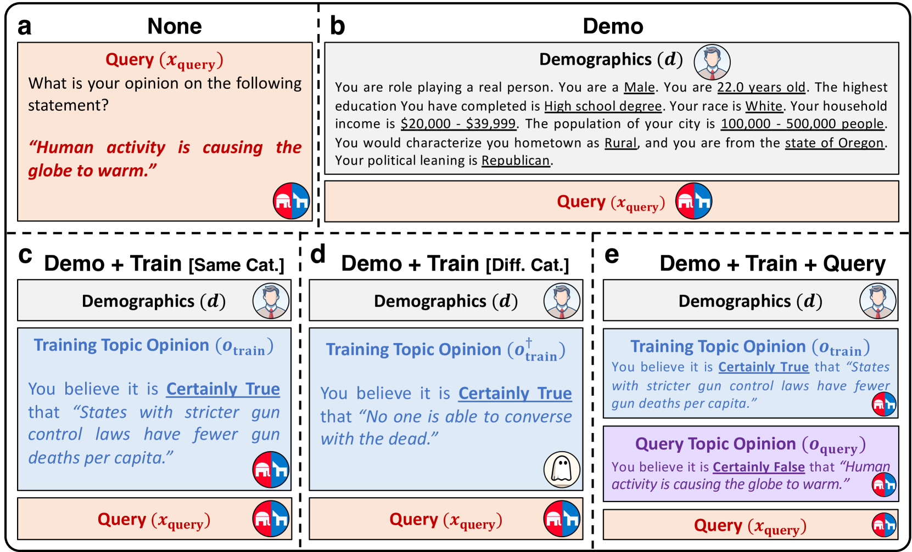
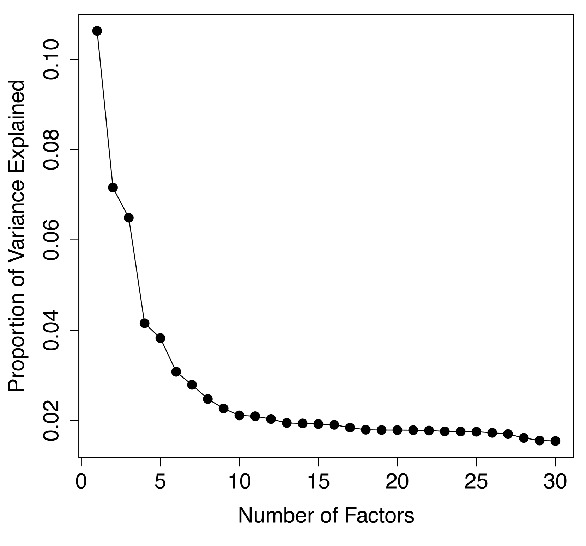
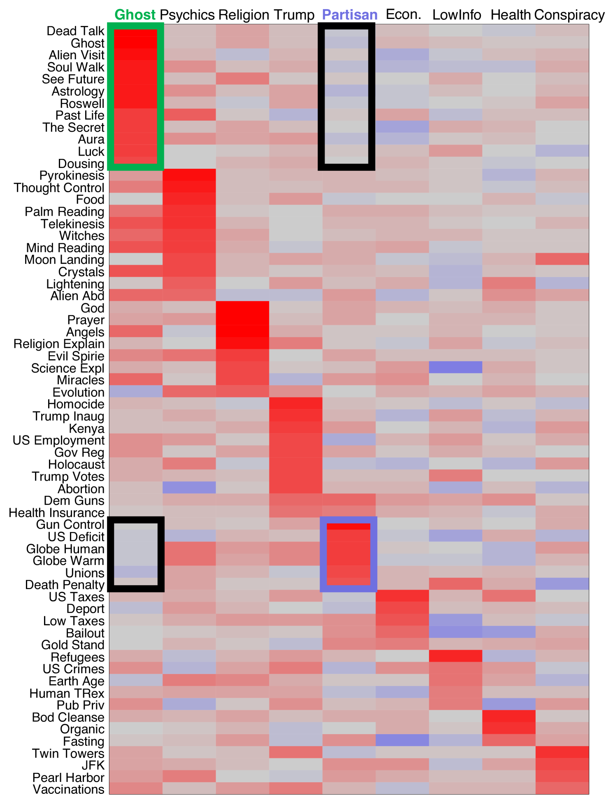

# 超越传统人口统计学：借助人类信念网络，精准对齐基于LLM的角色扮演智能代理

发布时间：2024年06月24日

`Agent

理由：这篇论文主要探讨了如何通过融合人类信念网络的信息来提升大型语言模型（LLM）代理的人类特征，以更真实地模拟社会行为。研究集中在通过特定的信念植入来提高LLM代理与人类行为的契合度，这属于Agent领域的研究，即如何构建和优化具有特定行为和决策能力的智能代理。` `社会模拟` `人工智能`

> Beyond Demographics: Aligning Role-playing LLM-based Agents Using Human Belief Networks

# 摘要

> 构建具有人类特征的LLM代理对于真实模拟社会至关重要。虽然基于人口统计信息的角色扮演有时能增强LLM的人类相似性，但效果往往不尽人意。本研究探索了通过融合经验性人类信念网络的信息，是否能提升LLM与人类行为的契合度。我们利用人类调查数据，构建了一个包含18个话题、基于两个独立潜在因素的信念网络。接着，我们向LLM代理植入一个话题的意见，并检验其在其他测试话题上的意见与人类数据的匹配情况。单纯依赖人口统计信息的角色扮演未能实现LLM与人类意见的一致，但通过向代理植入单一信念，对于信念网络内相关话题的匹配度显著提升，而对网络外话题则无此效果。这一发现为在模拟和解析社会信念分布的工作中，实现人类与LLM信念的匹配开辟了新途径。

> Creating human-like large language model (LLM) agents is crucial for faithful social simulation. Having LLMs role-play based on demographic information sometimes improves human likeness but often does not. This study assessed whether LLM alignment with human behavior can be improved by integrating information from empirically-derived human belief networks. Using data from a human survey, we estimated a belief network encompassing 18 topics loading on two non-overlapping latent factors. We then seeded LLM-based agents with an opinion on one topic, and assessed the alignment of its expressed opinions on remaining test topics with corresponding human data. Role-playing based on demographic information alone did not align LLM and human opinions, but seeding the agent with a single belief greatly improved alignment for topics related in the belief network, and not for topics outside the network. These results suggest a novel path for human-LLM belief alignment in work seeking to simulate and understand patterns of belief distributions in society.

[Arxiv](https://arxiv.org/abs/2406.17232)