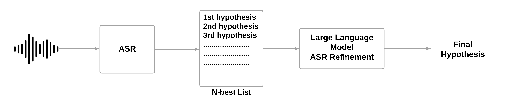
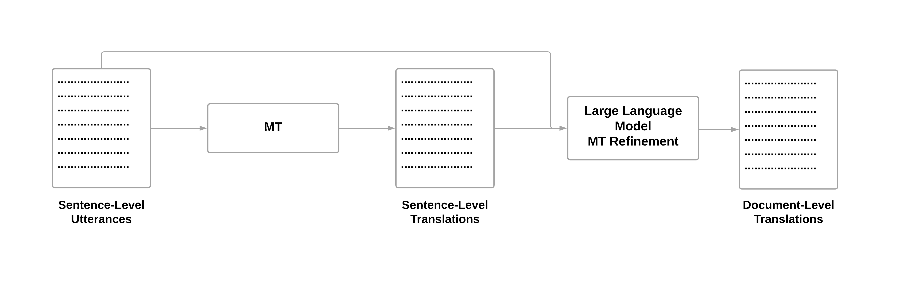

# KIT 在 IWSLT 2024 上展示的离线语音翻译系统，巧妙地将大型语言模型（LLMs）融入级联翻译流程，展现了前沿技术的融合之美。

发布时间：2024年06月24日

`LLM应用

这篇论文主要探讨了大型语言模型（LLMs）在自动语音识别（ASR）、机器翻译（MT）及端到端语音翻译（ST）等任务中的应用，并介绍了如何通过集成Mistral-7B模型来提升这些系统的性能。论文中提到的技术包括利用N-最佳列表和LLM微调来校正ASR输出，以及通过文档级别的LLM微调来提升翻译质量。这些内容直接涉及LLM在实际应用中的使用和优化，因此属于LLM应用分类。` `自动语音识别` `语音翻译`

> Blending LLMs into Cascaded Speech Translation: KIT's Offline Speech Translation System for IWSLT 2024

# 摘要

> 大型语言模型（LLMs）正被广泛应用于自动语音识别（ASR）、机器翻译（MT）及端到端语音翻译（ST）等任务。本文展示了KIT在受限+LLM赛道上的离线提交，通过引入新技术增强级联语音翻译系统。我们特别集成了Mistral-7B（mistralai/Mistral-7B-Instruct-v0.1），通过两种方式提升系统性能：一是利用N-最佳列表和LLM微调，精确校正ASR输出；二是通过文档级别的LLM微调，结合ASR和MT预测，提升翻译质量。结果显示，在tst2019测试集上，集成LLM使单词错误率降低了0.3%，COMET提高了0.65%。然而，在说话者重叠和背景噪音的复杂测试环境中，由于ASR性能不佳，LLM的集成并未带来益处。为此，我们采用分块长格式解码的ASR技术，以增强上下文利用，这在仅依赖语音活动检测分割时可能无法实现。

> Large Language Models (LLMs) are currently under exploration for various tasks, including Automatic Speech Recognition (ASR), Machine Translation (MT), and even End-to-End Speech Translation (ST). In this paper, we present KIT's offline submission in the constrained + LLM track by incorporating recently proposed techniques that can be added to any cascaded speech translation. Specifically, we integrate Mistral-7B\footnote{mistralai/Mistral-7B-Instruct-v0.1} into our system to enhance it in two ways. Firstly, we refine the ASR outputs by utilizing the N-best lists generated by our system and fine-tuning the LLM to predict the transcript accurately. Secondly, we refine the MT outputs at the document level by fine-tuning the LLM, leveraging both ASR and MT predictions to improve translation quality. We find that integrating the LLM into the ASR and MT systems results in an absolute improvement of $0.3\%$ in Word Error Rate and $0.65\%$ in COMET for tst2019 test set. In challenging test sets with overlapping speakers and background noise, we find that integrating LLM is not beneficial due to poor ASR performance. Here, we use ASR with chunked long-form decoding to improve context usage that may be unavailable when transcribing with Voice Activity Detection segmentation alone.

[Arxiv](https://arxiv.org/abs/2406.16777)