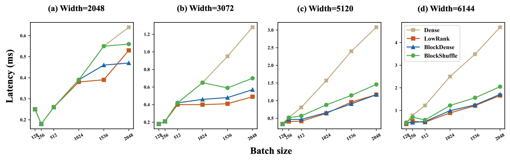
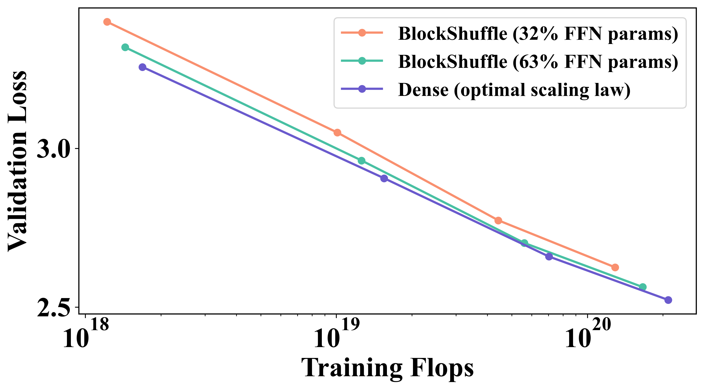
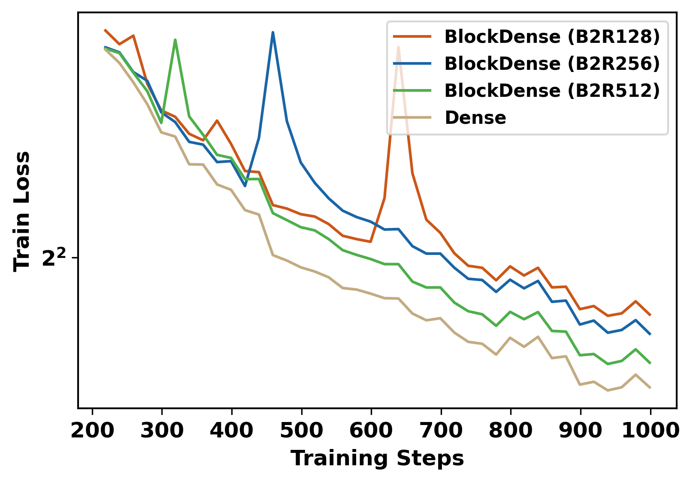
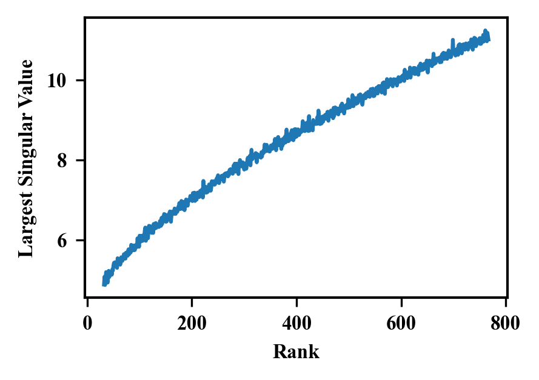
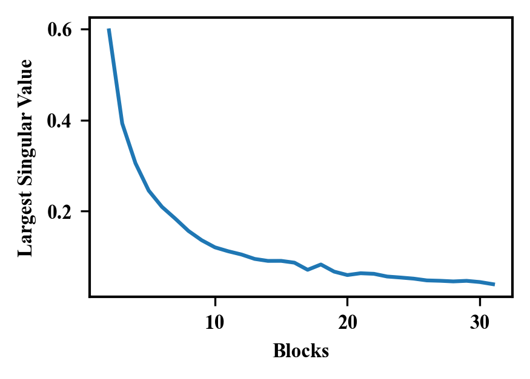
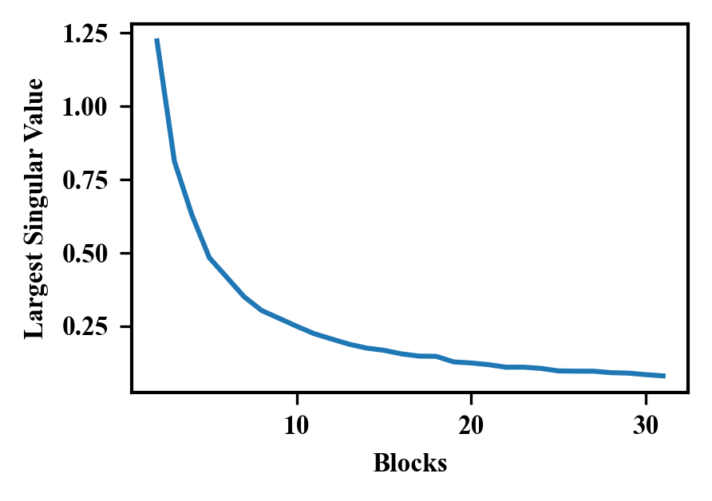

# 构筑高效基石：利用结构化前馈层精炼大型语言模型训练之道

发布时间：2024年06月24日

`LLM理论

理由：这篇论文主要探讨了大型语言模型（LLMs）中基于Transformer的前馈网络（FFN）的优化方法，通过引入新的线性层近似技术和“自引导训练”机制，旨在减少模型参数和计算开销同时保持性能。这些研究内容属于对LLM内部结构和训练方法的理论性探讨，因此归类为LLM理论。` `机器学习`

> Building on Efficient Foundations: Effectively Training LLMs with Structured Feedforward Layers

# 摘要

> 在大型语言模型（LLMs）领域，追求卓越性能往往伴随着高昂的计算成本。为此，研究者们正致力于在不牺牲性能的前提下，减少模型参数和计算开销。我们的研究聚焦于基于Transformer的LLMs，特别关注较少被研究的前馈网络（FFN），这是一个计算密集的部分。我们探索了三种结合低秩和块对角矩阵的线性层近似方法，与以往研究不同，我们的研究从零开始训练，扩展至13亿参数，并在最新的Transformer模型中进行，而非卷积架构。实验证明，这些方法在多种情况下，包括在线解码时使用预合并技术，都能带来实际的计算效率提升。我们还创新性地提出了“自引导训练”机制，旨在改善这些近似方法在初始训练阶段的不良表现。在RefinedWeb大型数据集上的测试显示，我们的方法在训练和推理上都既高效又有效。令人惊讶的是，结构化的FFN在扩展性能上呈现出比原始模型更为陡峭的曲线。通过将自引导训练应用于具有32% FFN参数和2.5倍加速的结构化矩阵，我们仅在相同的训练FLOPs下增加了0.4的困惑度。最终，我们开发的宽而结构化的网络在困惑度和吞吐量性能上超越了现有的中型和大型Transformer。我们的代码已公开在\url{https://github.com/CLAIRE-Labo/StructuredFFN/tree/main}。

> State-of-the-art results in large language models (LLMs) often rely on scale, which becomes computationally expensive. This has sparked a research agenda to reduce these models' parameter count and computational costs without significantly impacting their performance. Our study focuses on transformer-based LLMs, specifically targeting the computationally intensive feedforward networks (FFN), which are less studied than attention blocks. We consider three candidate linear layer approximations in the FFN by combining efficient low-rank and block-diagonal matrices. In contrast to many previous works that examined these approximations, our study i) explores these structures from the training-from-scratch perspective, ii) scales up to 1.3B parameters, and iii) is conducted within recent Transformer-based LLMs rather than convolutional architectures. We first demonstrate they can lead to actual computational gains in various scenarios, including online decoding when using a pre-merge technique. Additionally, we propose a novel training regime, called \textit{self-guided training}, aimed at improving the poor training dynamics that these approximations exhibit when used from initialization. Experiments on the large RefinedWeb dataset show that our methods are both efficient and effective for training and inference. Interestingly, these structured FFNs exhibit steeper scaling curves than the original models. Further applying self-guided training to the structured matrices with 32\% FFN parameters and 2.5$\times$ speed-up enables only a 0.4 perplexity increase under the same training FLOPs. Finally, we develop the wide and structured networks surpassing the current medium-sized and large-sized Transformer in perplexity and throughput performance. Our code is available at \url{https://github.com/CLAIRE-Labo/StructuredFFN/tree/main}.

[Arxiv](https://arxiv.org/abs/2406.16450)