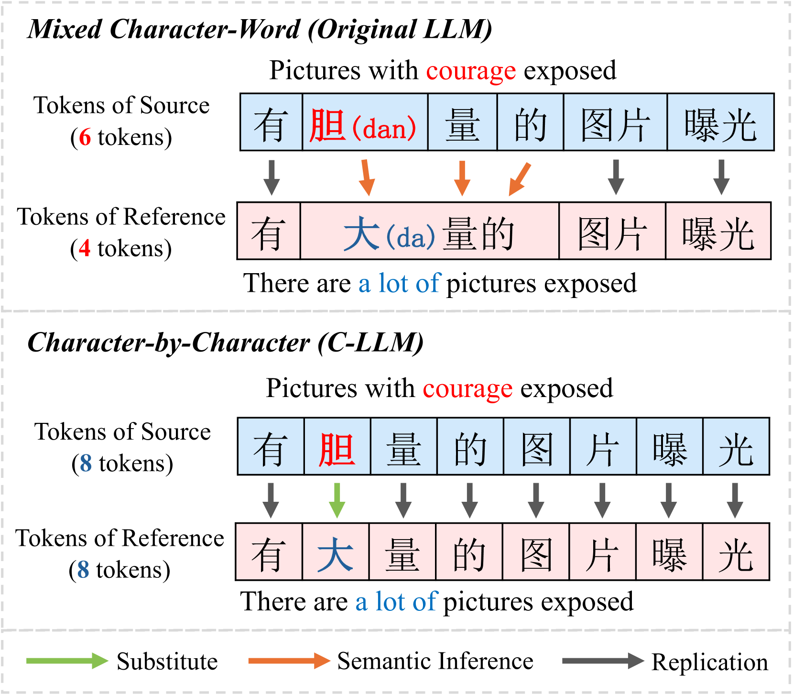
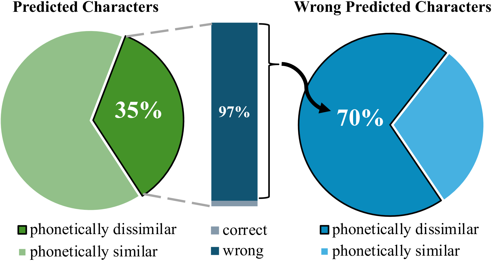
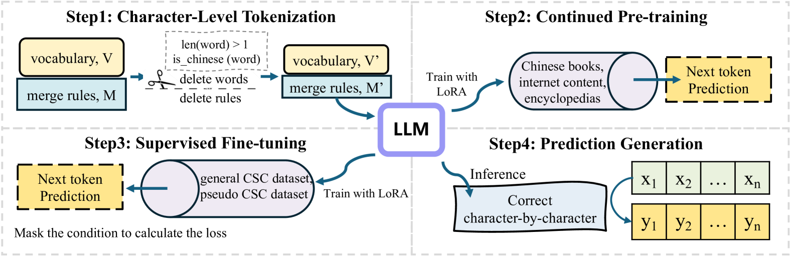
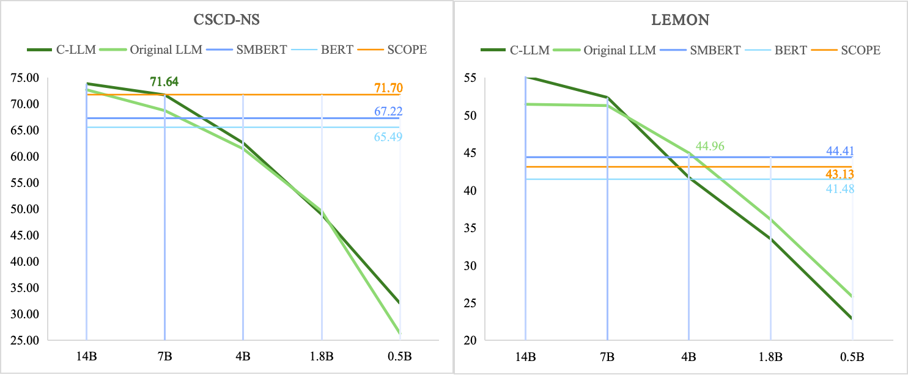

# C-LLM：逐字精进，智检中文拼写之误

发布时间：2024年06月24日

`LLM应用

这篇论文主要探讨了大型语言模型（LLMs）在中文拼写检查（CSC）任务中的应用，并提出了一种新的方法C-LLM，该方法通过字级别分词来解决传统LLMs在汉字级别约束上的不足。论文的核心贡献在于改进了LLMs在中文拼写检查任务中的性能，并通过实验验证了其有效性。因此，这篇论文属于LLM应用类别。` `拼写检查`

> C-LLM: Learn to Check Chinese Spelling Errors Character by Character

# 摘要

> 中文拼写检查（CSC）旨在纠正句子中的拼写错误。尽管大型语言模型（LLMs）在多个领域表现出色，但在CSC任务上的表现却常令人失望。研究发现，LLMs未能满足汉字级别的约束，如等长和音似性，这成为性能提升的瓶颈。问题根源在于当前混合字词分词方法无法满足这些字级别的要求。为此，我们开发了C-LLM，一种基于大型语言模型的逐字检查拼写错误的方法。通过字级别分词，模型能更好地学习字级别的对齐，有效解决了字级别约束的问题。CSC任务因此简化为以复制为主、替换为辅的形式。实验结果显示，C-LLM在两个基准测试上平均提升了10%，在通用场景下提升了2.1%，在特定领域场景下提升了12%，达到了业界领先水平。源代码可从https://github.com/ktlKTL/C-LLM获取。

> Chinese Spell Checking (CSC) aims to detect and correct spelling errors in sentences. Despite Large Language Models (LLMs) exhibit robust capabilities and are widely applied in various tasks, their performance on CSC is often unsatisfactory. We find that LLMs fail to meet the Chinese character-level constraints of the CSC task, namely equal length and phonetic similarity, leading to a performance bottleneck. Further analysis reveal that this issue stems from the granularity of tokenization, as current mixed character-word tokenization struggles to satisfy these character-level constraints. To address this issue, we propose C-LLM, a Large Language Model-based Chinese Spell Checking method that learns to check errors Character by Character. Character-level tokenization enables the model to learn character-level alignment, effectively mitigating issues related to character-level constraints. Furthermore, CSC is simplified to replication-dominated and substitution-supplemented tasks. Experiments on two CSC benchmarks demonstrate that C-LLM achieves an average improvement of 10% over existing methods. Specifically, it shows a 2.1% improvement in general scenarios and a significant 12% improvement in vertical domain scenarios, establishing state-of-the-art performance. The source code can be accessed at https://github.com/ktlKTL/C-LLM.

[Arxiv](https://arxiv.org/abs/2406.16536)