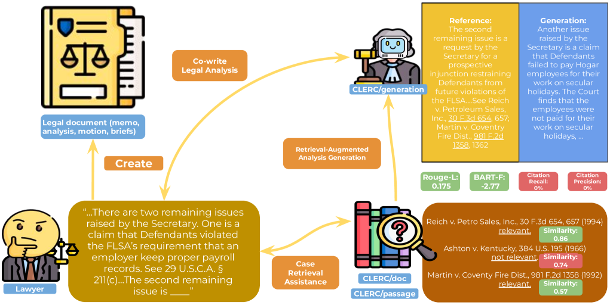
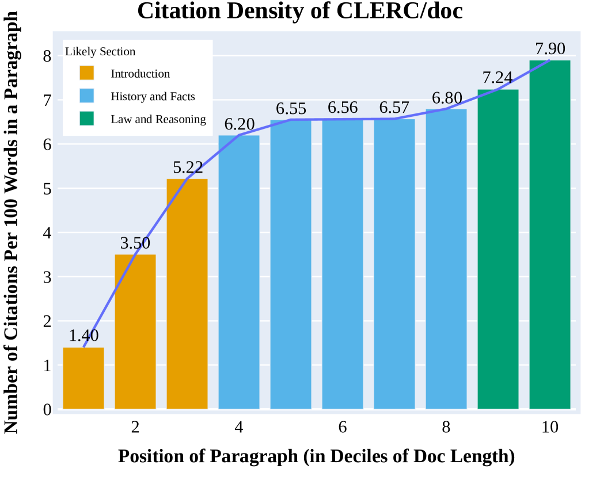
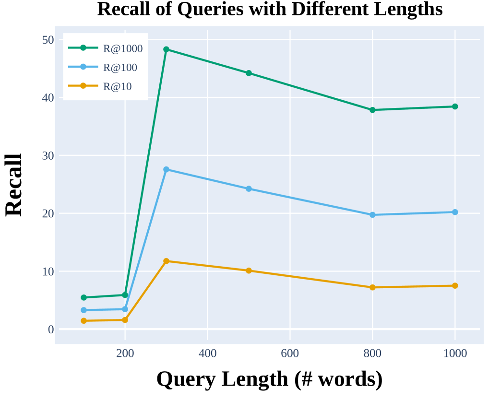
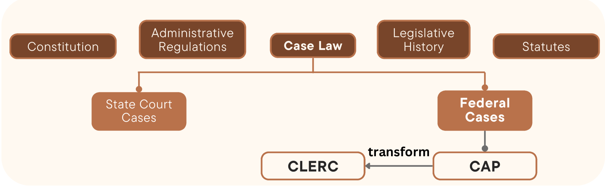

# CLERC：法律案例检索与增强分析生成数据集

发布时间：2024年06月24日

`RAG

理由：这篇论文主要关注的是构建一个支持信息检索与检索增强生成（RAG）两大核心任务的数据集——CLERC，用于法律领域的智能系统。它涉及的是如何通过数据集来训练和评估模型，以提高其在法律分析中的应用能力，特别是精准匹配引用和生成支持推理的论据。这与RAG技术的应用紧密相关，因此归类为RAG。` `信息检索`

> CLERC: A Dataset for Legal Case Retrieval and Retrieval-Augmented Analysis Generation

# 摘要

> 法律专业人士在撰写分析时需依赖先例，智能系统在此过程中大有裨益，但设计难度不小。这些系统需能精准定位、概括并推理关键案例，以发挥其价值。为此，我们与法律专家携手，将庞大的开源法律资料库转化为支持信息检索与检索增强生成两大核心任务的数据集——CLERC。该数据集旨在锻炼和检验模型，使其能（1）为法律分析精准匹配引用，（2）将这些引用及其上下文编织成支持推理的有力论据。我们对顶尖模型在CLERC上的表现进行了评估，发现现有技术仍显不足：GPT-4o虽在ROUGE F分数上领先，但幻觉频出；零-shot IR模型在召回率@1000上仅达48.3%。

> Legal professionals need to write analyses that rely on citations to relevant precedents, i.e., previous case decisions. Intelligent systems assisting legal professionals in writing such documents provide great benefits but are challenging to design. Such systems need to help locate, summarize, and reason over salient precedents in order to be useful. To enable systems for such tasks, we work with legal professionals to transform a large open-source legal corpus into a dataset supporting two important backbone tasks: information retrieval (IR) and retrieval-augmented generation (RAG). This dataset CLERC (Case Law Evaluation Retrieval Corpus), is constructed for training and evaluating models on their ability to (1) find corresponding citations for a given piece of legal analysis and to (2) compile the text of these citations (as well as previous context) into a cogent analysis that supports a reasoning goal. We benchmark state-of-the-art models on CLERC, showing that current approaches still struggle: GPT-4o generates analyses with the highest ROUGE F-scores but hallucinates the most, while zero-shot IR models only achieve 48.3% recall@1000.

[Arxiv](https://arxiv.org/abs/2406.17186)