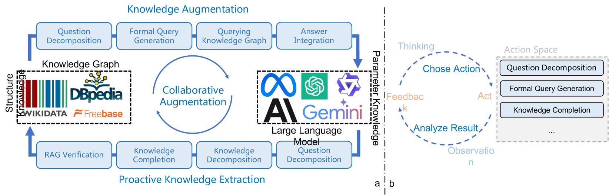
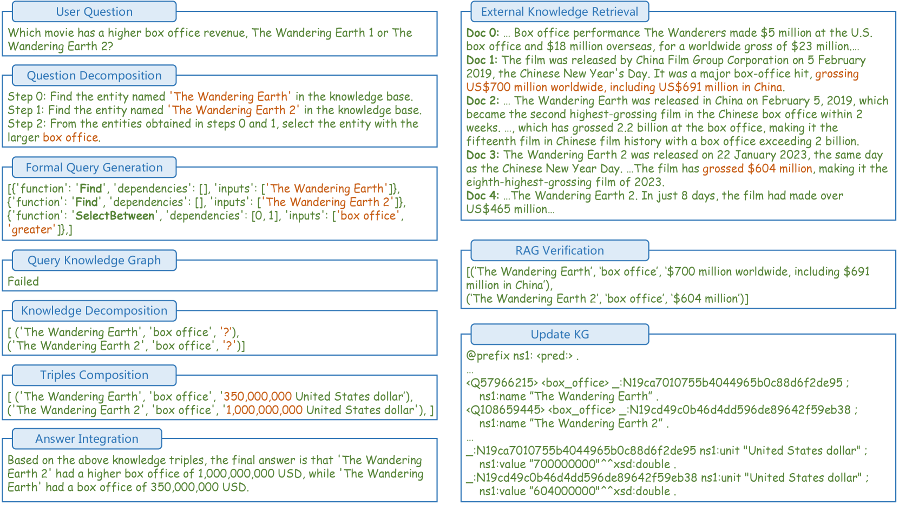
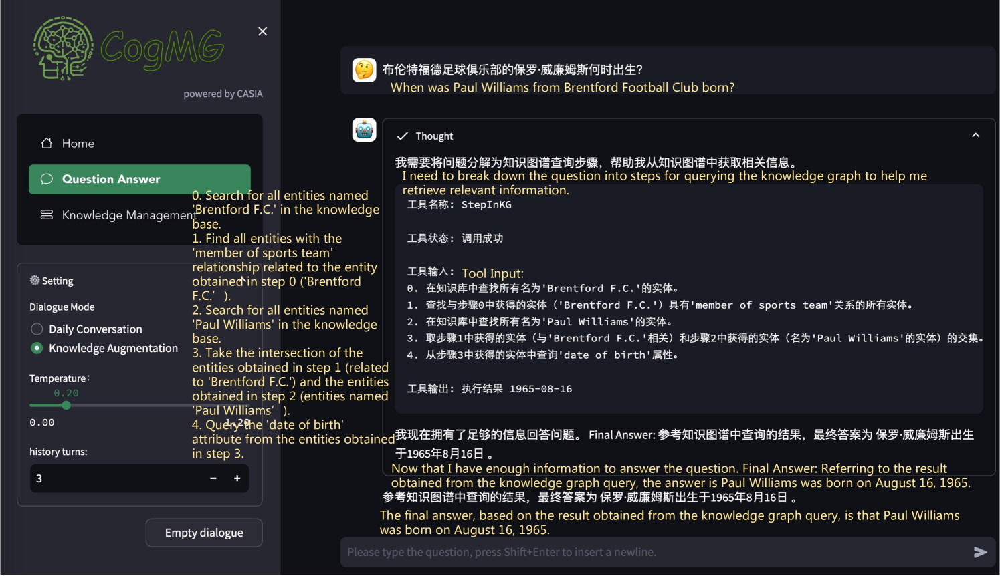

# CogMG：大型语言模型与知识图谱的协同增强

发布时间：2024年06月24日

`Agent

理由：这篇论文介绍了一个协作增强框架 CogMG，它旨在利用知识图谱来克服大型语言模型（LLM）在问答场景中的短板，特别是针对知识覆盖不全和更新不匹配的问题。该框架通过识别并分解知识图谱中缺失的知识三元组，并根据现实需求进行丰富和更新，从而减少幻觉并提升问答的事实准确性。这个框架可以被视为一个智能代理（Agent），因为它在特定的任务（问答）中主动地与环境（知识图谱）交互，以改善LLM的性能。因此，这篇论文更适合归类到Agent分类中。` `问答系统` `知识图谱`

> CogMG: Collaborative Augmentation Between Large Language Model and Knowledge Graph

# 摘要

> 尽管大型语言模型在问答应用中不可或缺，但其产生的幻觉和事实错误仍是一大难题。查询知识图谱虽能减少幻觉，却受限于图谱的知识覆盖不全。同时，通过信息抽取和图谱补全更新知识，又可能遭遇知识更新不匹配的问题。为此，我们提出了协作增强框架CogMG，旨在利用知识图谱克服LLM在问答场景中的短板，特别针对知识覆盖不全和更新不匹配的问题。该框架使LLM能够识别并分解知识图谱中缺失的知识三元组，并根据现实需求进行丰富和更新。通过在代理框架内对LLM进行监督微调，我们验证了这一方法的显著效果，有效减少了幻觉，提升了问答的事实准确性。相关代码和演示视频已公开。

> Large language models have become integral to question-answering applications despite their propensity for generating hallucinations and factually inaccurate content. Querying knowledge graphs to reduce hallucinations in LLM meets the challenge of incomplete knowledge coverage in knowledge graphs. On the other hand, updating knowledge graphs by information extraction and knowledge graph completion faces the knowledge update misalignment issue. In this work, we introduce a collaborative augmentation framework, CogMG, leveraging knowledge graphs to address the limitations of LLMs in QA scenarios, explicitly targeting the problems of incomplete knowledge coverage and knowledge update misalignment. The LLMs identify and decompose required knowledge triples that are not present in the KG, enriching them and aligning updates with real-world demands. We demonstrate the efficacy of this approach through a supervised fine-tuned LLM within an agent framework, showing significant improvements in reducing hallucinations and enhancing factual accuracy in QA responses. Our code and video are publicly available.

[Arxiv](https://arxiv.org/abs/2406.17231)