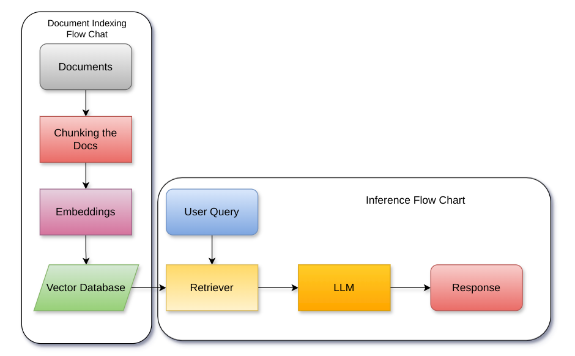
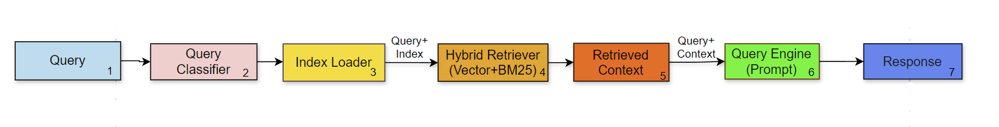
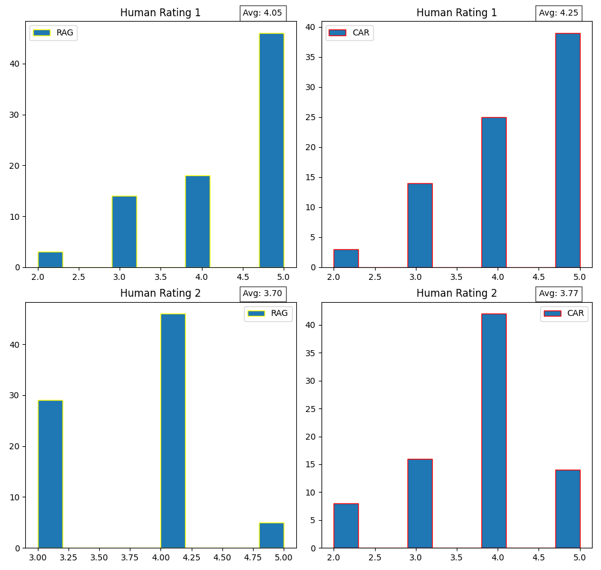

# 基于大型语言模型的快速信息检索响应生成新框架——上下文增强检索

发布时间：2024年06月24日

`RAG

理由：这篇论文主要探讨了基于RAG（Retrieval-Augmented Generation）的问答系统在处理大量上下文信息时的问题，并提出了一种新的方法——上下文增强检索（CAR）来改进信息检索的质量和效率。这种方法的创新之处在于融合了文本分类技术来动态优化向量数据库，从而提高答案生成的质量。因此，这篇论文更侧重于RAG框架的应用和改进，属于RAG分类。` `问答系统` `信息检索`

> Context-augmented Retrieval: A Novel Framework for Fast Information Retrieval based Response Generation using Large Language Model

# 摘要

> 在大型语言模型（LLM）中，通过嵌入上下文信息的提示持续生成高质量答案，关键在于信息检索的质量。然而，随着上下文信息量的增加，基于RAG的问答系统在答案和推理质量上有所下降。本研究通过融合经典文本分类与LLM，创新性地提出了一种名为上下文增强检索（CAR）的新方法，该方法通过实时分类流入语料库的信息，动态划分向量数据库，从而实现了快速且相关性强的信息检索，显著提升了答案生成的质量和效率。

> Generating high-quality answers consistently by providing contextual information embedded in the prompt passed to the Large Language Model (LLM) is dependent on the quality of information retrieval. As the corpus of contextual information grows, the answer/inference quality of Retrieval Augmented Generation (RAG) based Question Answering (QA) systems declines. This work solves this problem by combining classical text classification with the Large Language Model (LLM) to enable quick information retrieval from the vector store and ensure the relevancy of retrieved information. For the same, this work proposes a new approach Context Augmented retrieval (CAR), where partitioning of vector database by real-time classification of information flowing into the corpus is done. CAR demonstrates good quality answer generation along with significant reduction in information retrieval and answer generation time.

[Arxiv](https://arxiv.org/abs/2406.16383)