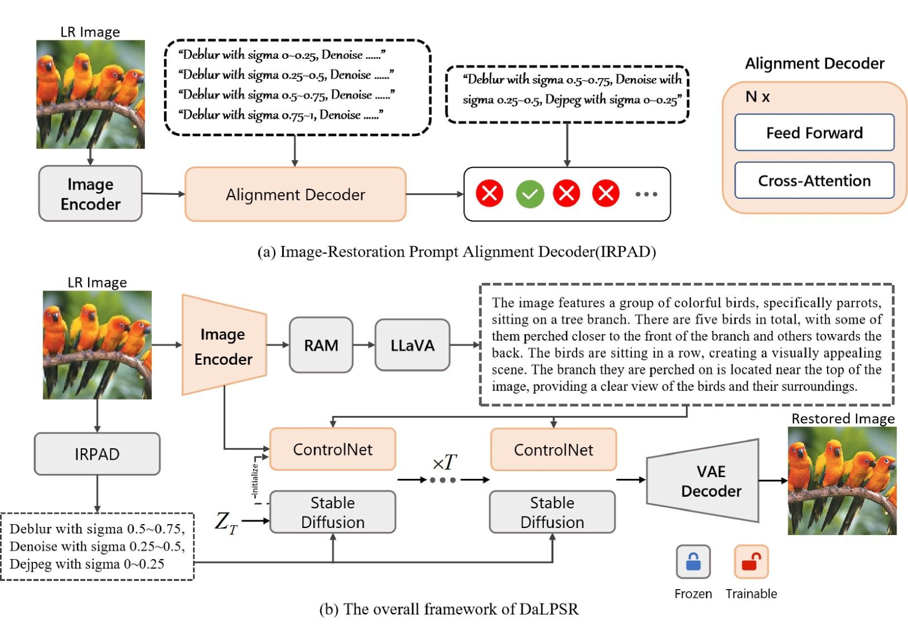
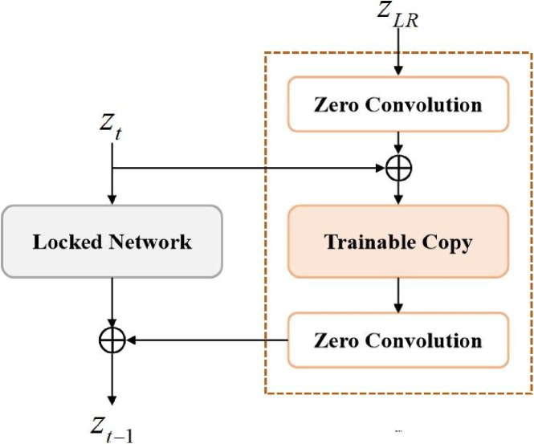
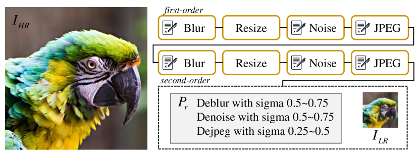
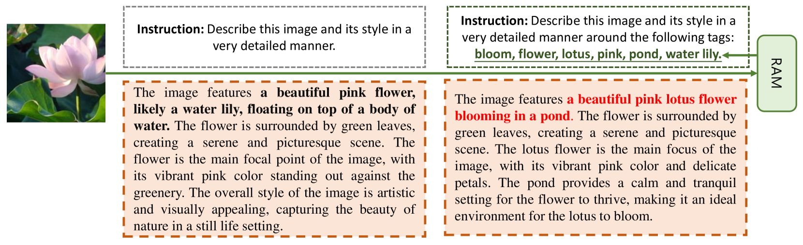
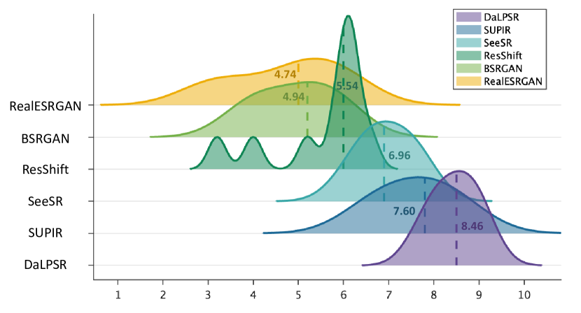

# DaLPSR：借助退化对齐的语言提示，提升真实世界图像的超分辨率效果

发布时间：2024年06月24日

`LLM应用

这篇论文主要探讨了如何利用大型语言模型（LLM）来提高图像超分辨率技术的性能。通过结合语义内容描述和退化提示，以及使用预训练的多模态大型语言模型来提取高级语义先验，论文提出了一种新的图像恢复方法。这种方法不仅考虑了图像的语义信息，还考虑了图像的退化信息，从而提高了图像恢复的精确度和保真度。因此，这篇论文属于LLM应用类别，因为它展示了如何将LLM技术应用于图像处理领域，以解决实际问题。` `图像处理` `计算机视觉`

> DaLPSR: Leverage Degradation-Aligned Language Prompt for Real-World Image Super-Resolution

# 摘要

> 图像超分辨率旨在重建低分辨率图像的高保真高分辨率版本。扩散模型因其丰富的先验知识而备受瞩目，其基于文本提示的成功也证实了文本控制在文本到图像领域的有效性。然而，低分辨率图像的严重退化及扩散模型的随机性使得现有模型难以准确捕捉退化图像的语义和退化信息，导致语义丢失、视觉伪影和幻觉等问题，对实际应用构成挑战。为此，本文提出了一种利用与退化对齐的语言提示进行精确、细致且高保真图像恢复的方法。我们探索了包括语义内容描述和退化提示在内的互补先验，并提出了一种图像恢复提示对齐解码器，自动评估图像退化程度，生成有利的退化先验。同时，利用预训练的多模态大型语言模型提取与人类感知紧密对齐的高级语义先验，确保图像恢复的保真度控制。在多个合成和真实世界数据集上与现有技术进行了全面比较，定量和定性分析均表明，我们的方法在感知质量上达到了新的最先进水平，特别是在无参考指标的真实世界案例中表现突出。

> Image super-resolution pursuits reconstructing high-fidelity high-resolution counterpart for low-resolution image. In recent years, diffusion-based models have garnered significant attention due to their capabilities with rich prior knowledge. The success of diffusion models based on general text prompts has validated the effectiveness of textual control in the field of text2image. However, given the severe degradation commonly presented in low-resolution images, coupled with the randomness characteristics of diffusion models, current models struggle to adequately discern semantic and degradation information within severely degraded images. This often leads to obstacles such as semantic loss, visual artifacts, and visual hallucinations, which pose substantial challenges for practical use. To address these challenges, this paper proposes to leverage degradation-aligned language prompt for accurate, fine-grained, and high-fidelity image restoration. Complementary priors including semantic content descriptions and degradation prompts are explored. Specifically, on one hand, image-restoration prompt alignment decoder is proposed to automatically discern the degradation degree of LR images, thereby generating beneficial degradation priors for image restoration. On the other hand, much richly tailored descriptions from pretrained multimodal large language model elicit high-level semantic priors closely aligned with human perception, ensuring fidelity control for image restoration. Comprehensive comparisons with state-of-the-art methods have been done on several popular synthetic and real-world benchmark datasets. The quantitative and qualitative analysis have demonstrated that the proposed method achieves a new state-of-the-art perceptual quality level, especially in real-world cases based on reference-free metrics.

[Arxiv](https://arxiv.org/abs/2406.16477)